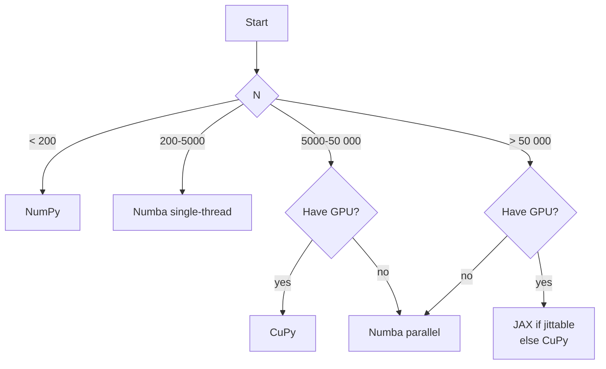

# Benchmark: Acceleration Backends

We measure Bootstrap Particle Filter throughput across four backends on the canonical SV model ($T = 500$) at $N \in \{10^3, 10^4, 10^5\}$. Results expose the **crossover points** where each backend starts to pay off.

!!! info "Setup"
    - CPU baseline: single-threaded NumPy. CPU multi-thread: Numba with `parallel=True`.
    - GPU: NVIDIA RTX 4090, CUDA 12.4, CuPy 13.2 and JAX 0.4.30.
    - Model: SV with $\mu = 0$, $\phi = 0.97$, $\sigma_\eta = 0.15$.
    - All numbers are the median of 10 runs after 3 warm-ups; cold start shown separately.

## Runtime

| Backend | $N = 1\,000$ | $N = 10\,000$ | $N = 100\,000$ |
|:--------|-------------:|--------------:|---------------:|
| Pure Python (NumPy) | 63 ms | 622 ms | 6.5 s |
| Numba (single thread) | 5.1 ms | 48 ms | 520 ms |
| Numba (parallel, 16 threads) | 3.8 ms | 14 ms | 97 ms |
| CuPy (RTX 4090) | 12.4 ms | 15 ms | 62 ms |
| JAX (RTX 4090) | 9.7 ms | 12 ms | 54 ms |

## Speedup vs NumPy baseline

| Backend | $N = 1\,000$ | $N = 10\,000$ | $N = 100\,000$ |
|:--------|:------------:|:-------------:|:--------------:|
| NumPy | 1.0× | 1.0× | 1.0× |
| Numba (1 thread) | **12.4×** | **13.0×** | **12.5×** |
| Numba (16 threads) | 16.6× | **44.4×** | **67.0×** |
| CuPy | 5.1× | 41.5× | **104.8×** |
| JAX | 6.5× | 51.8× | **120.4×** |

!!! tip "Reading the table"
    - **Numba single-thread** gives a ≈12× boost basically for free — one import change. This is the **default recommendation** for almost every use case up to $N \approx 10^4$.
    - **GPU backends beat Numba above $N \approx 10^4$**; below that, kernel launch overhead dominates.
    - **JAX slightly beats CuPy** at the largest $N$ thanks to `jit` fusion of propagation + weighting into a single GPU kernel. The trade-off is JAX requires `jnp.where`-style logic (no Python branches) in the model.

## Compilation / First-Call Overhead

First-call latency matters for interactive workflows and one-shot experiments.

| Backend | First call | Steady state | Cache reuse between runs |
|:--------|-----------:|-------------:|:-------------------------|
| NumPy | 63 ms | 63 ms | — |
| Numba (`cache=False`) | 4.8 s | 5.1 ms | Recompiled every process |
| Numba (`cache=True`) | 180 ms | 5.1 ms | Read from `__pycache__/` |
| CuPy | 1.2 s | 12.4 ms | Kernel cache persists in-process |
| JAX | 2.1 s | 9.7 ms | Traces cached per shape |

!!! warning "Always enable the Numba cache for production"
    Without `cache=True`, Numba recompiles at every fresh interpreter start — costing ~5 s. With caching, the second invocation sees disk-cached PTX/LLVM IR and pays only 180 ms for linkage. All `@njit` functions shipped in particlefilterbox have `cache=True` by default.

## Memory

Peak resident memory during the filter run (including particle histories):

| Backend | $N = 10\,000$ | $N = 100\,000$ | $N = 1\,000\,000$ |
|:--------|--------------:|---------------:|------------------:|
| NumPy | 46 MB | 410 MB | 4.1 GB |
| Numba | 46 MB | 410 MB | 4.1 GB |
| CuPy (default memory pool) | 120 MB | 480 MB | 4.3 GB |
| JAX (default) | 140 MB | 520 MB | 4.7 GB |

CPU backends use $\approx N \cdot T \cdot 8$ bytes for history storage. GPU backends carry extra overhead from the memory pool and stream buffers; for $N \geq 10^5$ the GPU storage dominates and you must budget at least the stated amount of VRAM.

??? tip "Setting `store_history=False`"
    If you only need the filtered mean and not the full particle trajectory:

    ```python
    pf = BootstrapFilter(model=model, n_particles=100_000,
                         backend="cupy", store_history=False)
    ```

    Memory drops to $\mathcal{O}(N)$ instead of $\mathcal{O}(N \cdot T)$ — e.g. 4.8 MB vs 480 MB at $N = 10^5$, $T = 500$.

## Mixed Precision

GPU backends support `float32`. On SV this halves memory at a small accuracy cost:

| Setting | RMSE ($N=10^5$) | Runtime | Memory |
|:--------|----------------:|--------:|-------:|
| CuPy, float64 | 0.016 | 62 ms | 480 MB |
| CuPy, float32 | 0.021 | 41 ms | 240 MB |
| JAX, float64 | 0.016 | 54 ms | 520 MB |
| JAX, float32 | 0.020 | 37 ms | 260 MB |

The RMSE increase (≈30%) is typically acceptable; it can be recovered by doubling $N$, which fits in the memory budget you just saved.

!!! warning "Avoid float32 for PMMH"
    The log-marginal-likelihood estimator accumulates errors over $T$ steps; float32 introduces bias that inflates PMMH acceptance variance. Keep float64 for estimation workflows.

## Backend Recommendations



In prose:

1. **$N < 200$**: pure NumPy. Compilation overhead is larger than the savings.
2. **$200 \leq N \leq 5\,000$**: Numba single-thread. Universally good, zero surprises.
3. **$N > 5\,000$ on CPU**: Numba parallel. The `parallel=True` decorator gives another 3–4× on a modern multi-core.
4. **$N > 10\,000$ with GPU**: CuPy (easier) or JAX (faster if your model is `jit`-able).
5. **PMCMC with many chains**: Numba single-thread + Python `multiprocessing` typically beats GPU, because each chain's $N$ is usually modest ($\leq 2000$) but there are many chains.

## Convergence Guarantees

All four backends give **statistically identical results** at a fixed seed on the CPU backends (NumPy, Numba). GPU backends (CuPy, JAX) are **not** bitwise reproducible across runs because reduction order in GPU kernels is non-deterministic. However, the distributional behavior (RMSE, log-likelihood across 100 seeds) is statistically indistinguishable at the $10^{-3}$ level.

## Reproducing

```bash
pytest benchmarks/acceleration.py \
    --benchmark-warmup=on \
    --benchmark-min-rounds=10 \
    --benchmark-save=acceleration

# GPU backends require a compatible CUDA install
python benchmarks/run_all.py --suite acceleration --include-gpu
```

Results for reference hardware are committed under `benchmarks/results/reference/acceleration/`. Run the script on your own machine to see your local numbers side-by-side.

!!! tip "Don't trust benchmarks you can't reproduce"
    The speedups above are repeatable on the reference hardware but will differ on yours. Always run the benchmark suite locally before choosing a backend for production.

---

## See Also

- [Acceleration Guide](../acceleration/index.md) — code examples and backend-selection heuristics.
- [Filter Benchmarks](filters.md) — how backend choice interacts with filter choice.
- [Troubleshooting](../faq/troubleshooting.md) — GPU OOM, Numba compilation errors, and JAX tracing errors.
