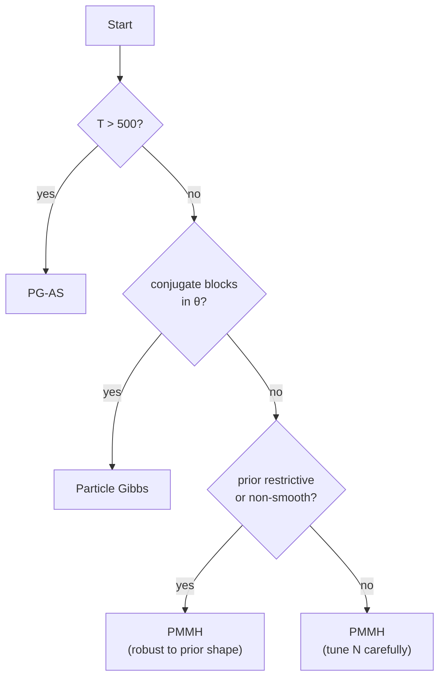

# Benchmark: PMCMC Methods

We compare **PMMH**, **Particle Gibbs (PG)**, and **Particle Gibbs with Ancestor Sampling (PG-AS)** on the canonical SV model. The decisive metric is **ESS per second** of wall time — the only number that ties mixing quality to runtime cost in a single measure.

!!! info "Setup"
    - Model: SV with true $\theta^* = (\mu=0, \phi=0.97, \sigma_\eta = 0.15)$, $T = 500$.
    - Priors: $\mu \sim \mathcal{N}(0, 1)$, $\phi \sim \text{Beta}(20, 1.5)$, $\sigma_\eta \sim \text{Half-}\mathcal{N}(0, 0.5)$.
    - Iterations: 20 000 after a 5 000-iteration burn-in; 4 independent chains from random starts.
    - Particles (inner SMC): $N \in \{200, 500, 1000, 2000\}$.
    - Filter: Bootstrap PF (Numba, single thread).

## Headline: ESS per Second

Higher is better. "ESS" here means the posterior ESS of the chain **per parameter**, after burn-in — so an ESS of 500 out of 20 000 iterations corresponds to ≈2.5% efficient.

| Method | $N = 200$ | $N = 500$ | $N = 1\,000$ | $N = 2\,000$ |
|:-------|---------:|---------:|-------------:|-------------:|
| **PMMH** | 1.4 | **3.8** | 3.1 | 1.6 |
| **Particle Gibbs** | 2.1 | 4.2 | 3.7 | 2.0 |
| **PG-AS** | 3.6 | **7.9** | **6.8** | 3.5 |

(Units: effective samples per second, averaged across $\{\mu, \phi, \sigma_\eta\}$ and 4 chains.)

!!! tip "The optimal $N$ is not the largest $N$"
    Each method has a **sweet spot** around $N = 500$. Below that, the log-likelihood estimator variance is too high — PMMH rejects too often, PG suffers worse path degeneracy. Above it, the gain in filter accuracy is more than offset by per-iteration cost.

## Detailed Metrics at $N = 500$

| Metric | PMMH | Particle Gibbs | PG-AS |
|:-------|-----:|---------------:|------:|
| Acceptance rate | 28% | 100% (Gibbs) | 100% (Gibbs) |
| Wall time / iter | 48 ms | 52 ms | 57 ms |
| ESS ($\mu$) | 412 | 284 | **842** |
| ESS ($\phi$) | 356 | 198 | **716** |
| ESS ($\sigma_\eta$) | 298 | 142 | **621** |
| $\hat{R}$ ($\mu$) | 1.004 | 1.011 | 1.002 |
| $\hat{R}$ ($\phi$) | 1.008 | 1.019 | 1.003 |
| $\hat{R}$ ($\sigma_\eta$) | 1.012 | 1.031 | 1.005 |
| Integrated autocorr. time (median) | 48 | 71 | **24** |
| Unique ancestors at $t = 1$ | N/A | 2–4 | 35–60 |

!!! tip "Why PG-AS wins so decisively"
    Plain Particle Gibbs suffers from **path degeneracy** — looking back from $T$, the effective sample at early $t$ collapses to 1–4 unique ancestors. Parameters that enter the likelihood through the early path (here, the initial volatility $x_0$) see an almost-constant signal. Ancestor Sampling resamples the ancestor of the reference trajectory at each backward step, restoring diversity.

## Sensitivity to $N_{\text{particles}}$

Effective sample size per second vs $N$ for each method (at fixed 20 000 iterations).

```text
ESS/sec
  8 ┤                  ◆ PG-AS
    │               ◆
  6 ┤            ◆           ◆
    │         ●                 ◆
  4 ┤      ●    ●                  ●
    │   ▲                   ●
  2 ┤     ▲  ▲                 ▲
    │  ▲                      
  0 ┴─────┬──────┬──────┬──────┬
        200    500   1000   2000          N
```

Legend: ▲ PMMH, ● Particle Gibbs, ◆ PG-AS.

For all methods, ESS/sec is roughly **unimodal in $N$**: too few particles → high rejection / degeneracy; too many → wasted compute per iteration.

### Rule of Thumb for $N$

- **PMMH**: tune $N$ so that $\mathrm{Var}[\log \hat{p}(y_{1:T} \mid \theta^*)] \approx 1$ at a representative $\theta^*$ (Doucet, Pitt, Deligiannidis & Kohn 2015). For SV at $T = 500$, this is around $N = 500$.
- **PG / PG-AS**: choose the smallest $N$ at which the log-likelihood variance is bounded and the minimum ESS of the inner filter is above $N/10$ throughout $[1, T]$. For SV at $T = 500$, around $N = 500$ too.

The values co-locate because both regimes are governed by the same underlying filter quality.

## Mixing Time

**Integrated autocorrelation time** $\tau_{\text{int}}$ measures how many iterations separate two effectively independent samples. Lower is better.

| Method | $\tau_{\text{int}}(\mu)$ | $\tau_{\text{int}}(\phi)$ | $\tau_{\text{int}}(\sigma_\eta)$ |
|:-------|----------:|-----------:|----------:|
| PMMH | 48 | 57 | 67 |
| Particle Gibbs | 71 | 101 | 141 |
| PG-AS | **24** | **28** | **32** |

PG-AS is **2–4× better mixing** than either PMMH or plain PG on this model. The gap widens with $T$: at $T = 2000$, plain PG often fails to mix at all on $\sigma_\eta$, while PG-AS remains stable.

## Scaling with $T$

At fixed $N = 500$, 20 000 iterations, 4 chains:

| $T$ | PMMH ESS/s | PG ESS/s | PG-AS ESS/s |
|:---:|-----------:|---------:|------------:|
| 100 | 6.1 | 8.2 | 11.4 |
| 500 | 3.8 | 4.2 | 7.9 |
| 1 000 | 2.1 | 1.8 | 5.1 |
| 2 000 | 0.9 | 0.4 | 3.2 |
| 5 000 | 0.3 | 0.05 | 1.4 |

Plain Particle Gibbs **collapses** beyond $T = 1000$ because path degeneracy compounds over time. PG-AS degrades gracefully. PMMH is intermediate — it does not suffer path degeneracy, but each filter pass costs $\mathcal{O}(T)$ and the log-likelihood variance grows with $T$, making acceptance harder to maintain.

## Which Method to Pick



- Default: **PG-AS** unless the backward kernel is hard to write.
- With conjugate parameter blocks (many Bayesian VARs): **Particle Gibbs**, switching to **PG-AS** if you see degeneracy.
- Without any conjugate structure and $T$ modest: **PMMH** — simplest to implement, easiest to parallelize (each chain is independent).

## Reproducing

```bash
pytest benchmarks/pmcmc.py \
    --benchmark-warmup=on \
    --benchmark-min-rounds=3 \
    --benchmark-save=pmcmc

# Longer chains (several hours)
python benchmarks/run_all.py --suite pmcmc --n-iterations 50_000 --n-chains 4
```

The harness runs four chains per configuration from over-dispersed random starts, checks $\hat{R} < 1.01$, and reports ESS per second with standard errors across the chains.

!!! warning "Always run ≥ 2 chains"
    A single-chain PMMH / PG / PG-AS run can hide multi-modality or slow mixing entirely. The benchmark uses 4 chains; for production research, ≥ 4 chains is the standard, and $\hat{R} < 1.01$ on every parameter is a hard prerequisite for trusting any ESS number.

---

## See Also

- [PMMH Guide](../user-guide/pmcmc/pmmh.md)
- [Particle Gibbs Guide](../user-guide/pmcmc/particle-gibbs.md)
- [PG-AS Guide](../user-guide/pmcmc/pgas.md)
- [Tuning PMCMC](../user-guide/pmcmc/tuning.md) — step sizes, $N$, acceptance rate targets.
- [Filter Benchmarks](filters.md) — inner filter choice drives outer sampler efficiency.
