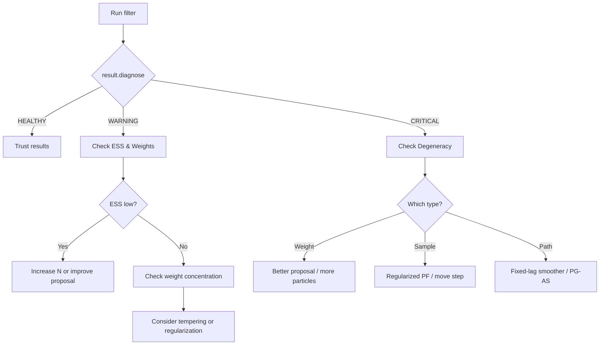

# Diagnostics

!!! info "Quick Reference"
    | | |
    |---|---|
    | **Quick Check** | `result.diagnose()` |
    | **Import** | `from particlefilterbox.diagnostics import ...` |
    | **Categories** | Filter, MCMC, Model |
    | **Philosophy** | Automatic alerts + manual deep-dives |

## Overview

Particle methods are **stochastic approximations** --- their output quality depends on the interaction between the model, the proposal, the number of particles, and the resampling scheme. Unlike deterministic methods, you cannot simply check whether the algorithm converged; you must actively **monitor** the approximation quality throughout the run.

**particlefilterbox** provides a layered diagnostic system:

1. **Automatic diagnostics** --- built into every filter run, with configurable alert thresholds
2. **Post-hoc diagnostics** --- detailed analysis classes for deep investigation
3. **Comparative diagnostics** --- tools for comparing filters, tuning parameters, and validating against known solutions

---

## Quick Diagnostic

Every filter result supports the `diagnose()` method, which returns a summary of all key diagnostics in a single call:

```python
from particlefilterbox import BootstrapPF, PFConfig
from particlefilterbox.models import StochasticVolatility

model = StochasticVolatility(variant="basic")
config = PFConfig(n_particles=2000, seed=42)
pf = BootstrapPF(model, config)

states, obs = model.simulate(n_obs=200, rng=config.rng)
result = pf.filter(obs)

# One-line diagnostic summary
report = result.diagnose()
print(report)
```

```text
=== Particle Filter Diagnostic Report ===
ESS:         mean=1384.2, min=312.1, alarm_rate=0.03
Weights:     max_concentration=0.12, entropy=7.21
Degeneracy:  unique_ratio=0.89, path_coalescence=OK
Resampling:  156/200 steps (78.0%)
Verdict:     HEALTHY
```

!!! tip "When to dig deeper"
    The quick diagnostic is a **screening tool**. If the verdict is `HEALTHY`, you can usually trust the results. If it reports `WARNING` or `CRITICAL`, use the specialized diagnostic classes below to understand *why* and *what to do about it*.

---

## Diagnostic Categories

### Filter Diagnostics

These diagnostics assess the quality of the particle approximation during filtering.

<div class="grid cards" markdown>

-   :material-chart-line: **[ESS Diagnostic](ess-diagnostic.md)**

    ---

    Effective Sample Size over time, alarm rates, and the relationship between ESS and estimation quality.

-   :material-weight: **[Weight Diagnostic](weight-diagnostic.md)**

    ---

    Weight distribution analysis: histograms, concentration curves, entropy, and log-weight stability.

-   :material-alert-circle: **[Degeneracy Diagnostic](degeneracy.md)**

    ---

    Detects weight degeneracy, sample impoverishment, and path coalescence. Three distinct failure modes with specific remedies.

-   :material-target: **[Convergence Diagnostic](convergence.md)**

    ---

    N-study for particle count selection, inter-run variance, and asymptotic variance estimation.

</div>

### MCMC Diagnostics

These diagnostics are specific to PMCMC methods (PMMH, Particle Gibbs, PG-AS).

<div class="grid cards" markdown>

-   :material-chart-scatter-plot: **[MCMC Convergence](mcmc-convergence.md)**

    ---

    Trace plots, $\hat{R}$ statistic, and effective sample size for MCMC chains.

-   :material-percent: **[Acceptance Rate](acceptance-rate.md)**

    ---

    Monitoring and tuning acceptance rates for Metropolis-Hastings steps.

-   :material-shuffle-variant: **[Mixing](mixing.md)**

    ---

    Autocorrelation analysis and mixing diagnostics for PMCMC chains.

</div>

### Model Diagnostics

These diagnostics assess whether the model specification is appropriate for the data.

<div class="grid cards" markdown>

-   :material-compare-horizontal: **[Filter Comparison](filter-comparison.md)**

    ---

    Compare multiple filters on the same data with standardized metrics.

-   :material-check-decagram: **[Kalman Validation](kalman-validation.md)**

    ---

    Validate particle filter output against the exact Kalman filter on linear-Gaussian models.

-   :material-chart-bell-curve: **[Predictive Checks](predictive-checks.md)**

    ---

    Posterior and prior predictive checks for model adequacy.

-   :material-calculator: **[Marginal Likelihood](marginal-likelihood.md)**

    ---

    Estimate and compare marginal likelihoods for model selection.

</div>

---

## Diagnostic Workflow

A recommended workflow for diagnosing particle filter issues:



!!! warning "Diagnostics are necessary, not sufficient"
    Good diagnostic values do not *guarantee* correct inference. They indicate that the particle approximation is behaving well *given the model*. If the model itself is misspecified, the filter can appear healthy while producing biased estimates. Always combine filter diagnostics with **model diagnostics** (predictive checks, marginal likelihood comparison).

---

## Configuration

All diagnostic classes accept consistent configuration parameters:

```python
from particlefilterbox.diagnostics import (
    ESSDiagnostic,
    WeightDiagnostic,
    ConvergenceDiagnostic,
    DegeneracyDiagnostic,
)

# All diagnostics are constructed from a filter result
diag_ess = ESSDiagnostic(result)
diag_weight = WeightDiagnostic(result)
diag_degen = DegeneracyDiagnostic(result)

# Convergence diagnostic needs model + observations
diag_conv = ConvergenceDiagnostic(model, observations)

# Every diagnostic supports .summary() and .plot()
print(diag_ess.summary())
diag_weight.plot()
```

---

## Quick Diagnostic Reference

!!! abstract "Diagnostic → What It Indicates → Action"

    | Diagnostic | What It Indicates | Recommended Action |
    |-----------|-------------------|-------------------|
    | [ESS low](ess-diagnostic.md) | Proposal poorly matched to likelihood | Improve proposal ([Guided PF](../user-guide/filters/guided.md), [Auxiliary PF](../user-guide/filters/auxiliary.md)) or increase $N$ |
    | [High weight concentration](weight-diagnostic.md) | Few particles dominate the approximation | Switch to [SIR](../user-guide/filters/sir.md) or [Regularized PF](../user-guide/filters/regularized.md); consider [tempering](../user-guide/smc/tempering.md) |
    | [Weight degeneracy](degeneracy.md) | One particle carries all weight | Resample more frequently; use a better proposal |
    | [Sample impoverishment](degeneracy.md) | All particles are copies of few ancestors | Resample *less* frequently; use [Regularized PF](../user-guide/filters/regularized.md) or MCMC moves |
    | [Path degeneracy](degeneracy.md) | Trajectories coalesce into one ancestor | Use [FFBSm/FFBSi](../user-guide/smoothers/index.md) or [PG-AS](../user-guide/pmcmc/pgas.md) |
    | [Slow convergence](convergence.md) | $N$ too small for reliable inference | Run an [N-study](convergence.md#the-n-study); consider [GPU acceleration](../acceleration/gpu.md) for large $N$ |
    | [$\hat{R} > 1.05$](mcmc-convergence.md) | MCMC chains not converged | Run longer; tune [PMMH](../user-guide/pmcmc/pmmh.md) proposal; try [PGAS](../user-guide/pmcmc/pgas.md) |
    | [Low acceptance rate](acceptance-rate.md) | PMMH proposals rejected too often | Increase $N$, reduce proposal scale, or use [adaptive PMMH](../user-guide/pmcmc/tuning.md) |
    | [Poor mixing / high IAT](mixing.md) | Chain explores posterior slowly | Reparameterize; switch between [PMMH](../user-guide/pmcmc/pmmh.md) and [PGAS](../user-guide/pmcmc/pgas.md) |
    | [High kurtosis in PPC](predictive-checks.md) | Model tails too light | Use heavier-tailed observation model |
    | [Low marginal likelihood](marginal-likelihood.md) | Model fits data poorly relative to alternatives | Consider alternative [models](../user-guide/models/index.md) |
    | [PF ≠ Kalman](kalman-validation.md) | Implementation bug in the particle filter | Debug filter loop; check resampling and weight computation |

---

## See Also

- **User Guide**: [Filters](../user-guide/filters/index.md) · [PMCMC](../user-guide/pmcmc/index.md) · [Smoothers](../user-guide/smoothers/index.md) · [Experiment Framework](../user-guide/experiment.md)
- **Core Components**: [ESS](../user-guide/core/ess.md) · [Resampling](../user-guide/core/resampling.md) · [ParticleCloud](../user-guide/core/particle-cloud.md)
- **Theory**: [Convergence Theory](../theory/convergence-theory.md) · [Particle Filter Theory](../theory/particle-filter-theory.md) · [PMCMC Theory](../theory/pmcmc-theory.md)
- **Acceleration**: [Overview](../acceleration/index.md) · [GPU](../acceleration/gpu.md) · [Numba](../acceleration/numba.md) --- when diagnostics suggest you need more particles, acceleration helps scale up $N$
