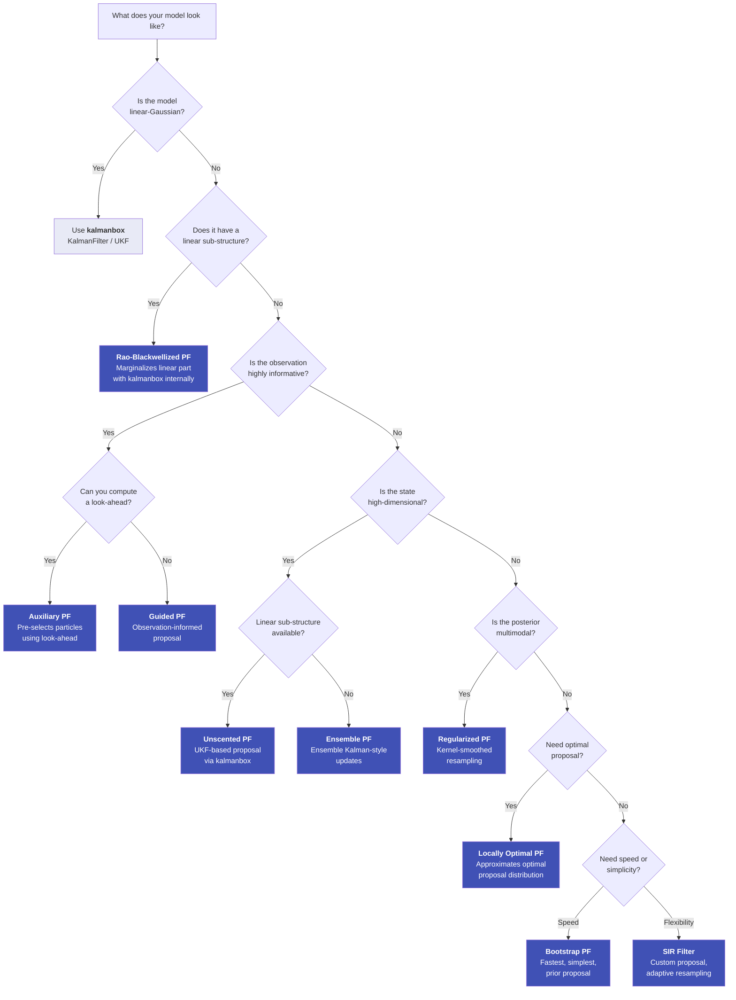

# Choosing a Filter

particlefilterbox provides **9 particle filter variants**, each suited to different model structures and computational constraints. This guide helps you pick the right one -- starting from a decision tree, through a detailed comparison table, to concrete scenarios with code.

!!! tip "Start simple"
    When in doubt, begin with the **Bootstrap Particle Filter**. It requires no
    tuning and works for any model. Upgrade to a more sophisticated filter only
    when diagnostics (low ESS, high variance) indicate the need.

---

## Decision Tree

Use this flowchart to narrow down your filter choice based on model characteristics:



---

## Filter Comparison Table

| Filter | Complexity | $N$ particles | Proposal | Resampling | kalmanbox? | GPU? | Best for |
|---|---|---|---|---|---|---|---|
| **[Bootstrap PF](../user-guide/filters/bootstrap.md)** | :material-speedometer-slow: Low | 1000--5000 | Prior $p(x_t \mid x_{t-1})$ | Systematic | No | Yes | Simple models, prototyping |
| **[SIR Filter](../user-guide/filters/sir.md)** | :material-speedometer-slow: Low | 1000--5000 | Custom / prior | Adaptive | No | Yes | General-purpose filtering |
| **[Auxiliary PF](../user-guide/filters/sir.md)** | :material-speedometer-medium: Medium | 500--2000 | Look-ahead adapted | Two-stage | No | Yes | Informative observations |
| **[Guided PF](../user-guide/filters/guided.md)** | :material-speedometer-medium: Medium | 500--2000 | Observation-informed | Systematic | No | Yes | Precise measurements |
| **[Rao-Blackwellized PF](../user-guide/filters/rbpf.md)** | :material-speedometer-medium: Medium | 200--1000 | Prior + Kalman | Systematic | **Yes** | Partial | Partially linear models |
| **[Unscented PF](../user-guide/filters/upf.md)** | :material-speedometer: High | 200--1000 | UKF approximation | Systematic | **Yes** | Partial | High-dimensional states |
| **[Locally Optimal PF](../user-guide/filters/locally-optimal.md)** | :material-speedometer: High | 200--800 | Optimal approximation | Systematic | No | No | Minimum weight variance |
| **[Regularized PF](../user-guide/filters/regularized.md)** | :material-speedometer-medium: Medium | 500--2000 | Prior | Kernel-smoothed | No | Yes | Multimodal posteriors |
| **[Ensemble PF](../user-guide/filters/ensemble.md)** | :material-speedometer-medium: Medium | 50--500 | Ensemble Kalman | None (EnKF-style) | No | Yes | Very high-dimensional |

!!! info "Reading the table"
    - **$N$ particles**: typical range for good performance. Better proposals (UPF, RBPF)
      need fewer particles for the same accuracy.
    - **kalmanbox?**: filters that integrate with [kalmanbox](https://github.com/nodesecon/kalmanbox)
      for their internal Kalman operations.
    - **GPU?**: whether the filter supports GPU acceleration via CuPy/JAX.

---

## Use-Case Scenarios

### Scenario 1: Stochastic Volatility

A classic univariate SV model where log-volatility follows an AR(1) process:

$$
h_t = \mu + \phi(h_{t-1} - \mu) + \sigma_\eta \eta_t, \quad y_t = \exp(h_t / 2) \, \varepsilon_t
$$

The observation is **moderately informative** -- when volatility is low, the likelihood becomes concentrated.

**Recommended**: SIR Filter or Auxiliary PF

```python
from particlefilterbox.models import SVModel
from particlefilterbox.filters import SIRFilter, AuxiliaryFilter

model = SVModel(mu=0.0, phi=0.97, sigma_eta=0.15)

# Option A: SIR with adaptive resampling
sir = SIRFilter(model=model, n_particles=2000)
results_sir = sir.filter(returns)

# Option B: Auxiliary PF for better ESS
apf = AuxiliaryFilter(model=model, n_particles=1000)
results_apf = apf.filter(returns)

print(f"SIR mean ESS: {results_sir.ess.mean():.0f} / 2000")
print(f"APF mean ESS: {results_apf.ess.mean():.0f} / 1000")
```

!!! tip "When to upgrade from SIR to APF"
    If your mean ESS drops below 50% of $N$, the Auxiliary PF's look-ahead
    mechanism can recover efficiency without increasing the particle count.

---

### Scenario 2: DSGE with Linear Component

A DSGE model where some state variables follow linear-Gaussian dynamics (e.g., technology shock) while others are nonlinear (e.g., occasionally binding constraints).

**Recommended**: Rao-Blackwellized PF (RBPF)

```python
from particlefilterbox.models import DSGEModel
from particlefilterbox.filters import RBPFFilter

model = DSGEModel(
    linear_states=['technology', 'monetary_policy'],
    nonlinear_states=['zlb_indicator'],
    params={'rho_a': 0.95, 'sigma_a': 0.01}
)

# RBPF marginalizes the linear states analytically
rbpf = RBPFFilter(
    model=model,
    n_particles=500,          # fewer particles needed!
    kalman_backend='kalmanbox' # uses kalmanbox internally
)
results = rbpf.filter(macro_data)

# Access both particle and Kalman estimates
print(f"Nonlinear state (particles): {results.mean[:, 0]}")
print(f"Linear state (Kalman): {results.kalman_mean[:, 0]}")
```

---

### Scenario 3: Jump-Diffusion

A model where the state includes sudden jumps (e.g., Merton's jump-diffusion for asset prices):

$$
x_t = x_{t-1} + \mu \Delta t + \sigma \sqrt{\Delta t}\, \varepsilon_t + J_t \cdot Z_t
$$

where $J_t \sim \text{Bernoulli}(\lambda \Delta t)$ and $Z_t \sim \mathcal{N}(\mu_J, \sigma_J^2)$.

**Recommended**: Auxiliary PF or Guided PF -- the look-ahead helps capture rare jump events.

```python
from particlefilterbox.models import JumpDiffusionModel
from particlefilterbox.filters import AuxiliaryFilter

model = JumpDiffusionModel(
    mu=0.05, sigma=0.2,
    jump_intensity=0.1,
    jump_mean=-0.02, jump_std=0.05
)

apf = AuxiliaryFilter(model=model, n_particles=2000)
results = apf.filter(prices)
```

---

### Scenario 4: High-Dimensional State

Models with state dimension $d \geq 10$, such as spatial models, large VARs, or multi-sector DSGE.

**Recommended**: Unscented PF (if sub-structure exists) or Ensemble PF (for very high dimensions).

```python
from particlefilterbox.filters import UnscentedPF, EnsembleFilter

# UPF: good for d ~ 10-50, uses UKF proposal via kalmanbox
upf = UnscentedPF(
    model=model,
    n_particles=500,
    kalman_backend='kalmanbox'
)
results_upf = upf.filter(observations)

# Ensemble PF: scales to d ~ 100+, uses ensemble Kalman updates
epf = EnsembleFilter(
    model=model,
    n_ensemble=200  # ensemble members, not particles
)
results_epf = epf.filter(observations)
```

!!! warning "Curse of dimensionality"
    Standard particle filters suffer exponentially with dimension. For $d > 5$,
    strongly consider RBPF (to reduce effective dimension) or UPF/Ensemble PF
    (to exploit local Gaussian structure).

---

### Scenario 5: Real-Time Tracking

Applications requiring low-latency filtering (e.g., robot localization, online signal processing) where speed matters more than optimal efficiency.

**Recommended**: Bootstrap PF -- minimal overhead per step, easily parallelizable.

```python
from particlefilterbox.filters import BootstrapFilter

model = TrackingModel(process_noise=0.1, obs_noise=1.0)
bpf = BootstrapFilter(model=model, n_particles=1000)

# Stream observations one at a time
for y_t in sensor_stream:
    cloud = bpf.step(y_t)
    estimate = cloud.mean
    # Act on the estimate immediately
    send_control_signal(estimate)
```

---

### Scenario 6: Multimodal Posterior

When the filtering distribution is multimodal (e.g., target tracking with data association ambiguity, regime-switching models), standard resampling collapses to a single mode.

**Recommended**: Regularized PF -- kernel-smoothed resampling preserves multimodality.

```python
from particlefilterbox.filters import RegularizedFilter

model = RegimeSwitchingModel(n_regimes=3)
rpf = RegularizedFilter(
    model=model,
    n_particles=3000,
    bandwidth='silverman'  # automatic kernel bandwidth
)
results = rpf.filter(observations)

# Check if posterior is multimodal
for t in [50, 100, 150]:
    cloud = results.cloud_at(t)
    print(f"Step {t}: {cloud.n_modes()} modes detected")
```

---

## Performance Tips

!!! tip "Start with Bootstrap, then upgrade"
    The Bootstrap PF is your **baseline**. Run it first, check the ESS, and only
    switch to a more complex filter if the ESS is consistently low. This avoids
    premature complexity and gives you a benchmark for comparison.

!!! tip "Monitor ESS to choose your proposal"
    The Effective Sample Size tells you how well the proposal matches the posterior:

    | Mean ESS / N | Diagnosis | Action |
    |---|---|---|
    | > 70% | Proposal is well-matched | Keep current filter |
    | 40--70% | Moderate mismatch | Consider APF or Guided PF |
    | 20--40% | Poor proposal | Switch to UPF or RBPF |
    | < 20% | Severe degeneracy | Rethink model or use Locally Optimal PF |

!!! tip "Use RBPF whenever possible"
    If **any** part of your state-space is linear-Gaussian, Rao-Blackwellization
    removes it from the particle approximation. This reduces the effective dimension
    and can dramatically cut the number of particles needed:

    $$
    N_{\text{RBPF}} \ll N_{\text{standard}} \quad \text{when } d_{\text{linear}} \gg d_{\text{nonlinear}}
    $$

!!! tip "Scale with Numba and GPU"
    When you need more particles rather than a better proposal:

    ```python
    # Numba JIT -- 5-20x speedup, no code changes
    bpf = BootstrapFilter(model=model, n_particles=10000, backend='numba')

    # GPU via CuPy -- 50-100x for large N
    bpf = BootstrapFilter(model=model, n_particles=100000, backend='cupy')
    ```

    See the [Acceleration Guide](../acceleration/index.md) for details.

---

## Integration with kalmanbox

Two filters in particlefilterbox directly leverage [kalmanbox](https://github.com/nodesecon/kalmanbox) for their internal Kalman operations, combining the strengths of both libraries.

### RBPF: Kalman Filter for the Linear Sub-Structure

The Rao-Blackwellized Particle Filter splits the state into **nonlinear** and **linear** components. Each particle carries its own Kalman filter instance (from kalmanbox) that tracks the linear states analytically:

$$
\underbrace{x_t^{\text{nl}}}_{\text{particles}} \quad + \quad \underbrace{x_t^{\text{lin}} \mid x_{1:t}^{\text{nl}}}_{\text{kalmanbox KalmanFilter}}
$$

This means the particle filter only needs to approximate the nonlinear part, while the linear part is solved exactly.

```python
from particlefilterbox.filters import RBPFFilter

# Define a model with both linear and nonlinear components
rbpf = RBPFFilter(
    model=model,
    n_particles=500,
    kalman_backend='kalmanbox'  # uses kalmanbox.KalmanFilter
)
results = rbpf.filter(observations)

# Each particle has an associated Kalman state
for i in range(5):
    kf_state = results.kalman_states[i]
    print(f"Particle {i}: linear mean = {kf_state.mean}, cov = {kf_state.cov}")
```

### UPF: Unscented Kalman Filter as Proposal

The Unscented Particle Filter uses kalmanbox's `UnscentedKalmanFilter` to construct a locally optimal Gaussian proposal for each particle:

$$
q(x_t \mid x_{t-1}^{(i)}, y_t) = \mathcal{N}\!\left(\hat{x}_t^{(i)}, P_t^{(i)}\right)
$$

where $\hat{x}_t^{(i)}$ and $P_t^{(i)}$ come from running a UKF update centered at each particle.

```python
from particlefilterbox.filters import UnscentedPF

upf = UnscentedPF(
    model=model,
    n_particles=500,
    kalman_backend='kalmanbox',  # uses kalmanbox.UnscentedKalmanFilter
    alpha=1e-3,                  # UKF sigma point parameters
    beta=2.0,
    kappa=0.0
)
results = upf.filter(observations)
```

!!! info "Installing kalmanbox"
    kalmanbox is an optional dependency. Install it alongside particlefilterbox:

    ```bash
    pip install particlefilterbox[kalman]
    # or
    pip install particlefilterbox kalmanbox
    ```

    Without kalmanbox, RBPF and UPF fall back to built-in minimal Kalman implementations.

---

## Quick Reference

| If your model is... | Use this filter | Why |
|---|---|---|
| Simple and fast enough | [Bootstrap PF](../user-guide/filters/bootstrap.md) | No tuning, fastest per step |
| General nonlinear | [SIR Filter](../user-guide/filters/sir.md) | Flexible proposal, adaptive resampling |
| Observation-dominated | [Auxiliary PF](../user-guide/filters/sir.md) | Look-ahead reduces weight variance |
| Partially linear | [RBPF](../user-guide/filters/rbpf.md) | Exact Kalman for linear part |
| High-dimensional | [UPF](../user-guide/filters/upf.md) / [Ensemble PF](../user-guide/filters/ensemble.md) | Better scaling with dimension |
| Multimodal | [Regularized PF](../user-guide/filters/regularized.md) | Kernel smoothing preserves modes |
| Needs best proposal | [Locally Optimal PF](../user-guide/filters/locally-optimal.md) | Minimizes weight variance |
| Precise observations | [Guided PF](../user-guide/filters/guided.md) | Observation-informed proposal |

---

## What's Next?

<div class="grid cards" markdown>

- :material-scatter-plot: **[Filters User Guide](../user-guide/filters/index.md)**

    Deep dive into each filter's algorithm, parameters, and advanced usage

- :material-school: **[Tutorials](../tutorials/index.md)**

    Step-by-step walkthroughs for stochastic volatility, DSGE, jump-diffusion, and more

- :material-chart-line: **[Diagnostics](../diagnostics/index.md)**

    Monitor ESS, weight distributions, and convergence to validate your filter choice

- :material-book-open-variant: **[Theory](../theory/index.md)**

    Mathematical foundations: convergence rates, optimal proposals, Rao-Blackwellization

</div>
