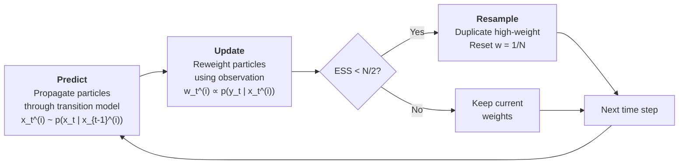
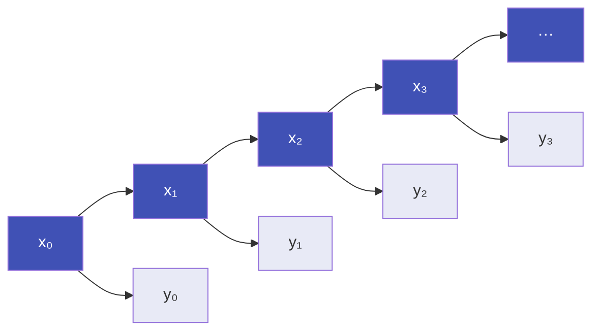

# Core Concepts

This page covers the fundamental building blocks of Sequential Monte Carlo (SMC) methods. Every filter, smoother, and PMCMC algorithm in particlefilterbox builds on these six concepts. Understanding them will make the rest of the library intuitive.

---

## ParticleCloud: The Central Data Structure

At the heart of particlefilterbox is the **ParticleCloud** -- a weighted collection of samples (particles) that represents a probability distribution.

A ParticleCloud consists of $N$ weighted particles:

$$
\left\{ x^{(i)}, \, w^{(i)} \right\}_{i=1}^{N}
$$

where $x^{(i)}$ is the $i$-th particle (a point in state space) and $w^{(i)}$ is its normalized weight. Together, they approximate a target distribution $\pi(x)$ as:

$$
\hat{\pi}(x) = \sum_{i=1}^{N} w^{(i)} \, \delta_{x^{(i)}}(x)
$$

This is a **weighted empirical measure**: instead of storing a parametric form (like a mean and covariance), we store a cloud of points with varying importance.

### API Overview

```python
from particlefilterbox.core import ParticleCloud

# Create a cloud with 1000 particles in 1D
cloud = ParticleCloud(n_particles=1000, dim=1)

# Access particles and weights
cloud.particles          # (1000, 1) array of particle locations
cloud.weights            # (1000,) array of normalized weights
cloud.log_weights        # (1000,) array of log-weights

# Summary statistics
cloud.mean               # weighted mean of the cloud
cloud.var                # weighted variance
cloud.quantile(0.05)     # 5th percentile
cloud.quantile(0.95)     # 95th percentile

# Diagnostics
cloud.ess                # Effective Sample Size
cloud.normalized_weights # normalized weights (sum to 1)
```

!!! info "Compare with kalmanbox"
    In [kalmanbox](https://github.com/nodesecon/kalmanbox), the filtered state
    at each time step is represented by a **mean vector** $\hat{x}_t$ and a
    **covariance matrix** $P_t$ -- a Gaussian summary.

    In particlefilterbox, the filtered state is a **ParticleCloud**: a set of
    weighted samples that can represent *any* distribution, including multimodal,
    skewed, and heavy-tailed posteriors.

    | | kalmanbox | particlefilterbox |
    |---|---|---|
    | **Representation** | $\hat{x}_t, P_t$ (Gaussian) | $\{x^{(i)}, w^{(i)}\}$ (empirical) |
    | **Shape constraint** | Unimodal, symmetric | Any shape |
    | **Computation** | $O(d^3)$ matrix operations | $O(N)$ per particle |
    | **Accuracy** | Exact for linear-Gaussian | Converges as $N \to \infty$ |

---

## Weights and Normalization

Each particle carries a **weight** that measures how well it explains the observed data. Weights are the mechanism through which the particle cloud concentrates mass in high-probability regions.

### Log-Weights for Numerical Stability

In practice, we always store **log-weights** rather than raw weights. Likelihood values can be extremely small (e.g., $10^{-300}$), causing underflow in floating-point arithmetic. Log-weights avoid this:

$$
\log w^{(i)} = \log p(y_t \mid x_t^{(i)})
$$

### Normalization

To obtain proper probability weights that sum to 1, we normalize:

$$
\tilde{w}^{(i)} = \frac{\exp(\log w^{(i)})}{\sum_{j=1}^{N} \exp(\log w^{(j)})}
$$

### The Log-Sum-Exp Trick

Direct computation of the denominator causes overflow or underflow. The **log-sum-exp** trick shifts all values by the maximum before exponentiating:

$$
\log \sum_{j=1}^{N} \exp(\log w^{(j)}) = M + \log \sum_{j=1}^{N} \exp(\log w^{(j)} - M)
$$

where $M = \max_j \log w^{(j)}$. After the shift, the largest exponent is $\exp(0) = 1$, preventing overflow. This is handled automatically inside ParticleCloud.

### Interpretation

Weights reflect **relative likelihood**: a particle with weight $w^{(i)} = 0.01$ is ten times more plausible than one with $w^{(j)} = 0.001$, given the current observation. After normalization, each weight is the particle's share of the total probability mass.

```python
import numpy as np
from particlefilterbox.core import ParticleCloud

cloud = ParticleCloud(n_particles=500, dim=1)

# Weights are always normalized internally
print(f"Sum of weights: {np.sum(cloud.normalized_weights):.6f}")  # 1.000000

# Log-weights avoid numerical issues
print(f"Log-weight range: [{cloud.log_weights.min():.2f}, {cloud.log_weights.max():.2f}]")
```

---

## Effective Sample Size (ESS)

Not all particles contribute equally. When a few particles dominate the weight distribution, the cloud is effectively using far fewer than $N$ samples. The **Effective Sample Size** quantifies this.

### Formula

$$
\text{ESS} = \frac{1}{\sum_{i=1}^{N} \left(\tilde{w}^{(i)}\right)^2}
$$

where $\tilde{w}^{(i)}$ are the normalized weights.

### Range and Interpretation

| Condition | ESS | Meaning |
|---|---|---|
| All weights equal | $N$ | Perfect diversity -- every particle contributes equally |
| One weight dominates | $\approx 1$ | Severe degeneracy -- effectively one useful particle |
| Typical threshold | $N/2$ | Below this, resample to restore diversity |

The ESS always satisfies $1 \leq \text{ESS} \leq N$. A value near $N$ means the proposal is well-matched to the posterior; a value near 1 means weight degeneracy has set in.

### Weight Degeneracy Over Time

Without intervention, weights degenerate over time. In a standard particle filter, after several steps the weight distribution becomes increasingly skewed:

```
 Step 1:  ████████████████████████  ESS = 950/1000  (healthy)
 Step 5:  ████████████████░░░░░░░░  ESS = 700/1000  (acceptable)
 Step 20: ████████░░░░░░░░░░░░░░░░  ESS = 350/1000  (resample!)
 Step 50: ██░░░░░░░░░░░░░░░░░░░░░░  ESS =  45/1000  (degenerate)
```

This is why **resampling** is essential -- it resets the weights by duplicating good particles and discarding poor ones.

```python
# Monitor ESS during filtering
results = pf.filter(observations)

print(f"Mean ESS: {np.mean(results.ess):.1f} / {pf.n_particles}")
print(f"Min ESS:  {np.min(results.ess):.1f}")
print(f"Resampled at {np.sum(results.resampled)} / {len(results.ess)} steps")
```

!!! warning "ESS below threshold"
    If the mean ESS is consistently low (e.g., below $N/4$), consider:

    - Increasing `n_particles`
    - Using a better proposal distribution (see [Proposals](#proposal-distributions) below)
    - Switching to the Auxiliary Particle Filter, which pre-adapts to the observation

---

## Resampling

Resampling is the mechanism that combats weight degeneracy. When ESS drops below a threshold, we **redraw** particles from the current cloud with probabilities proportional to their weights, then reset all weights to $1/N$.

### The Predict-Update-Resample Cycle

Every particle filter repeats three steps at each time point:



1. **Predict**: Draw each particle forward using the state transition model
2. **Update**: Assign each particle a weight based on the likelihood of the current observation
3. **Resample** (conditional): If $\text{ESS} < \text{threshold}$, resample to restore diversity

### Resampling Algorithms

particlefilterbox provides four resampling methods, each with different variance and computational properties:

| Method | Variance | Complexity | Description |
|---|---|---|---|
| **Multinomial** | Highest | $O(N \log N)$ | Draw $N$ independent samples from the weight distribution. Simple but noisy. |
| **Systematic** | Low | $O(N)$ | Single random offset $U \sim \text{Uniform}(0, 1/N)$, then evenly-spaced points. Preserves weight structure well. |
| **Stratified** | Low | $O(N)$ | One random draw per stratum $U_i \sim \text{Uniform}((i-1)/N, \, i/N)$. Slightly more variable than systematic. |
| **Residual** | Lowest | $O(N)$ | Deterministically copies $\lfloor N w^{(i)} \rfloor$ particles, then resamples the fractional remainders. Lowest variance overall. |

```python
# Resample with a specific method
cloud.resample(method='systematic')   # recommended default
cloud.resample(method='multinomial')
cloud.resample(method='stratified')
cloud.resample(method='residual')
```

!!! tip "Which resampling method to use?"
    **Systematic resampling** is the default in particlefilterbox and is recommended
    for most applications. It has $O(N)$ complexity, low variance, and is easy to
    implement. Residual resampling has even lower variance but is slightly more
    complex. Multinomial resampling is mainly useful as a baseline for comparison.

### Before and After Resampling

Resampling concentrates particles in high-probability regions:

```
Before resampling (unequal weights):
  Particle 1: ●      w = 0.40   ──┐
  Particle 2: ●      w = 0.05      │
  Particle 3: ●      w = 0.35   ──┐│
  Particle 4: ●      w = 0.02     ││
  Particle 5: ●      w = 0.18   ──┐││
                                   │││
After resampling (equal weights):  │││
  Particle 1: ●      w = 0.20  ◄──┘││  (copy of original 1)
  Particle 2: ●      w = 0.20  ◄───┘│  (copy of original 1)
  Particle 3: ●      w = 0.20  ◄────┘  (copy of original 3)
  Particle 4: ●      w = 0.20  ◄──     (copy of original 3)
  Particle 5: ●      w = 0.20  ◄──     (copy of original 5)
```

Low-weight particles (2 and 4) are eliminated; high-weight particles (1 and 3) are duplicated.

!!! warning "The diversity problem"
    Resampling restores weight uniformity but **destroys particle diversity** --
    after resampling, many particles are copies of each other. Over time, this
    causes **path degeneracy**: all particles trace back to a single ancestor.

    Strategies to mitigate this include:

    - **Jittering**: adding small noise to resampled particles
    - **MCMC moves**: applying a Markov chain step after resampling (used in SMC$^2$)
    - **Rao-Blackwellization**: analytically marginalizing some state components (RBPF)
    - **Better proposals**: reducing the need for resampling in the first place

---

## Proposal Distributions

The **proposal distribution** $q(x_t \mid x_{t-1}, y_t)$ determines how particles are propagated from one time step to the next. The choice of proposal has a direct impact on filter efficiency -- a good proposal generates particles in regions of high posterior probability, reducing weight variance and improving ESS.

### Prior Proposal (Bootstrap)

The simplest choice: propose from the state transition model, ignoring the current observation.

$$
q(x_t \mid x_{t-1}^{(i)}, y_t) = p(x_t \mid x_{t-1}^{(i)})
$$

The importance weights then reduce to the likelihood:

$$
w_t^{(i)} \propto p(y_t \mid x_t^{(i)})
$$

This is what the **Bootstrap Particle Filter** uses. It is easy to implement and works well when the transition model is informative, but it can be highly inefficient when observations are very precise (small observation noise) because proposed particles may land far from the observation.

### Optimal Proposal

The theoretically best proposal incorporates the current observation:

$$
q^*(x_t \mid x_{t-1}^{(i)}, y_t) = p(x_t \mid x_{t-1}^{(i)}, y_t) = \frac{p(y_t \mid x_t) \, p(x_t \mid x_{t-1}^{(i)})}{p(y_t \mid x_{t-1}^{(i)})}
$$

Under this proposal, the importance weights simplify to:

$$
w_t^{(i)} \propto p(y_t \mid x_{t-1}^{(i)}) = \int p(y_t \mid x_t) \, p(x_t \mid x_{t-1}^{(i)}) \, dx_t
$$

The optimal proposal minimizes the variance of the weights conditional on $x_{t-1}^{(i)}$ and $y_t$. However, it is **rarely available in closed form** -- it requires computing the integral above, which is only tractable for specific model classes (e.g., linear-Gaussian sub-structures).

### Locally-Optimal Proposal

When the exact optimal proposal is intractable, we can **approximate** it. Common strategies include:

- **Extended Kalman proposal**: Linearize the model around the predicted state, then use the resulting Gaussian as the proposal. This is what the Unscented Particle Filter (UPF) generalizes.
- **Unscented proposal**: Use the Unscented Kalman Filter equations to compute a Gaussian approximation to $p(x_t \mid x_{t-1}^{(i)}, y_t)$.
- **Laplace approximation**: Find the mode of $p(y_t \mid x_t) p(x_t \mid x_{t-1}^{(i)})$ and use a Gaussian centered there.

!!! info "Compare with kalmanbox"
    The Unscented and Extended Kalman proposals in particlefilterbox build directly
    on the UKF and EKF implementations from kalmanbox. If you have kalmanbox
    installed, particlefilterbox uses its Kalman machinery internally to construct
    these improved proposals.

### Auxiliary Variables and Look-Ahead

The **Auxiliary Particle Filter** takes a different approach: instead of improving the proposal, it adds a **first-stage resampling** step that pre-selects particles likely to explain the current observation *before* propagating them.

This look-ahead mechanism is especially effective when the state can make large jumps or when the observation is highly informative.

### Impact on Efficiency

The relationship between proposal quality and particle count is roughly:

$$
N_{\text{required}} \propto \text{Var}(w_t)
$$

A better proposal (lower weight variance) means **fewer particles** are needed for the same accuracy:

| Proposal | Typical ESS/N | Particles needed for RMSE = 0.1 |
|---|---|---|
| Prior (Bootstrap) | 30--60% | 2000--5000 |
| Locally-optimal (UPF) | 60--85% | 500--1500 |
| Optimal (when available) | 90--99% | 200--500 |

---

## State-Space Model Interface

All particle filters in particlefilterbox operate on **state-space models** (also called hidden Markov models). A state-space model is defined by three components:

### The Three Components

**1. Initial distribution** -- where the state begins:

$$
x_0 \sim p(x_0)
$$

**2. Transition (state) equation** -- how the state evolves:

$$
x_t \sim p(x_t \mid x_{t-1})
$$

**3. Observation (measurement) equation** -- how observations relate to the state:

$$
y_t \sim p(y_t \mid x_t)
$$

Together, these define a generative model for the data:



The states $x_t$ (top) are **hidden** -- we never observe them directly. The observations $y_t$ (bottom) are the data we actually see. The goal of filtering is to infer $p(x_t \mid y_{1:t})$.

### Defining a Custom Model

To use any particle filter in particlefilterbox, define a model by subclassing `StateSpaceModel` and implementing three methods:

```python
from particlefilterbox.models.base import StateSpaceModel
import numpy as np

class MyModel(StateSpaceModel):
    """A simple nonlinear state-space model."""

    def __init__(self, sigma_eta=1.0, sigma_eps=0.5):
        self.sigma_eta = sigma_eta
        self.sigma_eps = sigma_eps

    def initial_distribution(self, n_particles: int) -> np.ndarray:
        """Sample from p(x_0)."""
        return np.random.normal(0, 1, size=(n_particles, 1))

    def transition(self, particles: np.ndarray, t: int) -> np.ndarray:
        """Sample from p(x_t | x_{t-1}).

        Implements: x_t = 0.5 * x_{t-1} + 25 * x_{t-1} / (1 + x_{t-1}^2)
                         + 8 * cos(1.2 * t) + eta_t
        """
        x = particles[:, 0]
        mean = 0.5 * x + 25 * x / (1 + x**2) + 8 * np.cos(1.2 * t)
        new_x = mean + self.sigma_eta * np.random.randn(len(x))
        return new_x.reshape(-1, 1)

    def log_likelihood(self, particles: np.ndarray, observation: float,
                       t: int) -> np.ndarray:
        """Compute log p(y_t | x_t) for each particle."""
        x = particles[:, 0]
        predicted = x**2 / 20
        return -0.5 * ((observation - predicted) / self.sigma_eps)**2
```

Then use it with any filter:

```python
from particlefilterbox.filters.bootstrap import BootstrapFilter

model = MyModel(sigma_eta=1.0, sigma_eps=0.5)
pf = BootstrapFilter(model=model, n_particles=2000)
results = pf.filter(observations)
```

!!! tip "Built-in models"
    particlefilterbox includes several ready-to-use models:

    - `LocalLevelModel` -- random walk plus noise (linear-Gaussian)
    - `SVModel` -- stochastic volatility
    - `JumpDiffusionModel` -- jump-diffusion process
    - `BearingsOnlyModel` -- bearings-only tracking (highly nonlinear)

    See the [Models User Guide](../user-guide/models/index.md) for the full list.

---

## Putting It All Together

These six concepts form a complete picture of how particle filters work:

1. **Define a model** using the `StateSpaceModel` interface (transition, observation, initial)
2. **Initialize a ParticleCloud** by sampling from the initial distribution
3. **Predict**: propagate particles through the transition model (using a **proposal distribution**)
4. **Update**: compute **weights** based on the observation likelihood
5. **Monitor ESS** to detect weight degeneracy
6. **Resample** when ESS drops below the threshold, then repeat from step 3

---

## What's Next?

<div class="grid cards" markdown>

- :material-map-marker-path: **[Choosing a Filter](choosing-filter.md)**

    Decision guide for selecting the right algorithm based on your model characteristics

- :material-scatter-plot: **[Filters User Guide](../user-guide/filters/index.md)**

    Deep dive into Bootstrap PF, SIR, APF, RBPF, UPF, and more

- :material-school: **[Tutorials](../tutorials/index.md)**

    Step-by-step walkthroughs for stochastic volatility, DSGE models, and more

</div>
