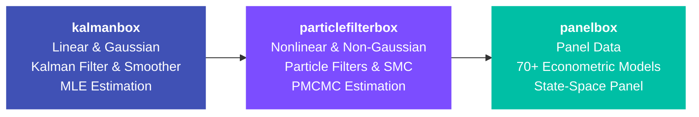

<div class="home-hero" markdown>

# :material-scatter-plot: particlefilterbox

**Sequential Monte Carlo for Nonlinear State-Space Models**

</div>

The natural extension of [kalmanbox](https://github.com/nodesecon/kalmanbox) for models where linearity and Gaussianity break down. particlefilterbox provides particle filters, smoothers, SMC samplers, and Particle MCMC --- everything you need for state estimation and parameter inference in nonlinear, non-Gaussian state-space models.

[](https://pypi.org/project/particlefilterbox/)
[](https://pypi.org/project/particlefilterbox/)
[](https://opensource.org/licenses/MIT)

10+ particle filters | 4 smoothers | 5 SMC methods | 5 PMCMC algorithms | 8+ pre-built models

---

## The Particle Filter in a Nutshell

Given a nonlinear state-space model:

$$
x_t = f(x_{t-1}, u_t), \qquad y_t = g(x_t, v_t)
$$

where $f$ and $g$ can be **arbitrary nonlinear functions**, the particle filter approximates the filtering distribution using a weighted set of $N$ particles:

$$
p(x_t \mid y_{1:t}) \approx \sum_{i=1}^{N} w_t^{(i)} \, \delta_{x_t^{(i)}}(x_t), \qquad \sum_{i=1}^{N} w_t^{(i)} = 1
$$

The **Bootstrap Particle Filter** cycles through three steps at each time $t$:

1. **Propagate**: $x_t^{(i)} \sim p(x_t \mid x_{t-1}^{(i)})$
2. **Weight**: $\tilde{w}_t^{(i)} = p(y_t \mid x_t^{(i)})$
3. **Resample**: select particles proportional to $\tilde{w}_t^{(i)}$

particlefilterbox implements this and many more sophisticated variants.

---

## What's Inside

<div class="grid cards" markdown>

-   :material-scatter-plot: **Particle Filters**

    ---

    Bootstrap, SIR, Auxiliary, Rao-Blackwellized, Unscented, Regularized, Ensemble, Guided, Locally Optimal, and more

    [:octicons-arrow-right-24: Filters Guide](user-guide/filters/index.md)

-   :material-chart-timeline: **Smoothers**

    ---

    Forward-Filtering Backward-Smoothing (FFBSm), FFBSi, Two-Filter, Fixed-Lag

    [:octicons-arrow-right-24: Smoothers Guide](user-guide/smoothers/index.md)

-   :material-cube-outline: **SMC Methods**

    ---

    SMC Sampler, SMC^2^, IBIS, Waste-Free SMC, SMC Tempering

    [:octicons-arrow-right-24: SMC Guide](user-guide/smc/index.md)

-   :material-sync: **PMCMC**

    ---

    PMMH, Particle Gibbs, PG-AS, Conditional SMC, SMC^2^ Online

    [:octicons-arrow-right-24: PMCMC Guide](user-guide/pmcmc/index.md)

-   :material-package-variant: **Pre-built Models**

    ---

    Stochastic Volatility, DSGE, Jump-Diffusion, Regime-Switching, Count Data, Bounded, Mixture, Continuous-Time

    [:octicons-arrow-right-24: Models Guide](user-guide/models/index.md)

-   :material-lightning-bolt: **Acceleration**

    ---

    Numba JIT compilation, GPU support (CuPy/JAX), parallel particle processing, adaptive N

    [:octicons-arrow-right-24: Acceleration Guide](acceleration/index.md)

</div>

---

## Ecosystem

particlefilterbox is part of the **NodeSEcon** econometric modeling stack, extending the linear state-space tools of kalmanbox into the nonlinear domain:



**kalmanbox** handles the linear-Gaussian case with the Kalman filter. When your model has nonlinear dynamics, stochastic volatility, regime switches, or non-Gaussian noise, **particlefilterbox** takes over with particle-based methods. Results from both feed into **panelbox** for panel-level analysis.

---

## Quick Start

=== "Basic"

    ```python
    from particlefilterbox.models.sv import SVModel
    from particlefilterbox.filters.bootstrap import BootstrapFilter

    # Define a stochastic volatility model
    model = SVModel(mu=0.0, phi=0.97, sigma_eta=0.15)

    # Run Bootstrap Particle Filter
    pf = BootstrapFilter(model=model, n_particles=1000)
    results = pf.filter(observations)

    # Filtered log-volatility estimate
    print(f"Final state: {results.filtered_mean[-1]:.4f}")
    ```

=== "With kalmanbox"

    ```python
    from kalmanbox import LocalLevel
    from particlefilterbox.models.sv import SVModel
    from particlefilterbox.filters.bootstrap import BootstrapFilter

    # Linear regime: use kalmanbox
    ll = LocalLevel(calm_period_data)
    linear_results = ll.fit()

    # Volatile regime: switch to particlefilterbox
    sv = SVModel(mu=0.0, phi=0.97, sigma_eta=0.15)
    pf = BootstrapFilter(model=sv, n_particles=2000)
    nonlinear_results = pf.filter(volatile_period_data)
    ```

=== "PMCMC Estimation"

    ```python
    from particlefilterbox.models.sv import SVModel
    from particlefilterbox.pmcmc.pmmh import PMMH

    # Estimate SV parameters via Particle Marginal MH
    model = SVModel()
    sampler = PMMH(
        model=model,
        n_particles=500,
        n_iterations=10_000,
        priors={"mu": ("normal", 0, 1),
                "phi": ("beta", 20, 1.5),
                "sigma_eta": ("half_normal", 0.5)}
    )
    chains = sampler.run(observations)
    print(chains.summary())  # Posterior means, credible intervals, R-hat
    ```

---

## When to Use particlefilterbox vs kalmanbox

| Criterion | **kalmanbox** | **particlefilterbox** |
|:----------|:-------------:|:---------------------:|
| **Dynamics** | Linear ($x_t = F x_{t-1} + \eta_t$) | Nonlinear ($x_t = f(x_{t-1}, \eta_t)$) |
| **Noise** | Gaussian | Any distribution |
| **Method** | Kalman Filter (exact) | Particle Filter (Monte Carlo) |
| **Estimation** | MLE (analytic gradient) | PMCMC / SMC^2^ (simulation-based) |
| **Speed** | Very fast ($O(d^3)$) | Slower ($O(N \cdot d)$, $N$ = particles) |
| **Models** | Local Level, BSM, TVP, ARIMA | SV, DSGE, Jump-Diffusion, Regime |
| **Smoothing** | Kalman Smoother (exact) | FFBSm, FFBSi, Two-Filter |
| **Missing data** | Built-in | Built-in |
| **Best for** | Linear-Gaussian models | Everything else |

!!! tip "Rule of thumb"
    Start with **kalmanbox**. If your model has nonlinear transitions, non-Gaussian noise, or stochastic volatility, switch to **particlefilterbox**. You can even use the Rao-Blackwellized Particle Filter to combine both: Kalman updates for the linear sub-state, particles for the nonlinear part.

---

## Installation

```bash
pip install particlefilterbox

# With visualization support
pip install particlefilterbox[viz]

# Full installation (viz + CLI + GPU)
pip install particlefilterbox[all]
```

See the [Installation Guide](getting-started/installation.md) for detailed instructions.

---

## Explore the Documentation

<div class="grid cards" markdown>

-   :material-rocket-launch: **Getting Started**

    ---

    Install and run your first particle filter in 5 minutes

    [:octicons-arrow-right-24: Getting Started](getting-started/index.md)

-   :material-book-open-variant: **User Guide**

    ---

    In-depth guides for filters, smoothers, SMC, and PMCMC

    [:octicons-arrow-right-24: User Guide](user-guide/index.md)

-   :material-sigma: **Theory**

    ---

    Mathematical foundations of SMC and particle filtering

    [:octicons-arrow-right-24: Theory](theory/index.md)

-   :material-stethoscope: **Diagnostics**

    ---

    ESS, weight analysis, convergence, and degeneracy checks

    [:octicons-arrow-right-24: Diagnostics](diagnostics/index.md)

-   :material-notebook: **Tutorials**

    ---

    Step-by-step walkthroughs from basics to advanced workflows

    [:octicons-arrow-right-24: Tutorials](tutorials/index.md)

-   :material-code-tags: **API Reference**

    ---

    Complete technical reference for all classes and functions

    [:octicons-arrow-right-24: API Reference](api/index.md)

</div>

---

## CLI

```bash
pfbox filter data.csv --model sv --n-particles 1000 --plot
pfbox estimate data.csv --model sv --method pmmh --n-iterations 5000
pfbox compare data.csv --models sv,local_level --n-particles 2000
pfbox simulate --model sv --n-obs 500 --seed 42
```

---

## Citation

If you use particlefilterbox in academic research, please cite:

```bibtex
@software{particlefilterbox2026,
  title = {particlefilterbox: Sequential Monte Carlo for Nonlinear State-Space Models},
  author = {NodeSEcon Development Team},
  year = {2026},
  url = {https://github.com/nodesecon/particlefilterbox}
}
```

---

## References

- Doucet, A. & Johansen, A.M. (2011). *A tutorial on particle filtering and smoothing: Fifteen years later*.
- Andrieu, C., Doucet, A. & Holenstein, R. (2010). *Particle Markov chain Monte Carlo methods*. JRSS-B.
- Del Moral, P., Doucet, A. & Jasra, A. (2006). *Sequential Monte Carlo samplers*. JRSS-B.
- Chopin, N. & Papaspiliopoulos, O. (2020). *An Introduction to Sequential Monte Carlo*. Springer.
