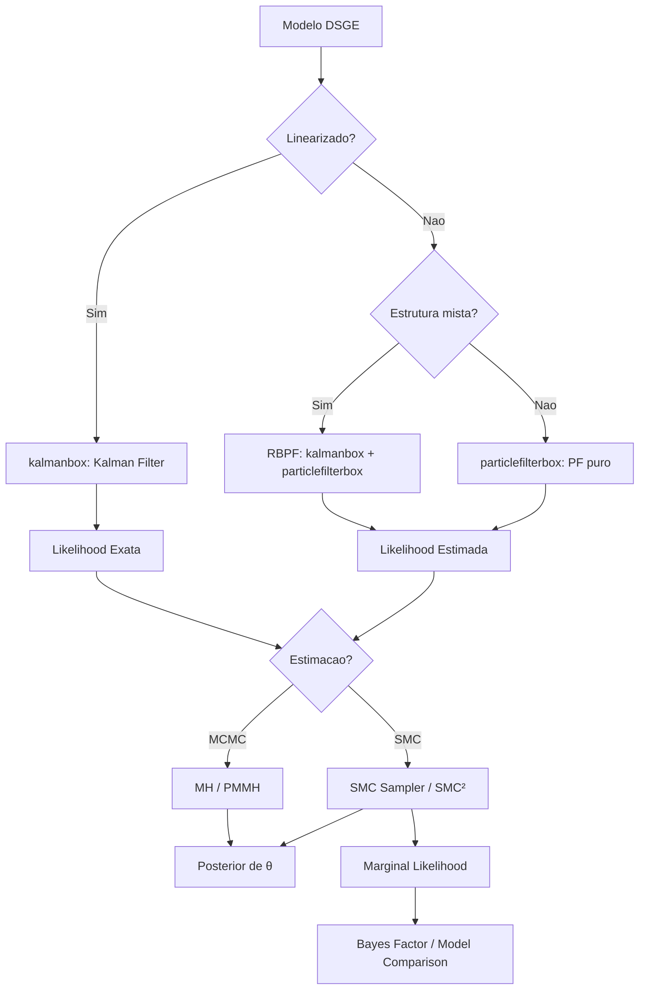

# Teoria de Modelos DSGE com Particle Filters

Esta pagina desenvolve a teoria de **Dynamic Stochastic General Equilibrium (DSGE)** no contexto de particle filters. Modelos DSGE linearizados usam o Filtro de Kalman (via `kalmanbox`), mas extensoes nao-lineares e estimacao Bayesiana completa requerem metodos de particulas.

---

## 1. DSGE e Representacao State-Space

### 1.1 Estrutura de um Modelo DSGE

Um modelo DSGE consiste em um sistema de equacoes de equilibrio derivadas de otimizacao intertemporal de agentes (familias, firmas, governo). Na forma generica, o modelo e descrito por condicoes de equilbrio:

$$
\mathbb{E}_t\left[f(z_{t+1}, z_t, z_{t-1}, \epsilon_t; \theta)\right] = 0
$$

onde:

- $z_t$: vetor de variaveis endogenas (produto, inflacao, taxa de juros, consumo, etc.)
- $\epsilon_t \sim \mathcal{N}(0, \Sigma_\epsilon)$: choques estruturais exogenos
- $\theta$: parametros estruturais (preferencias, tecnologia, rigidez de precos, etc.)

!!! example "Modelo Neo-Keynesiano Basico (3 equacoes)"
    $$
    \begin{aligned}
    \tilde{y}_t &= \mathbb{E}_t[\tilde{y}_{t+1}] - \frac{1}{\sigma}(i_t - \mathbb{E}_t[\pi_{t+1}] - r_t^n) & \text{(IS dinamica)} \\
    \pi_t &= \beta \, \mathbb{E}_t[\pi_{t+1}] + \kappa \, \tilde{y}_t + u_t & \text{(Curva de Phillips)} \\
    i_t &= \rho_i \, i_{t-1} + (1-\rho_i)(\psi_\pi \pi_t + \psi_y \tilde{y}_t) + \varepsilon_t^i & \text{(Regra de Taylor)}
    \end{aligned}
    $$

    onde $\tilde{y}_t$ e o output gap, $\pi_t$ e a inflacao, $i_t$ e a taxa de juros nominal, $r_t^n$ e a taxa natural, $u_t$ e um choque de custo, e $\varepsilon_t^i$ e um choque monetario.

### 1.2 Linearizacao em Torno do Steady State

O metodo padrao para resolver modelos DSGE e a **linearizacao** (ou log-linearizacao) em torno do estado estacionario determinista $\bar{z}$, definido por:

$$
f(\bar{z}, \bar{z}, \bar{z}, 0; \theta) = 0
$$

Definindo desvios $\hat{z}_t = z_t - \bar{z}$ (ou log-desvios $\hat{z}_t = \log z_t - \log \bar{z}$), a aproximacao de primeira ordem e:

$$
A \, \mathbb{E}_t[\hat{z}_{t+1}] + B \, \hat{z}_t + C \, \hat{z}_{t-1} + D \, \epsilon_t = 0
$$

onde $A, B, C, D$ sao matrizes de derivadas de $f$ avaliadas no steady state.

### 1.3 Solucao: Blanchard-Kahn e Forma State-Space

!!! abstract "Teorema: Condicao de Blanchard-Kahn (1980)"
    Particione $\hat{z}_t = (s_t^\top, j_t^\top)^\top$ em variaveis **predeterminadas** $s_t$ (com $n_s$ componentes) e **jump** $j_t$ (com $n_j$ componentes). O sistema tem solucao **unica e estavel** se e somente se:

    $$
    \text{numero de autovalores de } A^{-1}B \text{ fora do circulo unitario} = n_j
    $$

    Ou seja, o numero de autovalores explosivos iguala o numero de variaveis jump (condicao de determinancia).

Quando a condicao de Blanchard-Kahn e satisfeita, a solucao tem a forma **state-space linear**:

$$
\boxed{
\begin{aligned}
s_t &= \Phi_1(\theta) \, s_{t-1} + \Phi_\epsilon(\theta) \, \epsilon_t & \text{(transicao de estados)} \\
y_t &= \Phi_y(\theta) \, s_t + \Phi_\eta(\theta) \, \eta_t & \text{(observacao)}
\end{aligned}
}
$$

onde:

- $s_t \in \mathbb{R}^{n_s}$: vetor de estados (variaveis predeterminadas + exogenas)
- $y_t \in \mathbb{R}^{n_y}$: observaveis macroeconomicas
- $\Phi_1, \Phi_\epsilon, \Phi_y, \Phi_\eta$: matrizes funcao dos parametros estruturais $\theta$
- $\epsilon_t$: choques estruturais
- $\eta_t$: erros de medida (opcionais)

### 1.4 Por que o Filtro de Kalman Funciona para DSGE Linearizado

!!! success "Kalman Filter via `kalmanbox`"
    O modelo linearizado e **linear-gaussiano**:

    $$
    s_t | s_{t-1} \sim \mathcal{N}(\Phi_1 s_{t-1}, \Phi_\epsilon \Sigma_\epsilon \Phi_\epsilon^\top), \quad y_t | s_t \sim \mathcal{N}(\Phi_y s_t, \Phi_\eta \Sigma_\eta \Phi_\eta^\top)
    $$

    Portanto, o Filtro de Kalman fornece a solucao **exata** para filtragem e a **likelihood exata** para estimacao:

    $$
    p(y_{1:T} | \theta) = \prod_{t=1}^{T} p(y_t | y_{1:t-1}, \theta) = \prod_{t=1}^{T} \mathcal{N}(y_t; \hat{y}_{t|t-1}, F_t)
    $$

    onde $\hat{y}_{t|t-1}$ e $F_t$ sao a previsao e sua variancia, calculadas pelo Kalman filter.

    A biblioteca `kalmanbox` implementa esta filtragem de forma eficiente para modelos DSGE linearizados.

---

## 2. DSGE Nao-Linear

### 2.1 Por que Ir Alem da Linearizacao

A linearizacao de primeira ordem ignora varios fenomenos economicamente relevantes:

!!! warning "Limitacoes da Linearizacao"
    1. **Certainty equivalence**: Na solucao linearizada, o agente se comporta como se nao houvesse incerteza — premio de risco e zero
    2. **Assimetrias**: Recessoes e expansoes tem dinamicas diferentes que sao perdidas pela simetria da linearizacao
    3. **Nao-linearidades**: Zero lower bound (ZLB) na taxa de juros, custos de ajustamento convexos, ocasionalmente binding constraints
    4. **Volatilidade estocastica**: Choques com variancia variante no tempo nao sao captados pela linearizacao

### 2.2 Perturbacao de Ordem Superior

A solucao de perturbacao de segunda ordem adiciona termos quadraticos:

$$
\hat{z}_t = \Phi_1 \hat{z}_{t-1} + \Phi_\epsilon \epsilon_t + \frac{1}{2}\left[\hat{z}_{t-1}^\top \otimes I_{n_z}\right] \Phi_{zz} \hat{z}_{t-1} + \frac{1}{2}\left[\epsilon_t^\top \otimes I_{n_z}\right] \Phi_{\epsilon\epsilon} \epsilon_t + \left[\hat{z}_{t-1}^\top \otimes I_{n_z}\right] \Phi_{z\epsilon} \epsilon_t + \frac{1}{2} \Phi_{\sigma\sigma} \sigma^2
$$

onde:

- $\Phi_{zz}$: captura interacoes estado-estado (nao-linearidades endogenas)
- $\Phi_{\epsilon\epsilon}$: captura interacoes choque-choque
- $\Phi_{z\epsilon}$: captura interacoes estado-choque (efeitos GARCH-like)
- $\Phi_{\sigma\sigma}$: correcao de **nivel** (premio de risco, precaucao)

!!! info "Implicacao: A Forma State-Space Nao e Mais Linear"
    A solucao de segunda ordem tem a forma:

    $$
    s_t = h(s_{t-1}, \epsilon_t; \theta)
    $$

    onde $h$ e uma funcao **nao-linear** (quadratica) de $s_{t-1}$ e $\epsilon_t$. O Filtro de Kalman **nao se aplica** — necessitamos de um particle filter ou suas variantes.

### 2.3 Particle Filter para DSGE Nao-Linear

Para a solucao de segunda (ou terceira) ordem, o particle filter opera diretamente na representacao nao-linear:

$$
\begin{aligned}
s_t &= h(s_{t-1}, \epsilon_t; \theta), & \epsilon_t &\sim \mathcal{N}(0, \Sigma_\epsilon) \\
y_t &= g(s_t; \theta) + \eta_t, & \eta_t &\sim \mathcal{N}(0, \Sigma_\eta)
\end{aligned}
$$

!!! warning "Desafio: Alta Dimensionalidade"
    Modelos DSGE tipicos tem $n_s = 5$-$30$ estados. Pelo curse of dimensionality, o Bootstrap PF requer $N$ exponencial em $n_s$. Para modelos de media escala ($n_s \geq 10$), o Bootstrap PF e computacionalmente inviavel.

### 2.4 RBPF: Componente Linear via `kalmanbox`

O **Rao-Blackwellized Particle Filter (RBPF)** explora a estrutura especifica de modelos DSGE para reduzir drasticamente a dimensao efetiva do problema.

!!! abstract "Ideia Central: Decomposicao Linear/Nao-Linear"
    A solucao de segunda ordem pode ser decomposta como:

    $$
    s_t = \underbrace{\Phi_1 s_{t-1} + \Phi_\epsilon \epsilon_t}_{\text{componente linear}} + \underbrace{\Delta_t(s_{t-1}, \epsilon_t)}_{\text{correcao nao-linear}}
    $$

    onde $\Delta_t$ contem os termos quadraticos. A ideia e:

    1. Usar particulas para amostrar os **choques** $\epsilon_t^{(i)}$ (baixa dimensao: $n_\epsilon \leq n_s$)
    2. Dado $\epsilon_t^{(i)}$, a componente linear e filtrada **analiticamente** via Kalman filter (`kalmanbox`)

??? note "Prova: Validade do RBPF para DSGE"
    **Claim**: Para a solucao de perturbacao de segunda ordem, condicional nos choques $\epsilon_{1:t}$, o estado $s_t$ pode ser filtrado analiticamente.

    **Prova:**

    **Passo 1: Condicional em $\epsilon_{1:t}$.**

    Dado a sequencia de choques $\epsilon_{1:t}$, a equacao de transicao pode ser reescrita como:

    $$
    s_t = \Phi_1 s_{t-1} + b_t(\epsilon_t, s_{t-1})
    $$

    onde $b_t$ inclui $\Phi_\epsilon \epsilon_t$ e os termos quadraticos. Se os termos quadraticos em $s_{t-1}$ sao pequenos (perturbacao), podemos aproximar $b_t \approx \Phi_\epsilon \epsilon_t + \delta_t$, onde $\delta_t$ depende das estimativas de $s_{t-1}$ (via Kalman).

    **Passo 2: Filtragem condicional.**

    Condicional em $\epsilon_{1:t}^{(i)}$, o modelo torna-se:

    $$
    \begin{aligned}
    s_t &\approx \Phi_1 s_{t-1} + c_t^{(i)} + \xi_t^{(i)} \\
    y_t &= \Phi_y s_t + \eta_t
    \end{aligned}
    $$

    que e **linear-gaussiano** e pode ser filtrado pelo Kalman filter, produzindo:

    $$
    p(s_t | y_{1:t}, \epsilon_{1:t}^{(i)}) = \mathcal{N}(s_t; \hat{s}_{t|t}^{(i)}, P_{t|t}^{(i)})
    $$

    **Passo 3: Ponderacao das particulas.**

    Os pesos sao calculados pela likelihood preditiva do Kalman filter:

    $$
    w_t^{(i)} = p(y_t | y_{1:t-1}, \epsilon_{1:t}^{(i)}) = \mathcal{N}(y_t; \hat{y}_{t|t-1}^{(i)}, F_t^{(i)})
    $$

    onde $\hat{y}_{t|t-1}^{(i)}$ e $F_t^{(i)}$ sao a previsao e sua variancia, calculadas pelo Kalman filter da particula $i$. $\blacksquare$

!!! info "Algoritmo: RBPF para DSGE com `kalmanbox`"
    Para cada particula $i = 1, \ldots, N$:

    1. **Amostrar choques**: $\epsilon_t^{(i)} \sim p(\epsilon_t)$ ou de uma proposal melhorada
    2. **Atualizar Kalman filter** (via `kalmanbox`):
        - Calcular $c_t^{(i)} = \Phi_\epsilon \epsilon_t^{(i)} + \Delta_t(\hat{s}_{t-1|t-1}^{(i)}, \epsilon_t^{(i)})$
        - Previsao: $\hat{s}_{t|t-1}^{(i)} = \Phi_1 \hat{s}_{t-1|t-1}^{(i)} + c_t^{(i)}$
        - Previsao de observacao: $\hat{y}_{t|t-1}^{(i)} = \Phi_y \hat{s}_{t|t-1}^{(i)}$
        - Atualizacao de Kalman padrao para $P_{t|t}^{(i)}$
    3. **Calcular peso**: $w_t^{(i)} = \mathcal{N}(y_t; \hat{y}_{t|t-1}^{(i)}, F_t^{(i)})$
    4. **Normalizar e resamplear** se ESS baixo

!!! success "Ganho Computacional do RBPF"
    | Aspecto | PF Puro | RBPF com `kalmanbox` |
    |---------|---------|---------------------|
    | Dimensao efetiva | $n_s$ (estados) | $n_\epsilon$ (choques) |
    | $N$ necessario (modelo medio) | $\sim 10^4$-$10^6$ | $\sim 10^2$-$10^3$ |
    | Custo por particula | $O(1)$ | $O(n_s^2)$ (Kalman update) |
    | Custo total | $O(N)$ exponencial em $n_s$ | $O(N \cdot n_s^2)$ polinomial |

---

## 3. Estimacao Bayesiana de DSGE

### 3.1 Framework Bayesiano

A estimacao Bayesiana de modelos DSGE combina informacao da verossimilhanca com priors sobre os parametros estruturais:

$$
p(\theta | y_{1:T}) \propto p(y_{1:T} | \theta) \cdot p(\theta)
$$

onde:

- $p(y_{1:T} | \theta)$: likelihood (via Kalman para DSGE linear, via PF para DSGE nao-linear)
- $p(\theta)$: prior sobre parametros estruturais

!!! info "Priors em Modelos DSGE"
    Os priors refletem restricoes economicas e calibracoes da literatura:

    | Parametro | Interpretacao | Distribuicao Tipica | Restricao |
    |-----------|--------------|--------------------:|-----------|
    | $\beta$ | Fator de desconto | $\text{Beta}(0.99, 0.002)$ | $\beta \in (0, 1)$ |
    | $\sigma$ | Aversao ao risco | $\text{Gamma}(2, 0.5)$ | $\sigma > 0$ |
    | $\kappa$ | Slope da Phillips | $\text{Gamma}(0.3, 0.1)$ | $\kappa > 0$ |
    | $\phi_\pi$ | Resposta a inflacao | $\text{Normal}(1.5, 0.25)$ | $\phi_\pi > 1$ (Taylor principle) |
    | $\rho_i$ | Persistencia monetaria | $\text{Beta}(0.7, 0.1)$ | $\rho_i \in (0, 1)$ |

### 3.2 PMCMC para Parametros Estruturais

Para modelos DSGE nao-lineares, a likelihood e intratavel e usamos PMCMC:

=== "DSGE Linearizado"

    A likelihood e calculada **exatamente** pelo Kalman filter (`kalmanbox`). MCMC padrao (Random Walk MH ou Hamiltonian MC) e aplicavel:

    $$
    \alpha(\theta^*, \theta) = \min\left(1, \frac{p(y_{1:T}|\theta^*) p(\theta^*) q(\theta|\theta^*)}{p(y_{1:T}|\theta) p(\theta) q(\theta^*|\theta)}\right)
    $$

    onde $p(y_{1:T}|\theta)$ vem diretamente do Kalman filter.

=== "DSGE Nao-Linear (PMMH)"

    A likelihood e estimada pelo particle filter (ou RBPF):

    $$
    \alpha(\theta^*, \theta) = \min\left(1, \frac{\hat{p}^N(y_{1:T}|\theta^*) p(\theta^*) q(\theta|\theta^*)}{\hat{p}^N(y_{1:T}|\theta) p(\theta) q(\theta^*|\theta)}\right)
    $$

    **Desafio**: Para modelos DSGE, a likelihood varia drasticamente com $\theta$, e a variancia de $\log \hat{p}^N$ deve ser controlada.

=== "DSGE Nao-Linear (SMC$^2$)"

    Para modelos DSGE complexos, SMC$^2$ (Chopin, Jacob & Papaspiliopoulos, 2013) opera em dois niveis:

    - **Nivel externo**: SMC sampler sobre $\theta$ com $M$ particulas
    - **Nivel interno**: Para cada $\theta^{(j)}$, um PF com $N$ particulas estima a likelihood

    Vantagens sobre PMMH:

    - Paralelismo natural (particulas de $\theta$ sao independentes)
    - Adaptacao automatica da proposal
    - Estimacao simultanea da marginal likelihood

### 3.3 Priors Informativos vs Difusos

!!! warning "Desafios de Identificacao em DSGE"
    Muitos parametros DSGE sao **fracamente identificados** — a likelihood e quase plana em certas direcoes do espaco de parametros.

    **Parametros tipicamente bem identificados:**

    - Persistencia dos choques ($\rho$): a autocorrelacao dos dados e informativa
    - Volatilidade dos choques ($\sigma_\epsilon$): a variancia dos dados e informativa
    - Resposta da politica monetaria ($\phi_\pi$): a reacao dos juros a inflacao e observavel

    **Parametros tipicamente mal identificados:**

    - Fator de desconto ($\beta$): quase nao-identificado em amostras tipicas
    - Elasticidade de substituicao ($\sigma$): altamente confundido com outros parametros
    - Rigidez de precos (Calvo $\xi$): identificado apenas indiretamente

!!! tip "Estrategia Pratica"
    1. **Comece com priors informativos** baseados na literatura (Smets & Wouters, 2007)
    2. **Verifique sensibilidade**: re-estime com priors mais difusos
    3. **Compare prior vs posterior**: se forem muito similares, o dado nao e informativo sobre aquele parametro
    4. **Use transformacoes**: trabalhe no espaco irrestrito para melhor mixing do MCMC

### 3.4 Identificacao e Regularidade

!!! abstract "Condicoes de Regularidade para Inferencia Bayesiana em DSGE"
    Para que a posterior $p(\theta | y_{1:T})$ seja bem definida e o MCMC convirja:

    1. **Determinancia**: A condicao de Blanchard-Kahn deve ser satisfeita para todo $\theta$ no suporte do prior
    2. **Estacionariedade**: $\|\Phi_1(\theta)\| < 1$ (todos os autovalores de $\Phi_1$ dentro do circulo unitario)
    3. **Regularidade da likelihood**: $p(y_{1:T}|\theta)$ e continua em $\theta$
    4. **Prior proprio**: $\int p(\theta) d\theta = 1$ (garante posterior propria)

??? note "Prova: Regularidade da Likelihood para DSGE Linearizado"
    **Claim**: Se $\theta \mapsto (\Phi_1(\theta), \Phi_\epsilon(\theta), \Phi_y(\theta), \Phi_\eta(\theta))$ e continuamente diferenciavel e o modelo e estacionario, entao $\theta \mapsto p(y_{1:T}|\theta)$ e continuamente diferenciavel.

    **Prova:**

    A log-likelihood do modelo linear-gaussiano e:

    $$
    \log p(y_{1:T}|\theta) = -\frac{Tn_y}{2}\log(2\pi) - \frac{1}{2}\sum_{t=1}^T \left[\log|F_t(\theta)| + v_t(\theta)^\top F_t(\theta)^{-1} v_t(\theta)\right]
    $$

    onde $v_t = y_t - \hat{y}_{t|t-1}$ e a inovacao e $F_t = \Phi_y P_{t|t-1} \Phi_y^\top + \Phi_\eta \Sigma_\eta \Phi_\eta^\top$ e sua variancia.

    As recursoes de Kalman ($\hat{s}_{t|t-1}, P_{t|t-1}$) sao funcoes continuamente diferenciaveis das matrizes do sistema. Como composicao de funcoes $C^1$ e $C^1$, a log-likelihood e $C^1$ em $\theta$. $\blacksquare$

---

## 4. Comparacao de Modelos

### 4.1 Marginal Likelihood

A **marginal likelihood** (ou evidencia) e a ferramenta central para comparacao Bayesiana de modelos:

$$
p(y_{1:T} | \mathcal{M}_k) = \int p(y_{1:T} | \theta, \mathcal{M}_k) \, p(\theta | \mathcal{M}_k) \, d\theta
$$

onde $\mathcal{M}_k$ denota o modelo $k$. A marginal likelihood penaliza automaticamente modelos mais complexos (navalha de Occam Bayesiana):

!!! info "Decomposicao da Marginal Likelihood"
    $$
    \underbrace{\log p(y_{1:T} | \mathcal{M}_k)}_{\text{marginal log-likelihood}} = \underbrace{\log p(y_{1:T} | \hat{\theta}_k, \mathcal{M}_k)}_{\text{goodness-of-fit}} - \underbrace{\text{KL}(p(\theta|y_{1:T}, \mathcal{M}_k) \| p(\theta | \mathcal{M}_k))}_{\text{penalidade de complexidade}}
    $$

    A penalidade de complexidade e a divergencia KL entre posterior e prior — modelos com mais parametros efetivos tem posterior mais distante do prior, e portanto penalidade maior.

### 4.2 Estimacao da Marginal Likelihood via SMC

Para modelos DSGE, a marginal likelihood pode ser estimada por varios metodos:

=== "Via Particle Filter (por $\theta$ fixo)"

    Para cada $\theta$, o PF fornece um estimador nao-enviesado:

    $$
    \hat{p}^N(y_{1:T} | \theta) = \prod_{t=1}^{T} \frac{1}{N}\sum_{i=1}^{N} w_t^{(i)}
    $$

    Mas isto estima $p(y_{1:T}|\theta)$, nao a marginal likelihood integrada sobre $\theta$.

=== "Via SMC Sampler (Herbst & Schorfheide, 2015)"

    O SMC sampler sobre $\theta$ estima diretamente a marginal likelihood como produto das constantes de normalizacao:

    $$
    \hat{p}(y_{1:T} | \mathcal{M}_k) = \prod_{n=1}^{P} \left(\frac{1}{M}\sum_{j=1}^{M} w_n^{(j)}\right)
    $$

    onde $M$ particulas de $\theta$ sao movidas atraves de $P$ distribuicoes intermediarias:

    $$
    \pi_n(\theta) \propto p(y_{1:T} | \theta)^{\phi_n} \, p(\theta), \quad 0 = \phi_0 < \phi_1 < \cdots < \phi_P = 1
    $$

    Os pesos incrementais sao:

    $$
    w_n^{(j)} = p(y_{1:T} | \theta_n^{(j)})^{\phi_n - \phi_{n-1}}
    $$

    !!! success "Vantagens do SMC Sampler"
        - Estimador **nao-enviesado** da marginal likelihood
        - Naturalmente paralelizavel
        - Robusto a posteriors multimodais
        - Funciona tanto para modelos lineares (Kalman) quanto nao-lineares (PF)

=== "Via Harmonic Mean (nao recomendado)"

    O estimador de media harmonica a partir de amostras MCMC:

    $$
    \hat{p}(y_{1:T})^{-1} = \frac{1}{M}\sum_{m=1}^{M} \frac{1}{p(y_{1:T} | \theta^{(m)})}, \quad \theta^{(m)} \sim p(\theta | y_{1:T})
    $$

    !!! danger "Nao Use"
        Este estimador tem variancia **infinita** e e extremamente instavel. Pode parecer convergir para um valor errado. Use o SMC sampler.

### 4.3 Bayes Factors

O **Bayes factor** compara dois modelos:

$$
\text{BF}_{12} = \frac{p(y_{1:T} | \mathcal{M}_1)}{p(y_{1:T} | \mathcal{M}_2)}
$$

!!! note "Interpretacao (Escala de Kass & Raftery, 1995)"
    | $2 \log \text{BF}_{12}$ | Evidencia a favor de $\mathcal{M}_1$ |
    |------------------------:|:-------------------------------------|
    | $0$-$2$ | Nao vale mencionar |
    | $2$-$6$ | Positiva |
    | $6$-$10$ | Forte |
    | $> 10$ | Muito forte |

### 4.4 Aplicacao: Comparacao de Modelos DSGE

!!! example "Exemplo: Modelos com e sem Friccoes Financeiras"
    Considere dois modelos DSGE:

    - $\mathcal{M}_1$: Modelo Neo-Keynesiano basico (3 choques, 10 parametros)
    - $\mathcal{M}_2$: Modelo com acelerador financeiro (Bernanke, Gertler & Gilchrist, 1999) (5 choques, 16 parametros)

    **Procedimento:**

    1. Especificar priors para cada modelo: $p(\theta_1 | \mathcal{M}_1)$ e $p(\theta_2 | \mathcal{M}_2)$
    2. Estimar marginal likelihood via SMC sampler:
        - Para $\mathcal{M}_1$: usar Kalman filter (modelo linear) — $\log \hat{p}(y | \mathcal{M}_1)$
        - Para $\mathcal{M}_2$: usar RBPF com `kalmanbox` (modelo com nao-linearidades financeiras) — $\log \hat{p}(y | \mathcal{M}_2)$
    3. Calcular Bayes factor: $2\log \text{BF}_{21} = 2[\log \hat{p}(y|\mathcal{M}_2) - \log \hat{p}(y|\mathcal{M}_1)]$

    **Resultados tipicos** (dados dos EUA, pos-1984):

    - Pre-crise (1984-2007): $\mathcal{M}_1$ e $\mathcal{M}_2$ sao comparaveis ($\text{BF} \approx 1$)
    - Incluindo a Grande Recessao (1984-2015): $\mathcal{M}_2$ domina fortemente ($2\log\text{BF}_{21} > 15$)
    - A friccao financeira e essencial para explicar a crise de 2008

### 4.5 Pipeline Completo: DSGE com `particlefilterbox` e `kalmanbox`

---

## Resumo

| Cenario | Metodo de Filtragem | Likelihood | Estimacao |
|---------|--------------------:|:-----------|:----------|
| DSGE linearizado | Kalman (`kalmanbox`) | Exata | MCMC padrao |
| DSGE 2a ordem | RBPF (`kalmanbox` + PF) | Estimada (nao-enviesada) | PMMH / SMC$^2$ |
| DSGE com ZLB | PF puro | Estimada | PMMH / SMC$^2$ |
| Comparacao de modelos | Qualquer | — | SMC sampler |

---

## Referencias

!!! quote "Referencias Principais"
    - **Blanchard, O.J. & Kahn, C.M.** (1980). The solution of linear difference models under rational expectations. *Econometrica*, 48(5), 1305-1311.
    - **Smets, F. & Wouters, R.** (2007). Shocks and frictions in US business cycles: A Bayesian DSGE approach. *American Economic Review*, 97(3), 586-606.
    - **Fernandez-Villaverde, J. & Rubio-Ramirez, J.F.** (2007). Estimating macroeconomic models: A likelihood approach. *Review of Economic Studies*, 74(4), 1059-1087.
    - **An, S. & Schorfheide, F.** (2007). Bayesian analysis of DSGE models. *Econometric Reviews*, 26(2-4), 113-172.
    - **Herbst, E.P. & Schorfheide, F.** (2015). *Bayesian Estimation of DSGE Models*. Princeton University Press.
    - **Chopin, N., Jacob, P.E. & Papaspiliopoulos, O.** (2013). SMC$^2$: An efficient algorithm for sequential analysis of state space models. *Journal of the Royal Statistical Society: Series B*, 75(3), 397-426.
    - **Bernanke, B.S., Gertler, M. & Gilchrist, S.** (1999). The financial accelerator in a quantitative business cycle framework. *Handbook of Macroeconomics*, 1, 1341-1393.
    - **Kass, R.E. & Raftery, A.E.** (1995). Bayes factors. *Journal of the American Statistical Association*, 90(430), 773-795.
