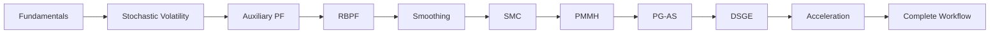

# Tutorials

Welcome to the **particlefilterbox** tutorials. Each tutorial is a self-contained, hands-on guide that walks you through a real application of particle filtering or Sequential Monte Carlo methods -- with complete code, expected output, and visualizations at every step.

## Learning Path

Follow the tutorials in order for a structured learning experience, or jump to any topic that interests you.

---

## Tutorial Index

| # | Tutorial | Level | Time | Description |
|---|----------|-------|------|-------------|
| 1 | [Fundamentals](fundamentals.md) | :material-star:{.beginner} Beginner | 30 min | Bootstrap PF step-by-step, weights, resampling, Kalman comparison |
| 2 | [Stochastic Volatility](stochastic-volatility.md) | :material-star-half-full:{.intermediate} Intermediate | 45 min | SV model, Bootstrap vs SIR, diagnostics, real data |
| 3 | [Auxiliary PF](auxiliary-pf.md) | :material-star-half-full:{.intermediate} Intermediate | 30 min | Look-ahead resampling, jump-diffusion, Bootstrap vs APF |
| 4 | [RBPF](rbpf.md) | :material-star-half-full:{.intermediate} Intermediate | 45 min | Rao-Blackwellized PF with mixed linear/nonlinear states |
| 5 | [Smoothing](smoothing.md) | :material-star-half-full:{.intermediate} Intermediate | 30 min | FFBSm, FFBSi, fixed-lag smoothing |
| 6 | [SMC Sampler](smc.md) | :material-star-outline:{.advanced} Advanced | 45 min | SMC for static parameter estimation and tempering |
| 7 | [PMMH](pmmh.md) | :material-star-outline:{.advanced} Advanced | 60 min | Particle MCMC for Bayesian parameter estimation |
| 8 | [PG-AS](pgas.md) | :material-star-outline:{.advanced} Advanced | 45 min | Particle Gibbs with Ancestor Sampling |
| 9 | [DSGE](dsge.md) | :material-star-outline:{.advanced} Advanced | 60 min | Dynamic Stochastic General Equilibrium models |
| 10 | [Acceleration](acceleration.md) | :material-star-half-full:{.intermediate} Intermediate | 30 min | Numba JIT, GPU acceleration, adaptive N |
| 11 | [Complete Workflow](complete-workflow.md) | :material-star-outline:{.advanced} Advanced | 90 min | End-to-end research workflow from data to publication |

---

## Prerequisites by Level

=== "Beginner"

    - Basic Python and NumPy knowledge
    - Familiarity with probability distributions
    - `pip install particlefilterbox` installed

=== "Intermediate"

    - Completed the Fundamentals tutorial
    - Understanding of state-space models
    - Familiarity with the [Core Concepts](../getting-started/core-concepts.md)

=== "Advanced"

    - Completed Beginner and Intermediate tutorials
    - Understanding of Bayesian inference and MCMC
    - Familiarity with the [Theory](../theory/index.md) section

---

## How to Use These Tutorials

!!! tip "Getting the most out of each tutorial"
    1. **Run the code yourself** -- copy each code block and execute it in a Jupyter notebook or Python script
    2. **Read the expected output** -- verify your results match before moving on
    3. **Experiment** -- each tutorial ends with suggested exercises to deepen understanding
    4. **Check the theory** -- links to the [Theory](../theory/index.md) section provide mathematical foundations

!!! info "Optional dependencies"
    Some tutorials use optional packages:

    - **kalmanbox** -- for Kalman filter comparisons in the Fundamentals tutorial
    - **matplotlib** -- for all visualizations (included in `pip install particlefilterbox[viz]`)
    - **pandas** -- for data manipulation in real-data examples

---

## Quick Links

- :material-school: **[Start Here: Fundamentals](fundamentals.md)**

    Build your first particle filter from scratch and understand every component

- :material-chart-line: **[Stochastic Volatility](stochastic-volatility.md)**

    The classic particle filter application in finance

- :material-flash: **[Auxiliary PF](auxiliary-pf.md)**

    Learn when and why to use look-ahead resampling

- :material-road-variant: **[Complete Workflow](complete-workflow.md)**

    End-to-end research workflow for advanced users

