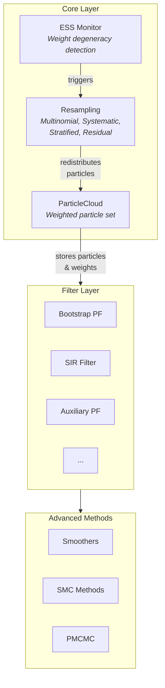
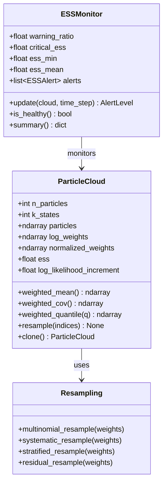

# Core Components

The core components form the foundation of every algorithm in particlefilterbox. Before particles are filtered, smoothed, or used in MCMC, they live in a **ParticleCloud**, are redistributed by **resampling** algorithms, and monitored for quality via the **Effective Sample Size (ESS)**.

---

## Architecture Overview



At each time step $t$, the particle filter:

1. **Propagates** particles through the state transition: $x_t^{(i)} \sim p(x_t \mid x_{t-1}^{(i)})$
2. **Weights** particles by observation likelihood: $w_t^{(i)} \propto p(y_t \mid x_t^{(i)})$
3. **Monitors** weight quality via ESS
4. **Resamples** if ESS drops below threshold, eliminating low-weight particles

The core components implement steps 2--4. The filter layer adds step 1 and orchestrates the loop.

---

## Component Summary

| Component | Class / Module | Role |
|-----------|---------------|------|
| [ParticleCloud](particle-cloud.md) | `particlefilterbox.core.ParticleCloud` | Stores $N$ weighted particles in $\mathbb{R}^k$, computes statistics |
| [Resampling](resampling.md) | `particlefilterbox.resampling` | Redistributes particles to combat weight degeneracy |
| [ESS](ess.md) | `particlefilterbox.diagnostics.ESSMonitor` | Monitors effective sample size and triggers resampling |

---

## How They Work Together

```python
from particlefilterbox.core import ParticleCloud
from particlefilterbox.resampling import systematic_resample
from particlefilterbox.diagnostics import ESSMonitor

# Create a particle cloud
cloud = ParticleCloud(n_particles=1000, k_states=2)

# Set up ESS monitoring
monitor = ESSMonitor(warning_ratio=0.1, critical_ess=1.0)

# --- Inside the filter loop (simplified) ---
# After weighting particles with observation likelihood:
cloud.add_log_weights(log_likelihoods)

# Check ESS
alert = monitor.update(cloud, time_step=t)

# Resample if ESS is low
if cloud.ess < 0.5 * cloud.n_particles:
    indices = systematic_resample(cloud.normalized_weights)
    cloud.resample(indices)
```

!!! tip "You rarely call these directly"
    In practice, particle filters handle the predict-weight-resample loop internally. Understanding core components helps you **configure** filters correctly and **diagnose** problems when they arise.

---

## Class Diagram



---

## Next Steps

Start with [ParticleCloud](particle-cloud.md) to understand the central data structure, then learn about [Resampling](resampling.md) strategies and [ESS monitoring](ess.md).
