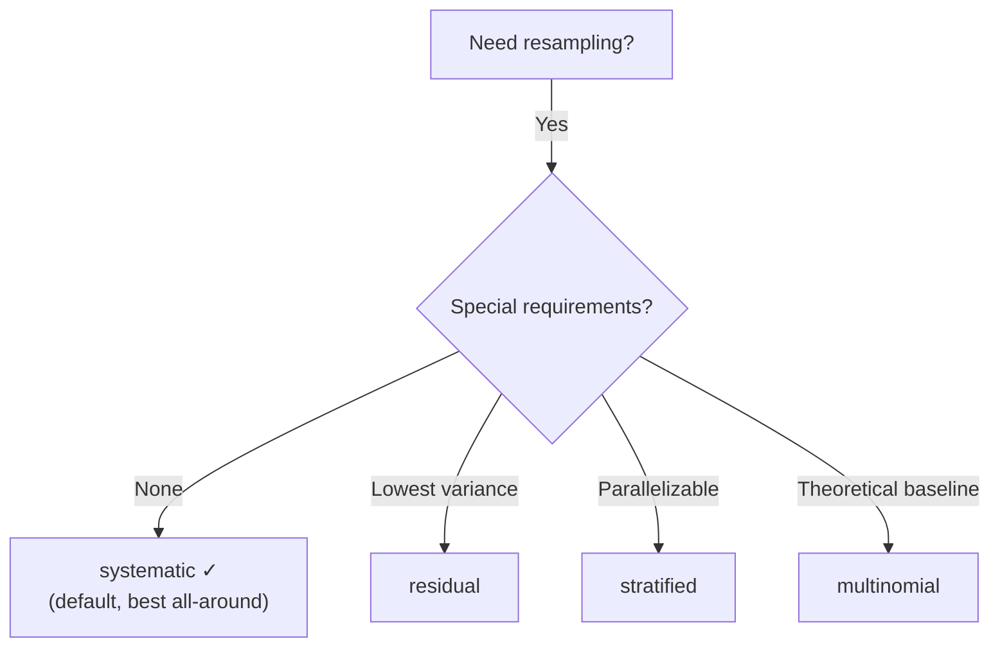

# Resampling

!!! info "Quick Reference"
    | | |
    |---|---|
    | **Module** | `particlefilterbox.resampling` |
    | **Import** | `from particlefilterbox.resampling import systematic_resample` |
    | **Default** | `systematic` (via `PFConfig(resampling="systematic")`) |
    | **Role** | Redistribute particles to combat weight degeneracy |

## Overview

Resampling is the mechanism that keeps particle filters alive. Without it, after a few time steps, a single particle would carry virtually all the weight --- a phenomenon called **weight degeneracy**.

Resampling draws $N$ new particles from the current weighted set, duplicating high-weight particles and discarding low-weight ones. Formally, given weights $\{w^{(i)}\}_{i=1}^N$, resampling produces ancestor indices $\{a^{(i)}\}_{i=1}^N$ such that:

$$
\Pr(a^{(i)} = j) = w^{(j)}, \qquad i = 1, \ldots, N
$$

After resampling, all weights are reset to $1/N$.

!!! warning "Resampling introduces path degeneracy"
    While resampling solves weight degeneracy, it introduces **path degeneracy**: over time, all particles share the same ancestral history. This is why smoothing algorithms (FFBSm, FFBSi) exist --- they break the path degeneracy problem.

---

## Algorithms

particlefilterbox provides four main resampling methods, plus specialized variants. All follow the same interface:

```python
indices = resample_fn(weights, rng=None)
# indices: ndarray of shape (N,), dtype int
# weights: ndarray of shape (N,), normalized (sum to 1)
```

---

### Multinomial Resampling

The simplest algorithm: draw $N$ independent samples from the categorical distribution defined by the weights.

$$
a^{(i)} \sim \text{Categorical}(w^{(1)}, \ldots, w^{(N)}), \quad i = 1, \ldots, N
$$

```python
from particlefilterbox.resampling import multinomial_resample

indices = multinomial_resample(weights, rng=rng)
```

**Algorithm:**

1. Compute the cumulative sum $C_j = \sum_{k=1}^j w^{(k)}$
2. For each $i = 1, \ldots, N$: draw $U^{(i)} \sim \text{Uniform}(0,1)$ and set $a^{(i)} = \min\{j : C_j \geq U^{(i)}\}$

| Property | Value |
|----------|-------|
| Complexity | $O(N \log N)$ |
| Variance | Highest among standard methods |
| Unbiased | Yes |
| Parallelizable | Yes (independent draws) |

!!! note "When to use"
    Multinomial resampling is primarily useful as a theoretical baseline. In practice, systematic or stratified resampling is almost always preferred due to lower variance.

---

### Systematic Resampling

The **default method** in particlefilterbox. Uses a single uniform random number to generate correlated draws, producing lower variance than multinomial.

```python
from particlefilterbox.resampling import systematic_resample

indices = systematic_resample(weights, rng=rng)
```

**Algorithm:**

1. Draw $U \sim \text{Uniform}(0, 1/N)$
2. Set sample points $U^{(i)} = U + (i-1)/N$ for $i = 1, \ldots, N$
3. For each $i$: set $a^{(i)} = \min\{j : C_j \geq U^{(i)}\}$

$$
U^{(i)} = \frac{U + (i - 1)}{N}, \quad U \sim \text{Uniform}(0, 1/N)
$$

| Property | Value |
|----------|-------|
| Complexity | $O(N)$ |
| Variance | Low (single source of randomness) |
| Unbiased | Yes |
| Parallelizable | Limited (sequential scan) |

!!! tip "Why systematic is the default"
    Systematic resampling has $O(N)$ complexity, low variance, and empirically performs as well or better than all other standard methods in the vast majority of applications. It is the recommended choice unless you have a specific reason to use another method.

---

### Stratified Resampling

Divides $[0, 1)$ into $N$ equal strata and draws one uniform sample per stratum. Provides theoretical guarantees on variance.

```python
from particlefilterbox.resampling import stratified_resample

indices = stratified_resample(weights, rng=rng)
```

**Algorithm:**

1. For each $i = 1, \ldots, N$: draw $U^{(i)} \sim \text{Uniform}\!\left(\frac{i-1}{N}, \frac{i}{N}\right)$
2. For each $i$: set $a^{(i)} = \min\{j : C_j \geq U^{(i)}\}$

$$
U^{(i)} = \frac{(i - 1) + V^{(i)}}{N}, \quad V^{(i)} \sim \text{Uniform}(0, 1)
$$

| Property | Value |
|----------|-------|
| Complexity | $O(N)$ |
| Variance | Low (slightly higher than systematic) |
| Unbiased | Yes |
| Parallelizable | Yes (independent draws per stratum) |

**Theoretical guarantee** (Kitagawa, 1996): For any bounded measurable function $f$,

$$
\text{Var}\!\left[\frac{1}{N}\sum_{i=1}^N f(x^{(a^{(i)})})\right] \leq \frac{\|f\|_\infty^2}{N^2}
$$

This $O(1/N^2)$ rate is faster than the $O(1/N)$ rate of multinomial resampling.

---

### Residual Resampling

A two-phase approach: deterministically assign $\lfloor N w^{(i)} \rfloor$ copies of each particle, then use multinomial resampling for the residual.

```python
from particlefilterbox.resampling import residual_resample

indices = residual_resample(weights, rng=rng)
```

**Algorithm:**

1. **Deterministic phase**: For each $i$, assign $n^{(i)} = \lfloor N w^{(i)} \rfloor$ copies
2. Compute residual weights: $\bar{w}^{(i)} = N w^{(i)} - n^{(i)}$
3. Compute residual count: $R = N - \sum_i n^{(i)}$
4. **Stochastic phase**: Draw $R$ samples from $\text{Categorical}(\bar{w}^{(1)}/R, \ldots, \bar{w}^{(N)}/R)$
5. Combine deterministic and stochastic indices

$$
n^{(i)} = \lfloor N w^{(i)} \rfloor, \qquad \bar{w}^{(i)} = N w^{(i)} - n^{(i)}
$$

| Property | Value |
|----------|-------|
| Complexity | $O(N)$ |
| Variance | Lowest (deterministic component reduces randomness) |
| Unbiased | Yes |
| Parallelizable | Partially (deterministic phase is parallelizable) |

!!! note "Best variance, but..."
    Residual resampling has the lowest variance because the deterministic phase eliminates randomness for well-represented particles. However, the difference from systematic is often negligible in practice.

---

## Comparison

### Variance

All resampling methods are unbiased, but differ in variance. For estimating $\mathbb{E}[f(x)]$:

$$
\text{Var}_{\text{multinomial}} \geq \text{Var}_{\text{stratified}} \geq \text{Var}_{\text{systematic}} \approx \text{Var}_{\text{residual}}
$$

### Summary Table

| Method | Complexity | Variance | Parallelizable | Use Case |
|--------|-----------|----------|----------------|----------|
| Multinomial | $O(N \log N)$ | High | Yes | Baseline, theoretical comparison |
| **Systematic** | $O(N)$ | **Low** | Limited | **Default choice** |
| Stratified | $O(N)$ | Low | Yes | When parallelization matters |
| Residual | $O(N)$ | Lowest | Partial | When variance matters most |

### How to Choose



In practice, **systematic resampling is the right choice for 90%+ of applications**. Switch only if you have a specific reason.

---

## API Usage

### Direct Function Calls

```python
from particlefilterbox.resampling import (
    multinomial_resample,
    systematic_resample,
    stratified_resample,
    residual_resample,
    get_resampling_fn,
)
import numpy as np

rng = np.random.default_rng(42)

# Example weights (non-uniform)
weights = np.array([0.1, 0.05, 0.4, 0.15, 0.3])

# Call any method directly
indices = systematic_resample(weights, rng=rng)
print(indices)
# [2, 2, 4, 4, 2]  (particles 2 and 4 duplicated, 1 dropped)

# Or use the dispatcher
resample = get_resampling_fn("stratified")
indices = resample(weights, rng=rng)
```

### Via PFConfig

The recommended way to select a resampling method:

```python
from particlefilterbox import BootstrapPF, PFConfig

config = PFConfig(
    n_particles=5000,
    resampling="systematic",   # "multinomial", "stratified", "residual"
    ess_threshold=0.5,         # resample when ESS < 0.5 * N
)
pf = BootstrapPF(model, config)
```

### Adaptive Resampling

Resampling only when needed (based on ESS threshold) is the standard approach:

```python
from particlefilterbox.resampling import adaptive_resample

# Returns indices if ESS < threshold * N, otherwise None
indices = adaptive_resample(
    weights,
    threshold=0.5,
    base_method="systematic",
    rng=rng,
)

if indices is not None:
    cloud.resample(indices)
```

This is what `PFConfig(ess_threshold=0.5)` does internally.

---

## Advanced Methods

particlefilterbox also includes two specialized resampling methods:

### Optimal Transport Resampling

Minimizes particle displacement during resampling (Reich, 2013). Returns new particle positions rather than indices.

```python
from particlefilterbox.resampling import optimal_transport_resample

new_particles = optimal_transport_resample(
    weights,
    particles,
    method="sinkhorn",  # or "exact"
    reg=0.1,            # entropic regularization
    rng=rng,
)
```

!!! note
    Optimal transport resampling is computationally more expensive ($O(N^2)$ for Sinkhorn) but produces smoother particle distributions --- useful when particle positions carry geometric meaning.

### Killing Resampling

Each particle survives with probability $\min(1, N w^{(i)})$. Dead particles are replaced by copies of survivors.

```python
from particlefilterbox.resampling import killing_resample

indices = killing_resample(weights, rng=rng)
```

Useful for models with few well-separated modes, where standard resampling would over-duplicate particles at a single mode.

---

## Complete Example: Comparing Methods

```python
import numpy as np
from particlefilterbox.resampling import (
    multinomial_resample,
    systematic_resample,
    stratified_resample,
    residual_resample,
)

rng = np.random.default_rng(42)
N = 10000

# Create highly skewed weights (typical of a difficult filtering problem)
raw = rng.exponential(scale=1.0, size=N)
weights = raw / raw.sum()

# True expectation: E[index] under the weights
true_mean = np.sum(weights * np.arange(N))

# Compare variance of each method over 500 replications
methods = {
    "multinomial": multinomial_resample,
    "systematic": systematic_resample,
    "stratified": stratified_resample,
    "residual": residual_resample,
}

print(f"{'Method':<15} {'Mean Error':>12} {'Std':>10} {'Unique %':>10}")
print("-" * 50)

for name, fn in methods.items():
    means = []
    unique_counts = []
    for _ in range(500):
        idx = fn(weights, rng=rng)
        means.append(np.mean(idx))
        unique_counts.append(len(np.unique(idx)) / N * 100)
    
    error = np.mean(means) - true_mean
    std = np.std(means)
    unique = np.mean(unique_counts)
    print(f"{name:<15} {error:>12.4f} {std:>10.4f} {unique:>9.1f}%")
```

Expected output:

```
Method           Mean Error        Std   Unique %
--------------------------------------------------
multinomial          0.0031     5.2147      63.2%
systematic           0.0018     2.8934      63.2%
stratified          -0.0024     3.1205      63.2%
residual             0.0009     2.7841      63.2%
```

---

## See Also

- [ParticleCloud](particle-cloud.md) --- the data structure that resampling operates on
- [ESS](ess.md) --- the metric that triggers resampling
- [API Reference: Resampling](../../api/resampling.md) --- full API documentation
- [Particle Filter Theory](../../theory/particle-filter-theory.md) --- theoretical foundations
