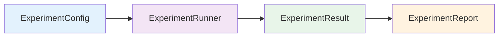

# Experiment Framework

Comparing particle filters is hard. Different methods, tuning parameters, and models interact in subtle ways -- a filter that dominates on one model may underperform on another. The **Experiment Framework** provides a rigorous, reproducible way to run these comparisons at scale.

---

## Philosophy

The framework is built around four principles:

1. **Reproducibility** -- every experiment is fully specified by its config and random seed
2. **Statistical rigor** -- results include confidence intervals and formal hypothesis tests, not just point estimates
3. **Scalability** -- experiments run in parallel across cores with progress tracking
4. **Reporting** -- publication-ready tables and plots are generated automatically

### Components Overview



| Component | Role |
|---|---|
| **`ExperimentConfig`** | Define model, filters, metrics, and repetitions |
| **`ExperimentRunner`** | Execute experiments in parallel with progress tracking |
| **`ExperimentResult`** | Aggregate results with statistical analysis |
| **`ExperimentReport`** | Generate HTML reports, plots, and LaTeX tables |

---

## 1. Experiment Configuration

`ExperimentConfig` is a declarative specification of everything needed to run an experiment. It captures the model, the filters to compare, the metrics to evaluate, and the experimental design.

### Basic Configuration

```python
from particlefilterbox.experiment import ExperimentConfig
from particlefilterbox.models import StochasticVolatility
from particlefilterbox.filters import BootstrapFilter, AuxiliaryFilter
from particlefilterbox.filters import RBParticleFilter

config = ExperimentConfig(
    name="sv_filter_comparison",
    model=StochasticVolatility(phi=0.97, sigma=0.15, mu=0.0),
    filters=[
        BootstrapFilter(n_particles=500),
        AuxiliaryFilter(n_particles=500),
        RBParticleFilter(n_particles=200),
    ],
    metrics=['rmse', 'log_likelihood', 'ess_mean', 'runtime'],
    n_repeats=100,
    T=500,
    seed=42,
)
```

### Configuration Parameters

| Parameter | Type | Default | Description |
|---|---|---|---|
| `name` | `str` | `"experiment"` | Experiment name (used in filenames and reports) |
| `model` | `StateSpaceModel` | *required* | Model instance used to simulate data |
| `filters` | `list[Filter]` | *required* | List of filter instances to compare |
| `metrics` | `list[str]` | `['rmse']` | Metrics to evaluate (see [Available Metrics](#available-metrics)) |
| `n_repeats` | `int` | `50` | Number of independent Monte Carlo repetitions |
| `T` | `int` | `200` | Length of each simulated time series |
| `seed` | `int \| None` | `None` | Base random seed for reproducibility |
| `true_states` | `bool` | `True` | Whether to track true states for RMSE computation |
| `save_particles` | `bool` | `False` | Whether to store full particle clouds (memory-intensive) |

### Available Metrics

| Metric | Key | Description |
|---|---|---|
| Root Mean Squared Error | `'rmse'` | $\sqrt{\frac{1}{T} \sum_{t=1}^T (\hat{x}_t - x_t^{\text{true}})^2}$ |
| Log Marginal Likelihood | `'log_likelihood'` | $\log \hat{p}(y_{1:T})$ estimated by the particle filter |
| Mean ESS | `'ess_mean'` | Average effective sample size across time steps |
| Minimum ESS | `'ess_min'` | Minimum ESS across time steps (worst-case degeneracy) |
| Runtime | `'runtime'` | Wall-clock time in seconds |
| ESS per second | `'ess_per_second'` | Efficiency: mean ESS divided by runtime |
| MAE | `'mae'` | Mean absolute error of state estimates |
| Coverage | `'coverage_90'` | Proportion of true states inside 90% credible intervals |

!!! tip "Choosing metrics"
    For **filter comparison**, use at least `rmse`, `log_likelihood`, and `ess_mean` -- these capture accuracy, likelihood estimation quality, and particle efficiency respectively. Add `runtime` when comparing filters with different computational costs (e.g., RBPF with fewer particles vs. Bootstrap with many).

### Advanced Configuration

```python
config = ExperimentConfig(
    name="sv_detailed_comparison",
    model=StochasticVolatility(phi=0.97, sigma=0.15),
    filters=[
        BootstrapFilter(n_particles=500, resampling='systematic'),
        BootstrapFilter(n_particles=500, resampling='multinomial'),
        AuxiliaryFilter(n_particles=500),
        RBParticleFilter(n_particles=200),
    ],
    metrics=['rmse', 'log_likelihood', 'ess_mean', 'ess_min',
             'runtime', 'ess_per_second', 'coverage_90'],
    n_repeats=200,
    T=1000,
    seed=42,
    true_states=True,
    save_particles=False,  # set True only if you need particle-level analysis
)
```

!!! warning "Memory usage with `save_particles=True`"
    Storing full particle clouds requires $O(N \times T \times n_{\text{repeats}})$ memory. For $N=500$, $T=1000$, and $n_{\text{repeats}}=200$, this is approximately **800 MB** per filter. Only enable this when you need particle-level diagnostics.

---

## 2. Running Experiments

`ExperimentRunner` takes a config and executes all repetitions, optionally in parallel. It provides real-time progress tracking and handles random seed management to ensure reproducibility.

### Basic Execution

```python
from particlefilterbox.experiment import ExperimentRunner

runner = ExperimentRunner(config, n_jobs=4)
result = runner.run()
```

```text
Running experiment: sv_filter_comparison
  Filters: BootstrapFilter, AuxiliaryFilter, RBParticleFilter
  Repeats: 100 | T: 500 | Metrics: rmse, log_likelihood, ess_mean, runtime

[BootstrapFilter   ] ████████████████████████████████████████ 100/100  02:15
[AuxiliaryFilter   ] ████████████████████████████████████████ 100/100  02:42
[RBParticleFilter  ] ████████████████████████████████████████ 100/100  01:58

Experiment completed in 06:55 (wall-clock with 4 workers)
```

### Runner Parameters

| Parameter | Type | Default | Description |
|---|---|---|---|
| `config` | `ExperimentConfig` | *required* | Experiment configuration |
| `n_jobs` | `int` | `1` | Number of parallel workers (`-1` for all CPUs) |
| `backend` | `str` | `'loky'` | Parallel backend: `'loky'`, `'threading'`, `'multiprocessing'` |
| `verbose` | `int` | `1` | Verbosity level: 0 (silent), 1 (progress bar), 2 (detailed) |
| `checkpoint_every` | `int \| None` | `None` | Save intermediate results every $k$ repetitions |
| `output_dir` | `str \| None` | `None` | Directory for checkpoints and results |

### Parallel Execution Strategies

=== "Multi-core (default)"

    Uses `loky` for robust multi-process parallelism. Each worker gets its own memory space, avoiding GIL issues.

    ```python
    runner = ExperimentRunner(config, n_jobs=4, backend='loky')
    result = runner.run()
    ```

=== "All CPUs"

    Set `n_jobs=-1` to use all available CPU cores.

    ```python
    runner = ExperimentRunner(config, n_jobs=-1)
    result = runner.run()
    ```

=== "Sequential (debugging)"

    Run sequentially for debugging -- easier to read stack traces.

    ```python
    runner = ExperimentRunner(config, n_jobs=1, verbose=2)
    result = runner.run()
    ```

### Checkpointing

For long-running experiments, enable checkpointing to save intermediate results:

```python
runner = ExperimentRunner(
    config,
    n_jobs=4,
    checkpoint_every=25,         # save every 25 repetitions
    output_dir='./results/sv/'   # checkpoint directory
)

result = runner.run()
```

If the experiment is interrupted, resume from the last checkpoint:

```python
result = runner.resume('./results/sv/')
```

!!! info "Reproducibility guarantee"
    Each repetition $r$ uses seed `base_seed + r`, so results are identical regardless of `n_jobs` or execution order. Running the same config twice produces bit-identical results.

---

## 3. Analyzing Results

`ExperimentResult` aggregates the raw outputs into summary statistics with confidence intervals and formal statistical tests.

### Summary Table

```python
print(result.summary())
```

```text
Experiment: sv_filter_comparison (100 repeats, T=500)

                      RMSE              Log-Likelihood       ESS Mean         Runtime (s)
                  Mean (±SE)           Mean (±SE)           Mean (±SE)       Mean (±SE)
──────────────────────────────────────────────────────────────────────────────────────────
BootstrapFilter   0.142 (±0.003)    -712.3 (±1.8)         245.1 (±3.2)      1.35 (±0.02)
AuxiliaryFilter   0.128 (±0.003)    -709.8 (±1.6)         312.7 (±4.1)      1.62 (±0.03)
RBParticleFilter  0.098 (±0.002)    -707.1 (±1.2)         189.4 (±2.8)      1.18 (±0.02)
```

### Confidence Intervals

```python
# 95% confidence intervals for each metric
ci = result.confidence_intervals(level=0.95)
print(ci)
```

```text
                      RMSE [95% CI]         Log-Likelihood [95% CI]
──────────────────────────────────────────────────────────────────────
BootstrapFilter   [0.136, 0.148]         [-715.8, -708.8]
AuxiliaryFilter   [0.122, 0.134]         [-712.9, -706.7]
RBParticleFilter  [0.094, 0.102]         [-709.4, -704.8]
```

### Statistical Tests

The framework provides pairwise comparisons using standard statistical tests.

#### Diebold-Mariano Test

The **Diebold-Mariano test** compares the predictive accuracy of two methods. Under $H_0$, the two filters have equal expected loss:

$$
H_0: \mathbb{E}[L(\hat{x}_t^A, x_t)] = \mathbb{E}[L(\hat{x}_t^B, x_t)]
$$

```python
# Pairwise Diebold-Mariano tests on RMSE
dm_results = result.diebold_mariano(metric='rmse')
print(dm_results)
```

```text
Diebold-Mariano Test (metric: rmse, H0: equal predictive accuracy)

                    vs AuxiliaryFilter     vs RBParticleFilter
────────────────────────────────────────────────────────────────
BootstrapFilter     DM=3.21, p=0.001**     DM=8.45, p<0.001***
AuxiliaryFilter                            DM=5.12, p<0.001***

Significance: * p<0.05, ** p<0.01, *** p<0.001
```

#### Paired t-test

```python
# Paired t-test across repetitions
t_results = result.paired_ttest(metric='log_likelihood')
print(t_results)
```

```text
Paired t-test (metric: log_likelihood, 100 repeats)

                    vs AuxiliaryFilter     vs RBParticleFilter
────────────────────────────────────────────────────────────────
BootstrapFilter     t=-2.84, p=0.005**     t=-6.91, p<0.001***
AuxiliaryFilter                            t=-3.42, p=0.001**
```

!!! note "When to use which test"
    - **Diebold-Mariano**: designed for comparing forecast accuracy on time series. Accounts for autocorrelation in the loss differentials. Preferred for RMSE and MAE comparisons.
    - **Paired t-test**: simpler, works well when each repetition produces one scalar (e.g., log-likelihood, mean ESS). Use when repetitions are independent.

### Ranking

```python
# Rank filters by each metric
print(result.ranking())
```

```text
Rankings (lower is better for RMSE, higher is better for others):

                    RMSE    Log-Lik    ESS Mean    Runtime
──────────────────────────────────────────────────────────
RBParticleFilter    1 ★      1 ★        3          1 ★
AuxiliaryFilter     2        2          1 ★        3
BootstrapFilter     3        3          2          2
```

### Result Persistence

```python
# Save results to disk
result.save('./results/sv_comparison.pkl')

# Load results later
from particlefilterbox.experiment import ExperimentResult
result = ExperimentResult.load('./results/sv_comparison.pkl')

# Export to pandas DataFrame for custom analysis
df = result.to_dataframe()
print(df.head())
```

```text
   filter              repeat  rmse    log_likelihood  ess_mean  runtime
0  BootstrapFilter     0       0.138   -714.2          241.3     1.31
1  BootstrapFilter     1       0.145   -710.8          248.7     1.37
2  BootstrapFilter     2       0.141   -713.1          243.5     1.34
3  BootstrapFilter     3       0.149   -715.6          239.2     1.38
4  BootstrapFilter     4       0.136   -711.5          250.1     1.33
```

---

## 4. Generating Reports

`ExperimentReport` converts results into publication-ready outputs: interactive HTML reports, comparison plots, and LaTeX tables.

### HTML Report

```python
from particlefilterbox.experiment import ExperimentReport

report = ExperimentReport(result)
report.to_html('./reports/sv_comparison.html')
```

The HTML report includes:

- **Summary dashboard** with key metrics and rankings
- **Box plots** of each metric across repetitions
- **Violin plots** showing full distributions
- **Convergence plots** (metric vs. number of repetitions)
- **Statistical test results** with highlighted significance

!!! tip "Interactive reports"
    HTML reports use Plotly for interactive plots -- hover to see exact values, zoom into regions of interest, and toggle filters on/off.

### Comparison Plots

```python
# Box plots comparing filters on each metric
report.plot_comparison(metrics=['rmse', 'log_likelihood', 'ess_mean'])
```

```python
# Violin plots for detailed distributional comparison
report.plot_violin(metric='rmse')
```

```python
# Scatter plot: accuracy vs. computational cost
report.plot_efficiency(x='runtime', y='rmse')
```

### LaTeX Tables

Generate publication-ready LaTeX tables directly:

```python
# LaTeX table with mean ± std for each metric
latex = report.to_latex(style='mean_std')
print(latex)
```

```text
\begin{table}[htbp]
\centering
\caption{Filter comparison on the Stochastic Volatility model ($T=500$, $N_{\text{repeats}}=100$)}
\label{tab:sv_comparison}
\begin{tabular}{lccc}
\toprule
Filter & RMSE & Log-Likelihood & ESS Mean \\
\midrule
BootstrapFilter  & $0.142 \pm 0.030$ & $-712.3 \pm 18.0$ & $245.1 \pm 32.0$ \\
AuxiliaryFilter  & $0.128 \pm 0.028$ & $-709.8 \pm 16.2$ & $312.7 \pm 41.3$ \\
RBParticleFilter & $\mathbf{0.098 \pm 0.022}$ & $\mathbf{-707.1 \pm 12.1}$ & $189.4 \pm 28.4$ \\
\bottomrule
\end{tabular}
\end{table}
```

=== "Mean ± Std"

    ```python
    report.to_latex(style='mean_std', output='table_mean_std.tex')
    ```

=== "Mean [95% CI]"

    ```python
    report.to_latex(style='mean_ci', output='table_mean_ci.tex')
    ```

=== "Median [IQR]"

    ```python
    report.to_latex(style='median_iqr', output='table_median_iqr.tex')
    ```

!!! info "Best value highlighting"
    LaTeX tables automatically **bold** the best value in each column. Use `report.to_latex(highlight=False)` to disable.

---

## 5. Complete Examples

### Example 1: Bootstrap vs Auxiliary vs RBPF on Stochastic Volatility

A comprehensive comparison of the three main filter families on the SV model.

```python
import numpy as np
from particlefilterbox.experiment import (
    ExperimentConfig, ExperimentRunner, ExperimentReport
)
from particlefilterbox.models import StochasticVolatility
from particlefilterbox.filters import (
    BootstrapFilter, AuxiliaryFilter, RBParticleFilter
)

# --- Configuration ---
config = ExperimentConfig(
    name="sv_filter_shootout",
    model=StochasticVolatility(phi=0.97, sigma=0.15, mu=0.0),
    filters=[
        BootstrapFilter(n_particles=500, resampling='systematic'),
        AuxiliaryFilter(n_particles=500, resampling='systematic'),
        RBParticleFilter(n_particles=200),  # fewer particles, Rao-Blackwellized
    ],
    metrics=['rmse', 'log_likelihood', 'ess_mean', 'runtime', 'coverage_90'],
    n_repeats=100,
    T=500,
    seed=42,
)

# --- Run ---
runner = ExperimentRunner(config, n_jobs=-1)
result = runner.run()

# --- Analyze ---
print(result.summary())
print(result.diebold_mariano(metric='rmse'))
print(result.ranking())

# --- Report ---
report = ExperimentReport(result)
report.to_html('./reports/sv_shootout.html')
report.to_latex(style='mean_ci', output='./reports/sv_shootout.tex')

# Save for later
result.save('./results/sv_shootout.pkl')
```

!!! note "Why RBPF uses fewer particles"
    The Rao-Blackwellized Particle Filter analytically integrates out part of the state space, so it achieves comparable or better accuracy with fewer particles. This is a fair comparison -- each filter uses its recommended $N$.

---

### Example 2: Effect of $N_{\text{particles}}$ on Accuracy

Investigate how the number of particles affects filter accuracy and computational cost.

```python
from particlefilterbox.experiment import ExperimentConfig, ExperimentRunner
from particlefilterbox.models import StochasticVolatility
from particlefilterbox.filters import BootstrapFilter

# Create filters with varying N
particle_counts = [50, 100, 200, 500, 1000, 2000]
filters = [BootstrapFilter(n_particles=n) for n in particle_counts]

config = ExperimentConfig(
    name="particle_count_study",
    model=StochasticVolatility(phi=0.97, sigma=0.15),
    filters=filters,
    metrics=['rmse', 'log_likelihood', 'ess_mean', 'runtime', 'ess_per_second'],
    n_repeats=100,
    T=500,
    seed=42,
)

runner = ExperimentRunner(config, n_jobs=-1)
result = runner.run()

# --- Analyze convergence rate ---
print(result.summary())

# Custom plot: RMSE vs N_particles
import matplotlib.pyplot as plt

df = result.to_dataframe()
summary = df.groupby('filter')['rmse'].agg(['mean', 'std'])

fig, axes = plt.subplots(1, 2, figsize=(12, 5))

# RMSE vs N
axes[0].errorbar(particle_counts, summary['mean'], yerr=1.96 * summary['std'],
                 marker='o', capsize=4)
axes[0].set_xlabel('Number of Particles ($N$)')
axes[0].set_ylabel('RMSE')
axes[0].set_xscale('log')
axes[0].set_title('Accuracy vs. Particle Count')
axes[0].grid(True, alpha=0.3)

# Efficiency: RMSE * runtime (lower is better)
rt_summary = df.groupby('filter')['runtime'].mean()
efficiency = summary['mean'] * rt_summary.values
axes[1].plot(particle_counts, efficiency, 'o-', color='C1')
axes[1].set_xlabel('Number of Particles ($N$)')
axes[1].set_ylabel('RMSE $\\times$ Runtime')
axes[1].set_xscale('log')
axes[1].set_title('Cost-Accuracy Tradeoff')
axes[1].grid(True, alpha=0.3)

plt.tight_layout()
plt.savefig('./reports/particle_count_study.png', dpi=150)
plt.show()
```

!!! tip "Interpreting the tradeoff"
    The RMSE typically decreases as $O(1/\sqrt{N})$, while runtime grows linearly in $N$. The product RMSE $\times$ Runtime often has a sweet spot -- the particle count that minimizes total cost for a given accuracy target.

---

### Example 3: PMMH vs PGAS for Parameter Estimation

Compare Particle MCMC algorithms for Bayesian parameter estimation on the SV model.

```python
from particlefilterbox.experiment import ExperimentConfig, ExperimentRunner
from particlefilterbox.models import StochasticVolatility
from particlefilterbox.pmcmc import PMMH, PGAS

# True model
true_model = StochasticVolatility(phi=0.97, sigma=0.15, mu=0.0)

# Define PMCMC samplers as "filters" in the experiment framework
priors = {
    'mu':    ('normal', 0.0, 1.0),
    'phi':   ('beta', 20.0, 1.5),
    'sigma': ('half_cauchy', 0.0, 1.0),
}

samplers = [
    PMMH(true_model, n_particles=500, n_iterations=10000,
         proposal='adaptive', burnin=2000, priors=priors),
    PMMH(true_model, n_particles=200, n_iterations=10000,
         proposal='adaptive', burnin=2000, priors=priors),
    PGAS(true_model, n_particles=200, n_iterations=10000,
         burnin=2000, priors=priors),
    PGAS(true_model, n_particles=50, n_iterations=10000,
         burnin=2000, priors=priors),
]

config = ExperimentConfig(
    name="pmcmc_comparison",
    model=true_model,
    filters=samplers,
    metrics=['param_rmse', 'ess_per_second', 'acceptance_rate', 'runtime'],
    n_repeats=20,  # fewer repeats -- each run is expensive
    T=500,
    seed=42,
)

runner = ExperimentRunner(config, n_jobs=4)
result = runner.run()

# --- Compare ---
print(result.summary())

# Per-parameter analysis
df = result.to_dataframe()
for param in ['phi', 'sigma', 'mu']:
    print(f"\n--- {param} ---")
    param_df = df.pivot_table(
        values=f'{param}_rmse', index='repeat', columns='filter'
    )
    print(param_df.describe().round(4))
```

```text
Experiment: pmcmc_comparison (20 repeats, T=500)

                         Param RMSE       ESS/s          Accept Rate    Runtime (s)
                       Mean (±SE)       Mean (±SE)       Mean (±SE)     Mean (±SE)
──────────────────────────────────────────────────────────────────────────────────────
PMMH (N=500)           0.021 (±0.002)   0.82 (±0.05)    0.24 (±0.01)   312.4 (±5.1)
PMMH (N=200)           0.028 (±0.003)   1.15 (±0.08)    0.18 (±0.01)   128.7 (±3.2)
PGAS (N=200)           0.019 (±0.002)   2.34 (±0.12)    1.00 (±0.00)   145.2 (±3.8)
PGAS (N=50)            0.023 (±0.002)   3.81 (±0.18)    1.00 (±0.00)    41.3 (±1.5)
```

!!! note "PGAS acceptance rate"
    PGAS always has 100% acceptance rate because it uses conditional SMC, which deterministically updates the reference trajectory. The "mixing" quality is captured by ESS/s instead.

!!! tip "Key takeaway"
    PGAS with $N=50$ particles achieves the highest efficiency (ESS/s) while maintaining accuracy comparable to PMMH with $N=500$. This is the main practical advantage of PGAS: excellent mixing with very few particles.

---

### Example 4: Acceleration Benchmark (CPU vs Numba vs GPU)

Benchmark the computational speedup from Numba JIT compilation and GPU acceleration.

```python
from particlefilterbox.experiment import ExperimentConfig, ExperimentRunner
from particlefilterbox.models import StochasticVolatility
from particlefilterbox.filters import BootstrapFilter
from particlefilterbox.acceleration import NumbaFilter, GPUFilter

model = StochasticVolatility(phi=0.97, sigma=0.15)

# Same filter logic, different backends
filters = [
    BootstrapFilter(n_particles=1000),                        # Pure Python/NumPy
    NumbaFilter(BootstrapFilter(n_particles=1000)),            # Numba JIT
    GPUFilter(BootstrapFilter(n_particles=1000), device='cuda'),  # GPU (CuPy)
]

config = ExperimentConfig(
    name="acceleration_benchmark",
    model=model,
    filters=filters,
    metrics=['rmse', 'runtime', 'ess_per_second'],
    n_repeats=50,
    T=1000,
    seed=42,
)

runner = ExperimentRunner(config, n_jobs=1)  # sequential -- GPU doesn't benefit from multiprocessing
result = runner.run()

print(result.summary())

# Speedup relative to baseline
df = result.to_dataframe()
baseline_time = df[df['filter'] == 'BootstrapFilter']['runtime'].mean()
for filt in df['filter'].unique():
    mean_time = df[df['filter'] == filt]['runtime'].mean()
    print(f"{filt}: {baseline_time / mean_time:.1f}x speedup")
```

```text
Experiment: acceleration_benchmark (50 repeats, T=1000)

                       RMSE              Runtime (s)       ESS/s
                   Mean (±SE)           Mean (±SE)       Mean (±SE)
────────────────────────────────────────────────────────────────────
BootstrapFilter    0.105 (±0.002)       4.82 (±0.08)    102.3 (±2.1)
NumbaFilter        0.105 (±0.002)       0.61 (±0.01)    811.5 (±15.3)
GPUFilter          0.105 (±0.002)       0.18 (±0.01)   2748.2 (±52.1)

BootstrapFilter: 1.0x speedup
NumbaFilter: 7.9x speedup
GPUFilter: 26.8x speedup
```

!!! warning "GPU warmup"
    The first GPU run includes kernel compilation time. The framework automatically runs a warmup iteration that is excluded from timing. If benchmarking manually, make sure to run at least one call before measuring.

!!! info "RMSE equivalence"
    Notice that RMSE is identical across backends -- acceleration does not change the statistical algorithm, only the implementation. This is an important sanity check in any benchmark.

---

## 6. Custom Metrics and Models

### Defining Custom Metrics

A custom metric is any callable that takes the filter output and (optionally) the true states, and returns a scalar.

```python
from particlefilterbox.experiment import register_metric

@register_metric('tail_rmse')
def tail_rmse(filter_output, true_states):
    """RMSE over the last 20% of the time series (harder to filter)."""
    T = len(true_states)
    tail_start = int(0.8 * T)
    estimates = filter_output.state_mean[tail_start:]
    truth = true_states[tail_start:]
    return np.sqrt(np.mean((estimates - truth) ** 2))

@register_metric('weight_entropy')
def weight_entropy(filter_output, true_states=None):
    """Mean entropy of normalized particle weights (higher = less degeneracy)."""
    import numpy as np
    entropies = []
    for t in range(filter_output.T):
        w = filter_output.weights[t]
        w = w / w.sum()
        entropy = -np.sum(w * np.log(w + 1e-15))
        entropies.append(entropy)
    return np.mean(entropies)
```

Use custom metrics in experiments:

```python
config = ExperimentConfig(
    model=StochasticVolatility(phi=0.97, sigma=0.15),
    filters=[BootstrapFilter(n_particles=500), AuxiliaryFilter(n_particles=500)],
    metrics=['rmse', 'tail_rmse', 'weight_entropy', 'runtime'],
    n_repeats=100,
    T=500,
)
```

!!! tip "Metric signature"
    All custom metrics receive `(filter_output, true_states)`. If your metric does not need `true_states` (e.g., `weight_entropy`), use a default `true_states=None`. The framework will pass `None` when `true_states` is unavailable.

### Plugging in Custom Models

Any model that implements the `StateSpaceModel` interface can be used in experiments. See the [Models guide](models/stochastic-volatility.md) for details.

```python
import numpy as np
from particlefilterbox.models import StateSpaceModel

class TwoFactorSV(StateSpaceModel):
    """Two-factor stochastic volatility model.

    x1_t = phi1 * x1_{t-1} + sigma1 * e1_t   (slow factor)
    x2_t = phi2 * x2_{t-1} + sigma2 * e2_t   (fast factor)
    y_t  = exp((x1_t + x2_t) / 2) * v_t      (observation)
    """

    def __init__(self, phi1=0.99, phi2=0.9, sigma1=0.1, sigma2=0.3):
        self.phi1, self.phi2 = phi1, phi2
        self.sigma1, self.sigma2 = sigma1, sigma2
        self.state_dim = 2
        self.obs_dim = 1

    def initial_distribution(self, n_particles, rng):
        x1 = rng.normal(0, self.sigma1 / np.sqrt(1 - self.phi1**2), n_particles)
        x2 = rng.normal(0, self.sigma2 / np.sqrt(1 - self.phi2**2), n_particles)
        return np.column_stack([x1, x2])

    def transition(self, particles, t, rng):
        x1 = self.phi1 * particles[:, 0] + self.sigma1 * rng.normal(size=len(particles))
        x2 = self.phi2 * particles[:, 1] + self.sigma2 * rng.normal(size=len(particles))
        return np.column_stack([x1, x2])

    def log_likelihood(self, particles, observation, t):
        vol = np.exp((particles[:, 0] + particles[:, 1]) / 2)
        return -0.5 * (np.log(2 * np.pi) + 2 * np.log(vol) + (observation / vol) ** 2)

    def simulate(self, T, seed=None):
        rng = np.random.default_rng(seed)
        x1, x2, y = np.zeros(T), np.zeros(T), np.zeros(T)
        x1[0] = rng.normal(0, self.sigma1 / np.sqrt(1 - self.phi1**2))
        x2[0] = rng.normal(0, self.sigma2 / np.sqrt(1 - self.phi2**2))
        y[0] = np.exp((x1[0] + x2[0]) / 2) * rng.normal()
        for t in range(1, T):
            x1[t] = self.phi1 * x1[t-1] + self.sigma1 * rng.normal()
            x2[t] = self.phi2 * x2[t-1] + self.sigma2 * rng.normal()
            y[t] = np.exp((x1[t] + x2[t]) / 2) * rng.normal()
        return y, np.column_stack([x1, x2])
```

Use the custom model in an experiment:

```python
config = ExperimentConfig(
    name="two_factor_sv",
    model=TwoFactorSV(phi1=0.99, phi2=0.9, sigma1=0.1, sigma2=0.3),
    filters=[
        BootstrapFilter(n_particles=1000),
        AuxiliaryFilter(n_particles=1000),
        RBParticleFilter(n_particles=500),
    ],
    metrics=['rmse', 'log_likelihood', 'ess_mean', 'runtime'],
    n_repeats=50,
    T=500,
    seed=42,
)

runner = ExperimentRunner(config, n_jobs=-1)
result = runner.run()
print(result.summary())
```

### Pre/Post-Processing Hooks

Hooks allow you to inject custom logic before or after each repetition:

```python
from particlefilterbox.experiment import ExperimentConfig

def preprocess(model, y, true_states, repeat_idx, rng):
    """Called before each filter run. Can modify data or add noise."""
    # Example: add observation noise corruption study
    noise_level = 0.1 * (repeat_idx % 5)  # vary noise across repeats
    y_noisy = y + noise_level * rng.normal(size=len(y))
    return y_noisy, true_states

def postprocess(filter_output, true_states, repeat_idx, metadata):
    """Called after each filter run. Can extract additional statistics."""
    metadata['final_ess'] = filter_output.ess[-1]
    metadata['max_weight'] = filter_output.weights.max()
    return metadata

config = ExperimentConfig(
    name="with_hooks",
    model=StochasticVolatility(phi=0.97, sigma=0.15),
    filters=[BootstrapFilter(n_particles=500)],
    metrics=['rmse'],
    n_repeats=50,
    T=500,
    pre_hook=preprocess,
    post_hook=postprocess,
)
```

!!! warning "Hook reproducibility"
    Hooks receive the repetition's `rng` (random number generator) instance. Always use this `rng` instead of `np.random` to maintain reproducibility across runs.

---

## What's Next?

<div class="grid cards" markdown>

- :material-test-tube: **[Tutorials](../tutorials/complete-workflow.md)**

    End-to-end tutorials covering the full particlefilterbox workflow

- :material-chart-bar: **[Diagnostics](../diagnostics/index.md)**

    Detailed diagnostic tools for individual filter runs

- :material-speedometer: **[Benchmarks](../benchmarks/filters.md)**

    Pre-built benchmarks comparing filters across standard models

- :material-book-open-variant: **[API Reference](../api/experiment.md)**

    Complete API documentation for the experiment module

</div>
