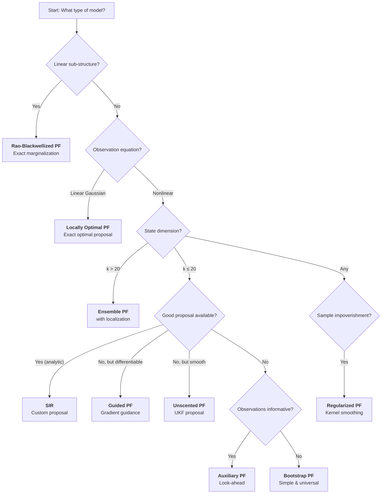

# Filter Comparison

This page provides a comprehensive comparison of all 9 particle filters available in particlefilterbox, with benchmarks, trade-off analysis, and a practical selection guide.

---

## Complete Feature Comparison

| Filter | Proposal | Obs. Informed | Needs Derivatives | Needs kalmanbox | Model Restrictions |
|--------|----------|:-------------:|:-----------------:|:---------------:|-------------------|
| [Bootstrap PF](bootstrap.md) | Prior | No | No | No | None |
| [SIR](sir.md) | Custom | Yes* | Depends | No | Needs $\log q$, $\log p(x \mid x')$ |
| [Auxiliary PF](auxiliary.md) | Prior + look-ahead | Partially | No | No | Needs `transition_mean` |
| [Guided PF](guided.md) | Gradient/Laplace | Yes | Yes | No | Differentiable likelihood |
| [Locally Optimal](locally-optimal.md) | Exact posterior | Yes | No | No | Linear-Gaussian obs. |
| [Rao-Blackwellized](rbpf.md) | Prior (nonlinear) | Yes (linear) | No | **Yes** | Mixed linear/nonlinear |
| [Unscented PF](upf.md) | UKF | Yes | No | **Yes** | Needs $f$, $h$, $Q$, $R$ |
| [Regularized PF](regularized.md) | Prior + kernel | No | No | No | Continuous state |
| [Ensemble PF](ensemble.md) | EnKF update | Yes | No | No | Needs $H$, $R$ |

\* Only when a custom proposal is provided; falls back to prior otherwise.

---

## Complexity Comparison

| Filter | Per-Particle Cost | Total per Step | Memory |
|--------|:-----------------:|:--------------:|:------:|
| Bootstrap PF | $O(1)$ | $O(N)$ | $O(N \cdot k)$ |
| SIR | $O(1)$ | $O(N)$ | $O(N \cdot k)$ |
| Auxiliary PF | $O(1)$ | $O(N)$ | $O(N \cdot k)$ |
| Guided PF (gradient) | $O(k)$ | $O(N \cdot k)$ | $O(N \cdot k)$ |
| Guided PF (Laplace) | $O(k^3)$ | $O(N \cdot k^3)$ | $O(N \cdot k^2)$ |
| Locally Optimal | $O(k)$ | $O(N \cdot k + k^3)$ | $O(N \cdot k)$ |
| Rao-Blackwellized | $O(k_l^3)$ | $O(N \cdot k_l^3)$ | $O(N \cdot k_l^2)$ |
| Unscented PF | $O(k^2)$ | $O(N \cdot k^2)$ | $O(N \cdot k^2)$ |
| Regularized PF | $O(k)$ | $O(N \cdot k)$ | $O(N \cdot k)$ |
| Ensemble PF | $O(k)$ | $O(N \cdot k^2)$ | $O(N \cdot k)$ |

Where $k$ = state dimension, $k_l$ = linear sub-state dimension, $N$ = number of particles.

---

## Benchmark: MSE vs Number of Particles

The following benchmark uses the **Gordon et al. (1993) model** — a nonlinear transition with linear observation:

$$
x_t = 0.5 x_{t-1} + \frac{25 x_{t-1}}{1 + x_{t-1}^2} + 8 \cos(1.2t) + \eta_t, \quad y_t = \frac{x_t}{20} + \varepsilon_t
$$

```python
import numpy as np
from particlefilterbox.filters import (
    BootstrapPF, SIR, AuxiliaryPF, GuidedPF,
    LocallyOptimalPF, RegularizedPF,
)
from particlefilterbox.core.config import PFConfig
from particlefilterbox.core.model import ParticleFilterModel

class GordonModel(ParticleFilterModel):
    k_states = 1
    k_obs = 1

    def initial_distribution(self, n_particles, rng):
        return rng.normal(0.0, np.sqrt(5.0), size=(n_particles, 1))

    def _mean_fn(self, x, t):
        return 0.5 * x + 25.0 * x / (1.0 + x**2) + 8.0 * np.cos(1.2 * t)

    def transition(self, particles, t, rng):
        return self._mean_fn(particles, t) + rng.normal(0, np.sqrt(10), size=particles.shape)

    def transition_mean(self, particles, t):
        return self._mean_fn(particles, t)

    def transition_cov(self, t):
        return np.array([[10.0]])

    def log_transition_density(self, x_curr, x_prev, t):
        mu = self._mean_fn(x_prev, t)[:, 0]
        return -0.5 * (x_curr[:, 0] - mu)**2 / 10.0

    def observation_matrix(self, t):
        return np.array([[0.05]])

    def observation_noise_cov(self, t):
        return np.array([[1.0]])

    def log_observation_likelihood(self, particles, y_t, t):
        pred = particles[:, 0] / 20.0
        return -0.5 * (y_t[0] - pred)**2

    def log_likelihood_gradient(self, x, y_t, t):
        grad = (y_t[0] - x[:, 0] / 20.0) / 20.0
        return grad[:, np.newaxis]

    def transition_noise_cov(self, t):
        return np.array([[10.0]])

# --- Benchmark ---
model = GordonModel()
rng = np.random.default_rng(42)
T = 200

x_true = np.zeros(T)
y_obs = np.zeros(T)
x_true[0] = rng.normal(0, np.sqrt(5))
y_obs[0] = x_true[0] / 20 + rng.normal(0, 1)
for t in range(1, T):
    x_true[t] = model._mean_fn(x_true[t-1:t], t)[0] + rng.normal(0, np.sqrt(10))
    y_obs[t] = x_true[t] / 20 + rng.normal(0, 1)

particle_counts = [100, 250, 500, 1000, 2000, 5000]
filters = {
    "Bootstrap": BootstrapPF,
    "Auxiliary": AuxiliaryPF,
    "Guided (grad)": lambda **kw: GuidedPF(**kw, guidance="gradient"),
    "Locally Optimal": LocallyOptimalPF,
    "Regularized": RegularizedPF,
}

print(f"{'N':>6} | ", end="")
for name in filters:
    print(f"{name:>16}", end=" | ")
print()
print("-" * (8 + 19 * len(filters)))

for N in particle_counts:
    print(f"{N:>6} | ", end="")
    for name, FilterClass in filters.items():
        config = PFConfig(n_particles=N, resampling="systematic", seed=42)
        pf = FilterClass(model=model, config=config)
        result = pf.filter(y_obs)
        mse = np.mean((result.filtered_means[:, 0] - x_true)**2)
        print(f"{mse:>16.4f}", end=" | ")
    print()
```

!!! tip "Expected results"
    Typical MSE ordering (best to worst) for a given $N$:

    1. **Locally Optimal** — uses the exact optimal proposal
    2. **Guided (gradient)** — approximates the optimal proposal
    3. **Auxiliary** — look-ahead improves particle allocation
    4. **Regularized** — maintains diversity after resampling
    5. **Bootstrap** — baseline, no observation information

    The gap narrows as $N$ increases — with enough particles, all filters converge.

---

## Benchmark: Execution Time vs Number of Particles

```python
import time

print(f"{'N':>6} | ", end="")
for name in filters:
    print(f"{name:>16}", end=" | ")
print()
print("-" * (8 + 19 * len(filters)))

for N in [500, 1000, 2000, 5000]:
    print(f"{N:>6} | ", end="")
    for name, FilterClass in filters.items():
        config = PFConfig(n_particles=N, resampling="systematic", seed=42)
        pf = FilterClass(model=model, config=config)
        t0 = time.perf_counter()
        pf.filter(y_obs)
        elapsed = time.perf_counter() - t0
        print(f"{elapsed:>15.3f}s", end=" | ")
    print()
```

!!! note "Relative timing"
    Approximate relative cost per time step (Bootstrap = 1.0×):

    | Filter | Relative cost |
    |--------|:------------:|
    | Bootstrap | 1.0× |
    | SIR (custom proposal) | 1.2× |
    | Auxiliary | 1.5× – 2.0× |
    | Guided (gradient) | 1.5× – 2.0× |
    | Guided (Laplace) | 3× – 10× |
    | Locally Optimal | 1.2× – 1.5× |
    | Regularized | 1.1× |
    | Rao-Blackwellized | 2× – 5× (depends on $k_l$) |
    | Unscented PF | 3× – 10× (depends on $k$) |
    | Ensemble PF | 2× – 5× (depends on $k$) |

---

## Filter Selection Guide

### By Problem Characteristics



### Quick Decision Table

| I need... | Use this filter | Why |
|-----------|----------------|-----|
| A first attempt, no model expertise | [Bootstrap PF](bootstrap.md) | Universal, no tuning |
| Better efficiency, no code changes | [Auxiliary PF](auxiliary.md) | Automatic look-ahead |
| Near-optimal proposals, no Jacobians | [Unscented PF](upf.md) | UKF handles nonlinearity |
| Minimum-variance weights | [Locally Optimal PF](locally-optimal.md) | Exact optimal proposal |
| Exploit linear sub-structure | [Rao-Blackwellized PF](rbpf.md) | Analytical marginalization |
| High-dimensional state ($k > 20$) | [Ensemble PF](ensemble.md) | Scales with localization |
| Prevent particle collapse | [Regularized PF](regularized.md) | Kernel jittering |
| Maximum flexibility | [SIR](sir.md) | Plug in any proposal |
| Differentiable likelihood, precise obs. | [Guided PF](guided.md) | Gradient-driven proposal |

### By Application Domain

| Domain | Recommended filters | Notes |
|--------|-------------------|-------|
| **Econometrics** (SV, DSGE) | Locally Optimal, RBPF, Bootstrap | Linear obs. common; RBPF for DSGE |
| **Finance** (portfolio, risk) | Bootstrap, Auxiliary, SIR | Flexible models, moderate dimension |
| **Tracking** (radar, GPS) | UPF, Guided, Auxiliary | Nonlinear observations, precise |
| **Geophysics / Weather** | Ensemble PF | Very high dimension, spatial structure |
| **Robotics / SLAM** | RBPF, UPF | Mixed structure, real-time |
| **Signal processing** | SIR, Locally Optimal | Custom proposals often available |
| **Biology / Ecology** | Bootstrap, Regularized | Simple models, parameter estimation |

---

## ESS Efficiency Summary

The following table summarizes the expected ESS as a fraction of $N$ for a moderately nonlinear model with informative observations:

| Filter | Expected $\text{ESS}/N$ | ESS Stability |
|--------|:----------------------:|:-------------:|
| Bootstrap PF | 0.1 – 0.3 | Variable |
| SIR (good proposal) | 0.5 – 0.9 | Stable |
| Auxiliary PF | 0.3 – 0.6 | Moderate |
| Guided PF (gradient) | 0.4 – 0.7 | Moderate |
| Guided PF (Laplace) | 0.6 – 0.9 | Stable |
| Locally Optimal PF | 0.8 – 1.0 | Very stable |
| Rao-Blackwellized PF | 0.5 – 0.9 | Stable |
| Unscented PF | 0.5 – 0.8 | Stable |
| Regularized PF | 0.2 – 0.4 | Improved diversity |
| Ensemble PF | 0.3 – 0.7 | Depends on localization |

!!! note "ESS is not everything"
    A high ESS does not guarantee accuracy. The Regularized PF may show lower ESS but better long-term diversity. The Ensemble PF may show moderate ESS but track high-dimensional states that no other filter can handle.

---

## Recommendations Summary

!!! tip "Start simple, upgrade when needed"
    1. **Start with Bootstrap PF** — establish a baseline
    2. **Check ESS** — if mean ESS < $0.3N$, try Auxiliary PF
    3. **Check model structure** — linear components → RBPF; linear observations → Locally Optimal
    4. **Check dimensionality** — $k > 20$ → Ensemble PF with localization
    5. **Check particle diversity** — repeated collapse → Regularized PF
    6. **Need maximum efficiency** — UPF or Guided PF for nonlinear; Locally Optimal for linear obs.

---

## References

- Gordon, N.J., Salmond, D.J. & Smith, A.F.M. (1993). Novel approach to nonlinear/non-Gaussian Bayesian state estimation. *IEE Proceedings F*, 140(2), 107–113.
- Doucet, A., de Freitas, N. & Gordon, N. (2001). *Sequential Monte Carlo Methods in Practice*. Springer.
- Chopin, N. & Papaspiliopoulos, O. (2020). *An Introduction to Sequential Monte Carlo*. Springer.
- Li, T., Bolic, M. & Djuric, P.M. (2015). Resampling methods for particle filtering: classification, implementation, and strategies. *IEEE Signal Processing Magazine*, 32(3), 70–86.
