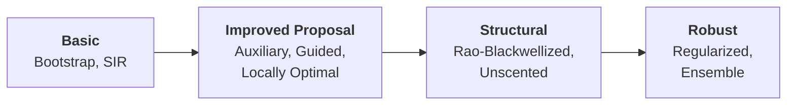

# Particle Filters

!!! info "Prerequisites"
    This guide assumes you have completed the [Getting Started](../../getting-started/index.md) section and are familiar with [ParticleCloud](../core/particle-cloud.md) and [Resampling](../core/resampling.md).

## Overview

particlefilterbox provides **9 particle filter variants** organized into four categories by increasing sophistication. Every filter shares the same core loop — *propagate, weight, resample* — but differs in **how particles are proposed** and **how weights are computed**.

---

## Taxonomy



### Basic Filters

The simplest filters that form the foundation of all particle filtering methods.

| Filter | Class | Proposal | Best for |
|--------|-------|----------|----------|
| [Bootstrap PF](bootstrap.md) | `BootstrapPF` | Prior $p(x_t \mid x_{t-1})$ | General-purpose, first attempt |
| [SIR Filter](sir.md) | `SIR` | Custom $q(x_t \mid x_{t-1}, y_t)$ | When a better proposal is available |

### Improved Proposal Filters

Filters that incorporate the current observation into the proposal, reducing weight variance.

| Filter | Class | Key idea | Best for |
|--------|-------|----------|----------|
| [Auxiliary PF](auxiliary.md) | `AuxiliaryPF` | Look-ahead via first-stage weights | Informative observations |
| [Guided PF](guided.md) | `GuidedPF` | Observation-driven drift | Moderate nonlinearity |
| [Locally Optimal PF](locally-optimal.md) | `LocallyOptimalPF` | Minimizes weight variance | Linear-Gaussian sub-structure |

### Structural Filters

Filters that exploit model structure to analytically marginalize part of the state.

| Filter | Class | Key idea | Best for |
|--------|-------|----------|----------|
| [Rao-Blackwellized PF](rbpf.md) | `RaoBlackwellPF` | Analytic update for linear sub-states | Mixed linear/nonlinear models |
| [Unscented PF](upf.md) | `UnscentedPF` | UKF-based proposal | Highly nonlinear dynamics |

### Robust Filters

Filters designed to handle degeneracy and particle impoverishment.

| Filter | Class | Key idea | Best for |
|--------|-------|----------|----------|
| [Regularized PF](regularized.md) | `RegularizedPF` | Kernel smoothing after resampling | Continuous state spaces |
| [Ensemble PF](ensemble.md) | `EnsemblePF` | Ensemble Kalman-style updates | High-dimensional states |

---

## Quick Comparison

| Filter | Complexity | Proposal quality | Ease of use | Observation sensitivity |
|--------|:----------:|:----------------:|:-----------:|:----------------------:|
| Bootstrap PF | $O(N)$ | Low | :material-star: :material-star: :material-star: | Low |
| SIR | $O(N)$ | Depends on $q$ | :material-star: :material-star: | Depends on $q$ |
| Auxiliary PF | $O(N)$ | Medium | :material-star: :material-star: | High |
| Guided PF | $O(N)$ | Medium-High | :material-star: :material-star: | High |
| Locally Optimal | $O(N)$ | Optimal* | :material-star: | High |
| Rao-Blackwellized | $O(N \cdot k)$ | High | :material-star: | Model-dependent |
| Unscented PF | $O(N \cdot k^2)$ | High | :material-star: :material-star: | High |
| Regularized PF | $O(N)$ | Low | :material-star: :material-star: :material-star: | Low |
| Ensemble PF | $O(N \cdot k)$ | Medium | :material-star: :material-star: | Medium |

\* Optimal within the class of proposals that depend on $(x_{t-1}, y_t)$.

!!! tip "Where to start"
    If you are new to particle filters, begin with the [Bootstrap PF](bootstrap.md). It requires **no tuning beyond `n_particles`** and works with any state-space model. Move to more sophisticated filters only when you observe weight degeneracy or poor ESS.

---

## Common API Pattern

All filters follow the same interface:

```python
from particlefilterbox.core.config import PFConfig

# 1. Configure
config = PFConfig(
    n_particles=1000,
    resampling="systematic",
    ess_threshold=0.5,
    seed=42,
)

# 2. Instantiate
pf = SomeFilter(model=my_model, config=config)

# 3. Run (batch mode)
result = pf.filter(observations)

# 4. Access results
print(result.filtered_means.shape)   # (T, state_dim)
print(result.log_likelihood)         # total log-likelihood
print(result.ess_history)            # ESS at each step
```

For online (step-by-step) filtering:

```python
cloud = pf.initialize(rng)

for t, y_t in enumerate(observations):
    cloud, ll_t = pf.filter_step(cloud, y_t, t)
    print(f"t={t}: log-lik={ll_t:.3f}, ESS={cloud.ess:.0f}")
```

See each filter's page for specific usage details and examples.
