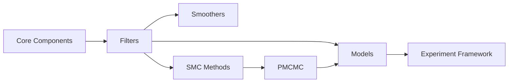

# User Guide

Welcome to the **particlefilterbox** User Guide. This section provides in-depth documentation for every component of the library, from the fundamental building blocks to advanced estimation algorithms.

!!! info "Prerequisites"
    This guide assumes you have completed the [Getting Started](../getting-started/index.md) section, including installation, the quickstart tutorial, and core concepts. If you haven't, start there first.

---

## Guide Sections

<div class="grid cards" markdown>

-   :material-cloud-outline:{ .lg .middle } **Core Components**

    ---

    ParticleCloud, resampling algorithms, and ESS monitoring --- the foundation of everything in particlefilterbox.

    [:octicons-arrow-right-24: Core Components](core/index.md)

-   :material-filter:{ .lg .middle } **Filters**

    ---

    Bootstrap PF, SIR, Auxiliary, Rao-Blackwellized, Unscented, Ensemble, and more. 10+ particle filter variants.

    [:octicons-arrow-right-24: Filters](filters/index.md)

-   :material-chart-timeline-variant-shimmer:{ .lg .middle } **Smoothers**

    ---

    FFBSm, FFBSi, Two-Filter, and Fixed-Lag smoothers for retrospective state estimation.

    [:octicons-arrow-right-24: Smoothers](smoothers/index.md)

-   :material-function-variant:{ .lg .middle } **SMC Methods**

    ---

    SMC Sampler, SMC², IBIS, Waste-Free SMC, and Tempering for static parameter estimation and model comparison.

    [:octicons-arrow-right-24: SMC Methods](smc/index.md)

-   :material-cog-sync:{ .lg .middle } **PMCMC**

    ---

    PMMH, Particle Gibbs, PG-AS, and Conditional SMC for fully Bayesian inference in state-space models.

    [:octicons-arrow-right-24: PMCMC](pmcmc/index.md)

-   :material-cube-outline:{ .lg .middle } **Models**

    ---

    Pre-built models: Stochastic Volatility, DSGE, Jump-Diffusion, Regime-Switching, and more.

    [:octicons-arrow-right-24: Models](models/index.md)

-   :material-flask:{ .lg .middle } **Experiment Framework**

    ---

    Run systematic experiments with multiple models, filters, and configurations. Compare results effortlessly.

    [:octicons-arrow-right-24: Experiment Framework](experiment.md)

</div>

---

## Recommended Learning Path

The sections are designed to be read in order, but you can jump to any topic. Here is the recommended progression:



| Step | Section | What You Learn |
|------|---------|----------------|
| 1 | [Core Components](core/index.md) | ParticleCloud, resampling, ESS --- foundations for everything |
| 2 | [Filters](filters/index.md) | How to run particle filters, choose variants, tune parameters |
| 3 | [Smoothers](smoothers/index.md) | Retrospective estimation: $p(x_t \mid y_{1:T})$ |
| 4 | [SMC Methods](smc/index.md) | Static parameters, model evidence, sequential inference |
| 5 | [PMCMC](pmcmc/index.md) | Full Bayesian posterior via MCMC + particle filters |
| 6 | [Models](models/index.md) | Apply methods to real-world economic and financial models |
| 7 | [Experiment](experiment.md) | Systematic comparison and reproducibility |

---

## Quick Reference

Every particle filter in particlefilterbox follows the same core workflow:

```python
from particlefilterbox import BootstrapPF, PFConfig
from particlefilterbox.models import StochasticVolatility

# 1. Define model
model = StochasticVolatility(variant="basic")

# 2. Configure filter
config = PFConfig(n_particles=5000, resampling="systematic", ess_threshold=0.5)

# 3. Run filter
pf = BootstrapPF(model, config)
results = pf.filter(observations)

# 4. Analyze
print(results.summary())
```

The guide explains each step in detail, starting with the data structures that underpin step 3.

---

## How This Guide is Organized

Each page in this guide follows a consistent structure:

1. **Quick Reference** --- class, import path, key parameters
2. **Mathematical Foundation** --- the equations behind the method
3. **API Walkthrough** --- detailed parameter and method documentation
4. **Examples** --- complete, runnable code with expected output
5. **When to Use** --- practical guidance on method selection
6. **See Also** --- links to theory, API reference, and tutorials
