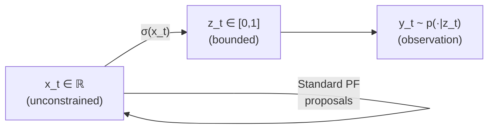

# Bounded State-Space

!!! info "Quick Reference"
    | | |
    |---|---|
    | **Class** | `BoundedModel` |
    | **Import** | `from particlefilterbox.models import BoundedModel` |
    | **Variants** | `logit`, `probit`, `beta` |
    | **State** | Unconstrained $x_t \in \mathbb{R}$ or bounded $z_t \in [a, b]$ |
    | **Observation** | Bounded $y_t \in [a, b]$ (proportions, rates, probabilities) |
    | **Recommended filter** | [Bootstrap PF](../filters/bootstrap.md) / [Guided PF](../filters/guided.md) |
    | **References** | Durbin & Koopman (2012); Casarin & Marin (2009); Da-Silva et al. (2011) |

---

## Overview

**Bounded state-space models** arise when the quantity of interest is restricted to a finite interval $[a, b]$. Examples include unemployment rates, portfolio weights, market shares, approval ratings, and any proportion or probability.

The challenge for particle filtering is twofold:

1. **State constraints**: particles must remain within bounds
2. **Non-Gaussian observations**: bounded data requires non-Gaussian likelihoods (Beta, truncated Normal)

particlefilterbox addresses this through **transformation-based** and **direct** approaches, with built-in handling of boundary constraints in the particle proposals.

---

## Mathematical Framework

### Logit Transform Approach

Map the bounded state to an unconstrained space via the logit transform:

$$
x_t = \text{logit}(z_t) = \log\!\left(\frac{z_t - a}{b - z_t}\right), \qquad z_t = a + (b - a) \, \sigma(x_t)
$$

where $\sigma(x) = 1 / (1 + e^{-x})$ is the sigmoid function and $z_t \in [a, b]$ is the bounded state.

**State dynamics** (in unconstrained space):

$$
x_t = \mu + \phi (x_{t-1} - \mu) + \sigma_\eta \, \eta_t, \qquad \eta_t \sim \mathcal{N}(0, 1)
$$

**Observation equation**:

$$
y_t = z_t + \sigma_\varepsilon \, \varepsilon_t = a + (b - a) \, \sigma(x_t) + \sigma_\varepsilon \, \varepsilon_t
$$

| Parameter | Symbol | Description |
|:----------|:-------|:------------|
| Lower bound | $a$ | Minimum value of the bounded space |
| Upper bound | $b$ | Maximum value of the bounded space |
| Level | $\mu$ | Long-run mean in logit space |
| Persistence | $\phi$ | AR coefficient in logit space |
| State noise | $\sigma_\eta$ | Innovation volatility in logit space |
| Obs noise | $\sigma_\varepsilon$ | Observation noise in bounded space |

!!! note "Default bounds"
    For proportions, $a = 0$ and $b = 1$. For percentage data, $a = 0$ and $b = 100$. The model automatically scales the transform to your specified bounds.

### Probit Transform Approach

Replace logit with the probit (inverse Normal CDF):

$$
x_t = \Phi^{-1}\!\left(\frac{z_t - a}{b - a}\right), \qquad z_t = a + (b - a) \, \Phi(x_t)
$$

The probit transform has lighter tails than logit, producing less extreme behavior near the boundaries. This is often preferred when the data rarely approach the bounds.

### Beta Observation Model

Instead of transforming the state, model the bounded observations directly with a Beta likelihood:

$$
y_t \mid z_t \sim \text{Beta}(\alpha_t, \beta_t)
$$

where the mean and precision are:

$$
\mu_t = \frac{z_t - a}{b - a}, \qquad \alpha_t = \mu_t \, \kappa, \qquad \beta_t = (1 - \mu_t) \, \kappa
$$

The precision parameter $\kappa > 0$ controls observation noise (higher $\kappa$ = less noise).

$$
\mathbb{E}[y_t \mid z_t] = \mu_t, \qquad \text{Var}(y_t \mid z_t) = \frac{\mu_t (1 - \mu_t)}{1 + \kappa}
$$

!!! tip "When to use Beta vs. Logit/Probit"
    Use the **Beta** variant when observations are strictly in $(0, 1)$ and you want the observation noise to be naturally heteroskedastic (smaller near 0 and 1). Use **logit/probit** when you want additive Gaussian noise in the transformed space, which is simpler and often sufficient.

---

## Handling Boundary Constraints in Particle Filters

### The Problem

Standard particle proposals can generate particles outside $[a, b]$, leading to:

- Invalid states (negative probabilities, rates > 100%)
- Zero-weight particles (wasted computation)
- Filter degeneracy near boundaries

### Reflected Proposals

Particles that exit the boundary are **reflected** back:

$$
\tilde{z}_t^{(i)} =
\begin{cases}
2a - z_t^{(i)} & \text{if } z_t^{(i)} < a \\
2b - z_t^{(i)} & \text{if } z_t^{(i)} > b \\
z_t^{(i)} & \text{otherwise}
\end{cases}
$$

This preserves the proposal density while ensuring all particles are valid.

### Truncated Proposals

Sample from a **truncated Normal** distribution directly:

$$
z_t^{(i)} \sim \mathcal{N}(\hat{z}_t, Q_t) \, \mathbf{1}(a \leq z_t \leq b)
$$

with an importance weight correction for the truncation:

$$
w_t^{(i)} \propto \frac{p(y_t \mid z_t^{(i)}) \, p(z_t^{(i)} \mid z_{t-1}^{(i)})}{q_{\text{trunc}}(z_t^{(i)} \mid z_{t-1}^{(i)}, y_t)}
$$

### Transform-Based (Recommended)

Work entirely in the unconstrained space $x_t \in \mathbb{R}$ and apply the inverse transform only for the observation likelihood. **No boundary issues arise** because $x_t$ is unbounded.



---

## API

### Constructor

```python
from particlefilterbox.models import BoundedModel

# Logit transform for [0, 1] proportions
bounded = BoundedModel(
    variant="logit",
    bounds=(0.0, 1.0),
    params={"mu": 0.0, "phi": 0.95, "sigma_eta": 0.2, "sigma_eps": 0.05},
)

# Probit transform for percentage data [0, 100]
bounded_pct = BoundedModel(
    variant="probit",
    bounds=(0.0, 100.0),
    params={"mu": 0.0, "phi": 0.98, "sigma_eta": 0.15, "sigma_eps": 1.0},
)

# Beta observation model
bounded_beta = BoundedModel(
    variant="beta",
    bounds=(0.0, 1.0),
    params={"mu": 0.0, "phi": 0.95, "sigma_eta": 0.2, "kappa": 50.0},
)

# Reflected proposals (direct bounded dynamics)
bounded_ref = BoundedModel(
    variant="logit",
    bounds=(0.0, 1.0),
    proposal="reflected",
    params={"mu": 0.0, "phi": 0.95, "sigma_eta": 0.2, "sigma_eps": 0.05},
)
```

### Parameters by Variant

=== "logit"

    | Parameter | Key | Default | Prior |
    |:----------|:----|:--------|:------|
    | $\mu$ | `mu` | $0.0$ | $\mathcal{N}(0, 3)$ |
    | $\phi$ | `phi` | $0.95$ | $\text{Beta}(20, 1.5)$ |
    | $\sigma_\eta$ | `sigma_eta` | $0.2$ | $\text{InvGamma}(2.5, 0.1)$ |
    | $\sigma_\varepsilon$ | `sigma_eps` | $0.05$ | $\text{InvGamma}(2.5, 0.01)$ |

=== "probit"

    | Parameter | Key | Default | Prior |
    |:----------|:----|:--------|:------|
    | $\mu$ | `mu` | $0.0$ | $\mathcal{N}(0, 3)$ |
    | $\phi$ | `phi` | $0.98$ | $\text{Beta}(20, 1.5)$ |
    | $\sigma_\eta$ | `sigma_eta` | $0.15$ | $\text{InvGamma}(2.5, 0.05)$ |
    | $\sigma_\varepsilon$ | `sigma_eps` | $0.05$ | $\text{InvGamma}(2.5, 0.01)$ |

=== "beta"

    | Parameter | Key | Default | Prior |
    |:----------|:----|:--------|:------|
    | $\mu$ | `mu` | $0.0$ | $\mathcal{N}(0, 3)$ |
    | $\phi$ | `phi` | $0.95$ | $\text{Beta}(20, 1.5)$ |
    | $\sigma_\eta$ | `sigma_eta` | $0.2$ | $\text{InvGamma}(2.5, 0.1)$ |
    | $\kappa$ | `kappa` | $50.0$ | $\text{Gamma}(5, 10)$ |

### Simulation

```python
bounded = BoundedModel(
    variant="logit",
    bounds=(0.0, 1.0),
    params={"mu": 0.0, "phi": 0.95, "sigma_eta": 0.2, "sigma_eps": 0.03},
)
sim = bounded.simulate(T=300, seed=42)

observations = sim["observations"]   # shape (300, 1), in [0, 1]
states_logit = sim["states"]         # shape (300, 1), unconstrained
states_bounded = sim["states_bounded"]  # shape (300, 1), in [0, 1]
```

---

## Filtering

### Basic Filtering

```python
import numpy as np
from particlefilterbox.models import BoundedModel
from particlefilterbox.filters import BootstrapPF
from particlefilterbox.core.config import PFConfig

# Logit model for unemployment rate (0-100%)
model = BoundedModel(
    variant="logit",
    bounds=(0.0, 100.0),
    params={"mu": -1.5, "phi": 0.98, "sigma_eta": 0.1, "sigma_eps": 0.3},
)

sim = model.simulate(T=200, seed=42)
y = sim["observations"]

config = PFConfig(n_particles=1000, seed=42)
pf = BootstrapPF(model=model, config=config)
result = pf.filter(y)

# Filtered state in bounded space
z_filtered = result.filtered_states_bounded.mean(axis=1).squeeze()

print(f"Log-likelihood: {result.log_likelihood:.2f}")
print(f"Mean filtered rate: {z_filtered.mean():.1f}%")
```

### Visualizing Bounded Estimates

```python
import matplotlib.pyplot as plt

fig, axes = plt.subplots(2, 1, figsize=(12, 8), sharex=True)

# Observations
axes[0].plot(y, 'o', color="steelblue", alpha=0.5, markersize=3)
axes[0].axhline(0, color="gray", linestyle="--", alpha=0.3)
axes[0].axhline(100, color="gray", linestyle="--", alpha=0.3)
axes[0].set_ylabel("Unemployment rate (%)")
axes[0].set_title("Observed Data")

# Filtered rate with credible interval
z_q05 = np.quantile(result.filtered_states_bounded.squeeze(), 0.05, axis=1)
z_q95 = np.quantile(result.filtered_states_bounded.squeeze(), 0.95, axis=1)

axes[1].fill_between(range(len(z_filtered)), z_q05, z_q95,
                     alpha=0.3, color="steelblue")
axes[1].plot(z_filtered, color="steelblue", label="Filtered")
axes[1].plot(sim["states_bounded"].squeeze(), color="red",
             alpha=0.7, linewidth=0.8, label="True")
axes[1].set_ylabel("Rate (%)")
axes[1].set_xlabel("Time")
axes[1].legend()

plt.tight_layout()
plt.show()
```

---

## Parameter Estimation with PMMH

```python
from particlefilterbox.models import BoundedModel
from particlefilterbox.filters import BootstrapPF
from particlefilterbox.pmcmc import PMMH
from particlefilterbox.core.config import PFConfig

# True model
true_model = BoundedModel(
    variant="logit",
    bounds=(0.0, 1.0),
    params={"mu": -0.5, "phi": 0.96, "sigma_eta": 0.15, "sigma_eps": 0.03},
)
sim = true_model.simulate(T=500, seed=42)
y = sim["observations"]

# Estimation
model = BoundedModel(variant="logit", bounds=(0.0, 1.0))
pf_config = PFConfig(n_particles=500, seed=0)

pmmh = PMMH(
    model=model,
    filter_cls=BootstrapPF,
    pf_config=pf_config,
    priors=model.default_prior(),
    n_iterations=12000,
    burn_in=4000,
    seed=42,
)

chain = pmmh.run(y)

print("Posterior estimates (true: mu=-0.5, phi=0.96, sigma_eta=0.15, sigma_eps=0.03):")
for param in ["mu", "phi", "sigma_eta", "sigma_eps"]:
    samples = chain[param]
    print(f"  {param}: {samples.mean():.4f} +/- {samples.std():.4f}")
```

---

## Example: Unemployment Rate Dynamics

A complete workflow for modeling monthly unemployment rates:

```python
import numpy as np
from particlefilterbox.models import BoundedModel
from particlefilterbox.filters import BootstrapPF
from particlefilterbox.pmcmc import PMMH
from particlefilterbox.core.config import PFConfig

# --- 1. Model: unemployment rate in [0%, 30%] ---
unemp_model = BoundedModel(
    variant="logit",
    bounds=(0.0, 30.0),
    params={
        "mu": -1.0,       # logit of ~7.3% baseline
        "phi": 0.98,      # highly persistent
        "sigma_eta": 0.08, # smooth evolution
        "sigma_eps": 0.2,  # measurement noise
    },
)

# --- 2. Simulate monthly data ---
sim = unemp_model.simulate(T=360, seed=42)  # 30 years
y = sim["observations"]

# --- 3. Filter ---
config = PFConfig(n_particles=1000, seed=42)
pf = BootstrapPF(model=unemp_model, config=config)
result = pf.filter(y)

# --- 4. Extract natural-rate estimate ---
z_hat = result.filtered_states_bounded.mean(axis=1).squeeze()
z_q10 = np.quantile(result.filtered_states_bounded.squeeze(), 0.10, axis=1)
z_q90 = np.quantile(result.filtered_states_bounded.squeeze(), 0.90, axis=1)

print(f"Log-likelihood: {result.log_likelihood:.2f}")
print(f"Average rate: {z_hat.mean():.1f}%")
print(f"Range: [{z_hat.min():.1f}%, {z_hat.max():.1f}%]")

# --- 5. Bayesian estimation ---
model_est = BoundedModel(variant="logit", bounds=(0.0, 30.0))
pf_config = PFConfig(n_particles=500, seed=0)

pmmh = PMMH(
    model=model_est,
    filter_cls=BootstrapPF,
    pf_config=pf_config,
    priors=model_est.default_prior(),
    n_iterations=10000,
    burn_in=3000,
    seed=42,
)
chain = pmmh.run(y)

print("\nPosterior estimates:")
for param in ["mu", "phi", "sigma_eta", "sigma_eps"]:
    samples = chain[param]
    print(f"  {param}: {samples.mean():.4f} +/- {samples.std():.4f}")
```

---

## Comparing Transform Approaches

| Feature | Logit | Probit | Beta |
|:--------|:------|:-------|:-----|
| **Transform** | $\log(z / (1-z))$ | $\Phi^{-1}(z)$ | none (direct) |
| **Tail behavior** | Heavy tails near bounds | Light tails near bounds | N/A |
| **Obs noise** | Additive Gaussian | Additive Gaussian | Heteroskedastic (Beta) |
| **State space** | $\mathbb{R}$ (unconstrained) | $\mathbb{R}$ (unconstrained) | $\mathbb{R}$ (logit of mean) |
| **Best for** | Rates that occasionally approach bounds | Rates well away from bounds | Proportions with natural heteroskedasticity |
| **Boundary handling** | Automatic (sigmoid) | Automatic (CDF) | Automatic (Beta support) |

---

## Filter Recommendations

| Scenario | Recommended Filter | Particles | Notes |
|:---------|:-------------------|:----------|:------|
| Logit/probit transform | [Bootstrap PF](../filters/bootstrap.md) | 500--1000 | Unconstrained state, standard filtering |
| Beta observation model | [Bootstrap PF](../filters/bootstrap.md) | 1000--1500 | Non-Gaussian likelihood needs more particles |
| State near boundaries | [Guided PF](../filters/guided.md) | 500--1000 | Better proposals near constraint regions |
| Reflected/truncated proposals | [Bootstrap PF](../filters/bootstrap.md) | 1000--2000 | Weight correction adds variance |
| Parameter estimation | [PMMH](../pmcmc/pmmh.md) + Bootstrap PF | 300--500 | Logit transform gives smoothest likelihood |

!!! warning "Observation Noise Near Boundaries"
    With the logit/probit approach and additive Gaussian observation noise, observations can technically exceed the bounds $[a, b]$. If your data is strictly bounded, use the Beta variant or clip observations before filtering.

---

## See Also

- [Bootstrap PF](../filters/bootstrap.md) --- Default filter for bounded models
- [Guided PF](../filters/guided.md) --- Improved proposals near boundaries
- [PMMH](../pmcmc/pmmh.md) --- Bayesian parameter estimation
- [Count Data](count.md) --- Another non-Gaussian observation model
- [Stochastic Volatility](stochastic-volatility.md) --- Related transformation-based approach (log-volatility)
