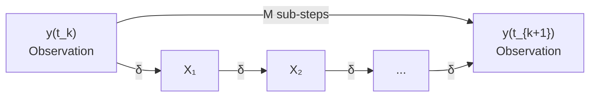

# Continuous-Time

!!! info "Quick Reference"
    | | |
    |---|---|
    | **Class** | `ContinuousTimeModel` |
    | **Import** | `from particlefilterbox.models import ContinuousTimeModel` |
    | **Variants** | `euler-maruyama`, `milstein`, `bridge` |
    | **State** | Continuous $X_t$ (solution of SDE) |
    | **Observation** | Discrete observations $y_{t_k}$ at times $t_0 < t_1 < \ldots < t_T$ |
    | **Recommended filter** | [Bootstrap PF](../filters/bootstrap.md) / [Guided PF](../filters/guided.md) |
    | **References** | Del Moral & Murray (2015); Golightly & Wilkinson (2011); Durham & Gallant (2002) |

---

## Overview

**Continuous-time state-space models** arise when the latent process evolves according to a **stochastic differential equation (SDE)** but observations are collected at discrete time points. This is the natural framework for:

- **Interest rate models** (CIR, Vasicek)
- **Stochastic volatility** (Heston model)
- **Population dynamics** (Lotka-Volterra)
- **Physics-based systems** (Langevin dynamics)

The fundamental challenge is that the SDE transition density $p(X_{t+\Delta} \mid X_t)$ is rarely available in closed form, requiring **numerical discretization** to simulate paths between observation times. particlefilterbox provides three discretization schemes with automatic sub-stepping.

---

## Mathematical Framework

### General SDE

An Itô SDE in $d$ dimensions:

$$
dX_t = f(X_t, t) \, dt + g(X_t, t) \, dW_t
$$

where:

| Component | Symbol | Description |
|:----------|:-------|:------------|
| Drift | $f(X_t, t)$ | Deterministic tendency ($\mathbb{R}^d \to \mathbb{R}^d$) |
| Diffusion | $g(X_t, t)$ | Noise intensity ($\mathbb{R}^d \to \mathbb{R}^{d \times m}$) |
| Brownian motion | $W_t$ | $m$-dimensional Wiener process |

**Observations** at discrete times $t_0, t_1, \ldots, t_T$:

$$
y_{t_k} = h(X_{t_k}) + \varepsilon_k, \qquad \varepsilon_k \sim \mathcal{N}(0, R)
$$

### Discretization Schemes

#### Euler-Maruyama

The simplest discretization. For step size $\delta$:

$$
X_{t+\delta} = X_t + f(X_t, t) \, \delta + g(X_t, t) \, \sqrt{\delta} \, Z, \qquad Z \sim \mathcal{N}(0, I)
$$

- **Order**: strong order $0.5$, weak order $1.0$
- **Pros**: simple, general, works for any SDE
- **Cons**: requires small $\delta$ for accuracy; can produce negative values for non-negativity-constrained processes

#### Milstein

Adds a correction term using the diffusion derivative:

$$
X_{t+\delta} = X_t + f(X_t) \, \delta + g(X_t) \, \sqrt{\delta} \, Z + \frac{1}{2} g(X_t) \, g'(X_t) \, (\delta Z^2 - \delta)
$$

where $g'(X_t) = \partial g / \partial X$.

- **Order**: strong order $1.0$, weak order $1.0$
- **Pros**: more accurate than Euler-Maruyama for the same $\delta$
- **Cons**: requires the derivative $g'(X)$; more complex for multidimensional SDEs

!!! note "Milstein = Euler-Maruyama when diffusion is constant"
    If $g(X_t) = \sigma$ (constant diffusion), the Milstein correction vanishes and both schemes are identical. The Milstein scheme provides improvement only when the diffusion coefficient depends on the state.

#### SDE Bridges

For **guided proposals** between observations, construct a bridge process that connects $X_{t_k}$ to a target consistent with $y_{t_{k+1}}$:

$$
d\tilde{X}_t = \left[f(\tilde{X}_t) + g(\tilde{X}_t)^2 \, \frac{\hat{x}_{t_{k+1}} - \tilde{X}_t}{t_{k+1} - t}\right] dt + g(\tilde{X}_t) \, dW_t
$$

where $\hat{x}_{t_{k+1}}$ is an approximate target point derived from $y_{t_{k+1}}$. The bridge pulls particles toward the next observation, dramatically improving proposal efficiency.

---

## Sub-stepping Strategy

Between consecutive observation times $t_k$ and $t_{k+1}$, the SDE is simulated with $M$ sub-steps:

$$
\delta = \frac{t_{k+1} - t_k}{M}
$$



The trade-off: more sub-steps improve accuracy but increase computational cost linearly.

| Discretization | Recommended $M$ | Error vs. cost |
|:---------------|:-----------------|:---------------|
| Euler-Maruyama | 10--100 | $\mathcal{O}(\delta^{0.5})$ strong, $\mathcal{O}(M)$ cost |
| Milstein | 5--50 | $\mathcal{O}(\delta^{1.0})$ strong, $\mathcal{O}(M)$ cost |
| Bridge | 10--50 | Better particle efficiency offsets cost |

!!! tip "Adaptive sub-stepping"
    Set `adaptive_dt=True` to let particlefilterbox automatically choose $M$ based on the local drift and diffusion magnitudes. This concentrates computation where the SDE is stiff or volatile.

---

## Particle Filter for Continuous-Time Models

### Standard Approach

Between observations $y_{t_k}$ and $y_{t_{k+1}}$:

1. **Propagate**: simulate each particle forward from $X_{t_k}^{(i)}$ to $X_{t_{k+1}}^{(i)}$ using $M$ discretization sub-steps
2. **Weight**: $w_{t_{k+1}}^{(i)} \propto p(y_{t_{k+1}} \mid X_{t_{k+1}}^{(i)})$
3. **Resample** if ESS drops below threshold

### Guided PF with SDE Bridges

The bridge proposal **conditions on the next observation**, pulling particles toward informative regions:

$$
w_{t_{k+1}}^{(i)} \propto \frac{p(y_{t_{k+1}} \mid X_{t_{k+1}}^{(i)}) \, p_{\text{SDE}}(X_{t_{k+1}}^{(i)} \mid X_{t_k}^{(i)})}{q_{\text{bridge}}(X_{t_{k+1}}^{(i)} \mid X_{t_k}^{(i)}, y_{t_{k+1}})}
$$

This is especially important when observations are informative and the inter-observation interval $\Delta t_k = t_{k+1} - t_k$ is large.

!!! warning "Computational cost"
    Each particle requires $M$ sub-steps between observations. With $N$ particles and $T$ observations, the total cost is $\mathcal{O}(N \times M \times T)$. For expensive SDEs, consider [Numba JIT](../../acceleration/numba.md) or [GPU acceleration](../../acceleration/gpu.md).

---

## API

### Constructor

```python
from particlefilterbox.models import ContinuousTimeModel

# CIR interest rate model
# dX_t = κ(θ - X_t)dt + σ√X_t dW_t
def cir_drift(x, t):
    kappa, theta = 0.5, 0.05
    return kappa * (theta - x)

def cir_diffusion(x, t):
    sigma = 0.1
    return sigma * np.sqrt(np.maximum(x, 0))

cir = ContinuousTimeModel(
    drift=cir_drift,
    diffusion=cir_diffusion,
    discretization="milstein",
    dt=0.01,             # sub-step size
    obs_noise=0.001,     # observation noise std
    k_states=1,
)

# Euler-Maruyama with automatic sub-stepping
sde = ContinuousTimeModel(
    drift=f,
    diffusion=g,
    discretization="euler-maruyama",
    dt=0.01,
    obs_noise=0.01,
)

# Bridge proposal for better efficiency
sde_bridge = ContinuousTimeModel(
    drift=f,
    diffusion=g,
    discretization="bridge",
    dt=0.01,
    obs_noise=0.01,
)
```

### Parameters

| Parameter | Key | Default | Description |
|:----------|:----|:--------|:------------|
| Drift | `drift` | required | Function $f(x, t) \to \mathbb{R}^d$ |
| Diffusion | `diffusion` | required | Function $g(x, t) \to \mathbb{R}^{d \times m}$ |
| Discretization | `discretization` | `euler-maruyama` | Scheme: `euler-maruyama`, `milstein`, `bridge` |
| Sub-step size | `dt` | $0.01$ | Time step $\delta$ for discretization |
| Obs noise | `obs_noise` | $0.01$ | Observation noise standard deviation |
| State dim | `k_states` | $1$ | Dimension of the state $X_t$ |
| Observation function | `obs_fn` | identity | $h(X_t)$ mapping state to observation space |
| Adaptive stepping | `adaptive_dt` | `False` | Automatically adjust $M$ per interval |

### Pre-built Models

particlefilterbox includes common SDE models:

```python
from particlefilterbox.models import ContinuousTimeModel

# Cox-Ingersoll-Ross (interest rates)
cir = ContinuousTimeModel.cir(kappa=0.5, theta=0.05, sigma=0.1, dt=0.01)

# Heston stochastic volatility
heston = ContinuousTimeModel.heston(
    mu=0.05, kappa=2.0, theta=0.04, sigma_v=0.3, rho=-0.7, dt=0.005
)

# Ornstein-Uhlenbeck (mean-reverting)
ou = ContinuousTimeModel.ornstein_uhlenbeck(
    mu=0.0, theta=1.0, sigma=0.5, dt=0.01
)

# Geometric Brownian Motion (asset prices)
gbm = ContinuousTimeModel.gbm(mu=0.05, sigma=0.2, dt=0.01)
```

### Simulation

```python
import numpy as np

# CIR model
cir = ContinuousTimeModel.cir(kappa=0.5, theta=0.05, sigma=0.1, dt=0.001)

# Simulate with observations every 0.1 time units
sim = cir.simulate(T=500, obs_interval=0.1, x0=0.05, seed=42)

observations = sim["observations"]     # shape (500, 1), observed at t_k
states = sim["states"]                 # shape (500, 1), true X_{t_k}
times = sim["times"]                   # shape (500,), observation times
fine_states = sim["fine_states"]       # shape (500*M, 1), all sub-steps
fine_times = sim["fine_times"]         # shape (500*M,), sub-step times
```

---

## Filtering

### CIR Interest Rate Model

```python
import numpy as np
from particlefilterbox.models import ContinuousTimeModel
from particlefilterbox.filters import BootstrapPF
from particlefilterbox.core.config import PFConfig

# CIR: dX = 0.5(0.05 - X)dt + 0.1√X dW
cir = ContinuousTimeModel.cir(kappa=0.5, theta=0.05, sigma=0.1, dt=0.005)

sim = cir.simulate(T=300, obs_interval=0.1, x0=0.05, seed=42)
y = sim["observations"]

config = PFConfig(n_particles=1000, seed=42)
pf = BootstrapPF(model=cir, config=config)
result = pf.filter(y)

# Filtered interest rate
rate_filtered = result.filtered_states.mean(axis=1).squeeze()

print(f"Log-likelihood: {result.log_likelihood:.2f}")
print(f"Mean ESS: {np.mean(result.ess_history):.0f}")
print(f"Mean filtered rate: {rate_filtered.mean():.4f}")
```

### Heston Stochastic Volatility

The Heston model has a 2D state $(S_t, V_t)$ --- log-price and variance:

$$
\begin{aligned}
dS_t &= \mu \, dt + \sqrt{V_t} \, dW_t^{(1)} \\[4pt]
dV_t &= \kappa (\theta - V_t) \, dt + \sigma_v \sqrt{V_t} \, dW_t^{(2)}
\end{aligned}
$$

with $\text{Corr}(dW_t^{(1)}, dW_t^{(2)}) = \rho$.

```python
# Heston model
heston = ContinuousTimeModel.heston(
    mu=0.05, kappa=2.0, theta=0.04, sigma_v=0.3, rho=-0.7, dt=0.005
)

sim = heston.simulate(T=500, obs_interval=1/252, x0=[0.0, 0.04], seed=42)
y = sim["observations"]  # observed returns

# Filter with more particles (2D state)
config = PFConfig(n_particles=2000, seed=42)
pf = BootstrapPF(model=heston, config=config)
result = pf.filter(y)

# Extract filtered variance
vol_filtered = result.filtered_states[:, :, 1].mean(axis=1)
annualized_vol = np.sqrt(vol_filtered * 252)

print(f"Mean annualized vol: {annualized_vol.mean() * 100:.1f}%")
```

### Visualizing Continuous-Time Filtering

```python
import matplotlib.pyplot as plt

fig, axes = plt.subplots(3, 1, figsize=(12, 10), sharex=True)

# Observations
axes[0].plot(sim["times"], y.squeeze(), color="steelblue", alpha=0.7, linewidth=0.5)
axes[0].set_ylabel("$y_{t_k}$")
axes[0].set_title("Observations")

# Filtered state vs true
true_rate = sim["states"].squeeze()
x_q05 = np.quantile(result.filtered_states.squeeze(), 0.05, axis=1)
x_q95 = np.quantile(result.filtered_states.squeeze(), 0.95, axis=1)

axes[1].fill_between(sim["times"], x_q05, x_q95, alpha=0.3, color="steelblue")
axes[1].plot(sim["times"], rate_filtered, color="steelblue", label="Filtered")
axes[1].plot(sim["times"], true_rate, color="red", alpha=0.7, linewidth=0.8, label="True")
axes[1].set_ylabel("$X_t$")
axes[1].legend()
axes[1].set_title("Filtered State")

# Fine-grained true path
axes[2].plot(sim["fine_times"], sim["fine_states"].squeeze(),
             color="gray", alpha=0.5, linewidth=0.3)
axes[2].plot(sim["times"], true_rate, 'o', color="red", markersize=3, label="Observed times")
axes[2].set_ylabel("$X_t$ (fine)")
axes[2].set_xlabel("Time")
axes[2].legend()
axes[2].set_title("True SDE Path (all sub-steps)")

plt.tight_layout()
plt.show()
```

---

## Parameter Estimation with PMMH

### Estimating CIR Parameters

```python
from particlefilterbox.models import ContinuousTimeModel
from particlefilterbox.filters import BootstrapPF
from particlefilterbox.pmcmc import PMMH
from particlefilterbox.core.config import PFConfig

# True CIR model
cir_true = ContinuousTimeModel.cir(kappa=0.5, theta=0.05, sigma=0.1, dt=0.005)
sim = cir_true.simulate(T=1000, obs_interval=0.1, x0=0.05, seed=42)
y = sim["observations"]

# Model for estimation
cir_est = ContinuousTimeModel.cir(kappa=1.0, theta=0.04, sigma=0.15, dt=0.005)

pf_config = PFConfig(n_particles=500, seed=0)
priors = {
    "kappa": {"distribution": "gamma", "a": 2.0, "b": 1.0},
    "theta": {"distribution": "normal", "loc": 0.05, "scale": 0.02},
    "sigma": {"distribution": "inverse_gamma", "a": 3.0, "b": 0.3},
}

pmmh = PMMH(
    model=cir_est,
    filter_cls=BootstrapPF,
    pf_config=pf_config,
    priors=priors,
    n_iterations=12000,
    burn_in=4000,
    seed=42,
)

chain = pmmh.run(y)

print("Posterior estimates (true: kappa=0.5, theta=0.05, sigma=0.1):")
for param in ["kappa", "theta", "sigma"]:
    samples = chain[param]
    print(f"  {param}: {samples.mean():.4f} +/- {samples.std():.4f}")
```

---

## Example: CIR Interest Rate Model

A complete workflow for modeling short-term interest rates:

```python
import numpy as np
from particlefilterbox.models import ContinuousTimeModel
from particlefilterbox.filters import BootstrapPF
from particlefilterbox.pmcmc import PMMH
from particlefilterbox.core.config import PFConfig

# --- 1. CIR model ---
# dX_t = κ(θ - X_t)dt + σ√X_t dW_t
# Feller condition: 2κθ > σ² ensures X_t > 0
kappa, theta, sigma = 0.5, 0.05, 0.1
assert 2 * kappa * theta > sigma**2, "Feller condition violated"

cir = ContinuousTimeModel.cir(kappa=kappa, theta=theta, sigma=sigma, dt=0.005)

# --- 2. Simulate weekly observations over 10 years ---
sim = cir.simulate(T=520, obs_interval=1/52, x0=0.04, seed=42)
rates = sim["observations"]

# --- 3. Filter ---
config = PFConfig(n_particles=1000, seed=42)
pf = BootstrapPF(model=cir, config=config)
result = pf.filter(rates)

rate_hat = result.filtered_states.mean(axis=1).squeeze()

print(f"Log-likelihood: {result.log_likelihood:.2f}")
print(f"Long-run mean (theta): {theta:.4f}")
print(f"Sample mean rate: {rates.mean():.4f}")
print(f"Filtered mean rate: {rate_hat.mean():.4f}")

# --- 4. Bayesian estimation ---
cir_est = ContinuousTimeModel.cir(kappa=1.0, theta=0.04, sigma=0.15, dt=0.005)
pf_config = PFConfig(n_particles=300, seed=0)

pmmh = PMMH(
    model=cir_est,
    filter_cls=BootstrapPF,
    pf_config=pf_config,
    priors={
        "kappa": {"distribution": "gamma", "a": 2.0, "b": 1.0},
        "theta": {"distribution": "normal", "loc": 0.05, "scale": 0.02},
        "sigma": {"distribution": "inverse_gamma", "a": 3.0, "b": 0.3},
    },
    n_iterations=10000,
    burn_in=3000,
    seed=42,
)
chain = pmmh.run(rates)

print(f"\nPosterior estimates (true: kappa={kappa}, theta={theta}, sigma={sigma}):")
for param in ["kappa", "theta", "sigma"]:
    samples = chain[param]
    print(f"  {param}: {samples.mean():.4f} +/- {samples.std():.4f}")
```

---

## Example: Heston Stochastic Volatility

```python
import numpy as np
from particlefilterbox.models import ContinuousTimeModel
from particlefilterbox.filters import BootstrapPF
from particlefilterbox.core.config import PFConfig

# --- 1. Heston model ---
heston = ContinuousTimeModel.heston(
    mu=0.05,       # drift of log-price
    kappa=2.0,     # mean-reversion speed of variance
    theta=0.04,    # long-run variance (~20% annual vol)
    sigma_v=0.3,   # vol-of-vol
    rho=-0.7,      # leverage effect
    dt=0.002,      # fine discretization
)

# --- 2. Simulate daily returns for 5 years ---
sim = heston.simulate(T=1260, obs_interval=1/252, x0=[0.0, 0.04], seed=42)
returns = sim["observations"]

# --- 3. Filter ---
config = PFConfig(n_particles=2000, seed=42)
pf = BootstrapPF(model=heston, config=config)
result = pf.filter(returns)

# --- 4. Extract vol surface ---
variance = result.filtered_states[:, :, 1]  # V_t
vol_mean = np.sqrt(variance.mean(axis=1) * 252)
vol_q05 = np.sqrt(np.quantile(variance, 0.05, axis=1) * 252)
vol_q95 = np.sqrt(np.quantile(variance, 0.95, axis=1) * 252)

print(f"Log-likelihood: {result.log_likelihood:.2f}")
print(f"Average annualized vol: {vol_mean.mean() * 100:.1f}%")
print(f"Vol range: [{vol_mean.min() * 100:.1f}%, {vol_mean.max() * 100:.1f}%]")
```

---

## Comparing Discretization Schemes

| Scheme | Strong Order | Weak Order | Cost per step | Diffusion derivative | Best for |
|:-------|:-------------|:-----------|:--------------|:--------------------|:---------|
| Euler-Maruyama | $0.5$ | $1.0$ | Low | Not needed | General purpose, prototyping |
| Milstein | $1.0$ | $1.0$ | Medium | Required ($g'$) | State-dependent diffusion (CIR, Heston) |
| Bridge | $0.5$+ | $1.0$+ | Higher | Not needed | Informative observations, large $\Delta t$ |

!!! tip "Choosing a discretization"
    - Start with **Euler-Maruyama** and a small `dt` (e.g., 0.001--0.01)
    - Switch to **Milstein** if the diffusion depends on the state (e.g., $\sigma\sqrt{X}$ in CIR) and you want fewer sub-steps
    - Use **bridge proposals** when observations are highly informative and the bootstrap filter degenerates (low ESS)

---

## Filter Recommendations

| Scenario | Recommended Filter | Particles | Sub-steps | Notes |
|:---------|:-------------------|:----------|:----------|:------|
| 1D SDE, moderate noise | [Bootstrap PF](../filters/bootstrap.md) | 500--1000 | 10--50 | Standard choice |
| 2D+ SDE (Heston) | [Bootstrap PF](../filters/bootstrap.md) | 1000--3000 | 20--100 | Higher dimension needs more particles |
| Informative observations | [Guided PF](../filters/guided.md) | 500--1000 | 10--50 | Bridge proposals reduce weight variance |
| Large observation gaps | [Guided PF](../filters/guided.md) + bridge | 1000--2000 | 50--200 | Bridge essential for long inter-obs intervals |
| Parameter estimation | [PMMH](../pmcmc/pmmh.md) + Bootstrap | 300--500 | 10--50 | Balance sub-steps vs. MCMC iterations |

!!! warning "Feller condition for CIR"
    The CIR process requires $2 \kappa \theta > \sigma^2$ to ensure the process stays strictly positive. Euler-Maruyama can produce negative values even when the Feller condition holds --- use `absorbing_boundary=True` or the Milstein scheme to mitigate this.

---

## See Also

- [Bootstrap PF](../filters/bootstrap.md) --- Standard filter for SDE models
- [Guided PF](../filters/guided.md) --- Bridge proposals for improved efficiency
- [PMMH](../pmcmc/pmmh.md) --- Bayesian estimation of SDE parameters
- [Stochastic Volatility](stochastic-volatility.md) --- Discrete-time volatility model (simpler, faster)
- [Jump-Diffusion](jump-diffusion.md) --- SDE with discontinuous jumps
- [Numba JIT](../../acceleration/numba.md) --- Accelerate SDE simulation loops
