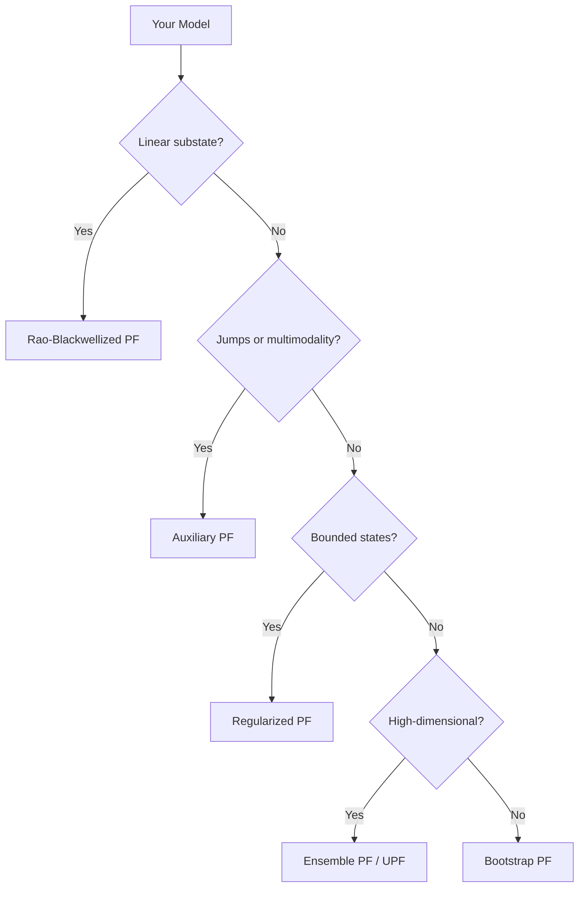

# Pre-built Models

particlefilterbox ships with **8 pre-built models** covering financial, macroeconomic, and general-purpose applications. Each model provides a consistent interface for simulation, filtering, and Bayesian parameter estimation --- so you can focus on the problem, not the plumbing.

!!! info "Design Philosophy"
    Every model exposes the same core methods --- `initial_state()`, `transition()`, `log_observation_density()`, and `simulate()` --- plus default priors for PMCMC estimation. You can use any model with any compatible filter out of the box.

---

## Model Catalogue

| Model | Category | State Type | Observation | Key Parameters | Recommended Filter |
|:------|:---------|:-----------|:------------|:---------------|:-------------------|
| [**StochasticVolatility**](stochastic-volatility.md) | Financial | Continuous (log-vol) | Continuous (returns) | $\mu, \phi, \sigma$ | [Bootstrap PF](../filters/bootstrap.md) |
| [**JumpDiffusion**](jump-diffusion.md) | Financial | Continuous (log-price) | Continuous (log-returns) | $\mu, \sigma, \lambda, \mu_J, \sigma_J$ | [Auxiliary PF](../filters/auxiliary.md) |
| [**DSGE**](dsge.md) | Macro | Multivariate continuous | Multivariate continuous | $A, B, C$ matrices + structural | [Rao-Blackwellized PF](../filters/rbpf.md) |
| [**NonlinearRegime**](regime.md) | General | Mixed (continuous + discrete) | Continuous | Transition matrix, regime params | [Bootstrap PF](../filters/bootstrap.md) |
| [**CountStateSpace**](count.md) | General | Continuous (latent intensity) | Count (integer) | $\phi, \sigma, N$ | [Bootstrap PF](../filters/bootstrap.md) |
| [**BoundedStates**](bounded.md) | General | Bounded continuous | Continuous | Bounds, $\phi, \sigma$ | [Regularized PF](../filters/regularized.md) |
| [**Mixture**](mixture.md) | General | Continuous | Continuous (mixture) | Weights $\pi_k$, component params | [Bootstrap PF](../filters/bootstrap.md) |
| [**ContinuousTime**](continuous-time.md) | Financial | Continuous (SDE) | Continuous | SDE coefficients, $\Delta t$ | [Guided PF](../filters/guided.md) |

---

## Categories

### Financial Models

Models for asset pricing and risk management where latent states drive observable market data.

- **[Stochastic Volatility](stochastic-volatility.md)** --- Time-varying volatility with 4 variants: basic, leverage, jumps, and factor. The workhorse for volatility modeling.
- **[Jump-Diffusion](jump-diffusion.md)** --- Merton, Kou, and Bates models for asset prices with discontinuous jumps. Essential for tail risk.
- **[ContinuousTime](continuous-time.md)** --- Euler-Maruyama discretizations of CIR, Vasicek, and Heston SDEs for interest rates and stochastic volatility.

### Macroeconomic Models

Models for structural macroeconomic analysis with latent economic states.

- **[DSGE](dsge.md)** --- Dynamic Stochastic General Equilibrium models with first- and second-order approximations, ZLB constraints, and **kalmanbox integration** for Rao-Blackwellization.

### General-Purpose Models

Flexible models for diverse applications from epidemiology to regime detection.

- **[NonlinearRegime](regime.md)** --- Markov regime-switching with nonlinear dynamics in each regime.
- **[CountStateSpace](count.md)** --- Poisson, binomial, and SIR models for count observations.
- **[BoundedStates](bounded.md)** --- States with physical constraints (e.g., ZLB for interest rates, positive volatility).
- **[Mixture](mixture.md)** --- Mixture observation densities with log-sum-exp numerical stability.

---

## Consistent API

All models follow the same pattern:

```python
from particlefilterbox.models import StochasticVolatility
from particlefilterbox.filters import BootstrapPF
from particlefilterbox.core.config import PFConfig

# 1. Create model with parameters
model = StochasticVolatility(variant="basic", params={"mu": 0.0, "phi": 0.97, "sigma": 0.15})

# 2. Simulate data (for testing)
sim = model.simulate(T=1000, seed=42)

# 3. Filter with any compatible particle filter
config = PFConfig(n_particles=1000, seed=42)
pf = BootstrapPF(model=model, config=config)
result = pf.filter(sim["observations"])

# 4. Access results
print(f"Log-likelihood: {result.log_likelihood:.2f}")
print(f"Filtered states shape: {result.filtered_states.shape}")
```

### Core Methods

Every model implements these methods:

| Method | Signature | Purpose |
|:-------|:----------|:--------|
| `initial_state` | `(n_particles, rng) -> NDArray` | Sample $x_0 \sim p(x_0)$ |
| `transition` | `(state, rng) -> NDArray` | Propagate $x_t \sim p(x_t \mid x_{t-1})$ |
| `log_observation_density` | `(y, state) -> NDArray` | Compute $\log p(y_t \mid x_t)$ |
| `simulate` | `(T, seed) -> dict` | Generate synthetic data |
| `default_prior` | `() -> dict` | Prior distributions for PMCMC |

### Model Properties

| Property | Type | Description |
|:---------|:-----|:------------|
| `k_states` | `int` | Dimension of state space |
| `k_obs` | `int` | Dimension of observation space |
| `param_names` | `list[str]` | Names of estimable parameters |
| `params` | `dict` | Current parameter values |

---

## Choosing a Filter for Your Model

The right filter depends on the model structure:



!!! tip "Rule of Thumb"
    Start with the **Bootstrap PF**. It works with every model. Switch to a specialized filter when you need better efficiency (higher ESS per particle) or when the model structure allows it (e.g., linear substates for RBPF).

---

## Creating Custom Models

If the pre-built models don't fit your needs, subclass `ParticleFilterModel`:

```python
from particlefilterbox.core.model import ParticleFilterModel
import numpy as np
from numpy.typing import NDArray

class MyModel(ParticleFilterModel):
    k_states = 2
    k_obs = 1

    def __init__(self, alpha: float = 0.9, sigma: float = 0.1):
        self._params = {"alpha": alpha, "sigma": sigma}

    @property
    def params(self) -> dict[str, float]:
        return self._params

    def initial_distribution(
        self, n_particles: int, rng: np.random.Generator
    ) -> NDArray[np.float64]:
        return rng.standard_normal((n_particles, self.k_states)) * 0.1

    def transition(
        self, particles: NDArray, t: int, rng: np.random.Generator
    ) -> NDArray:
        alpha = self._params["alpha"]
        sigma = self._params["sigma"]
        return alpha * particles + sigma * rng.standard_normal(particles.shape)

    def log_observation_likelihood(
        self, particles: NDArray, y_t: NDArray, t: int
    ) -> NDArray:
        predicted = particles[:, 0]  # observe first state
        return -0.5 * (y_t - predicted) ** 2
```

!!! note "ParticleFilterModel vs Model Classes"
    The pre-built models (e.g., `StochasticVolatility`) use a slightly simplified interface optimized for their specific use case. For full compatibility with all filters and PMCMC samplers, subclass `ParticleFilterModel` from `particlefilterbox.core.model`.

---

## What's Next?

Dive into the models most relevant to your application:

- **Finance**: Start with [Stochastic Volatility](stochastic-volatility.md), then [Jump-Diffusion](jump-diffusion.md)
- **Macro**: Go to [DSGE](dsge.md)
- **Parameter estimation**: Learn about [PMMH](../pmcmc/pmmh.md) for Bayesian estimation with any model
