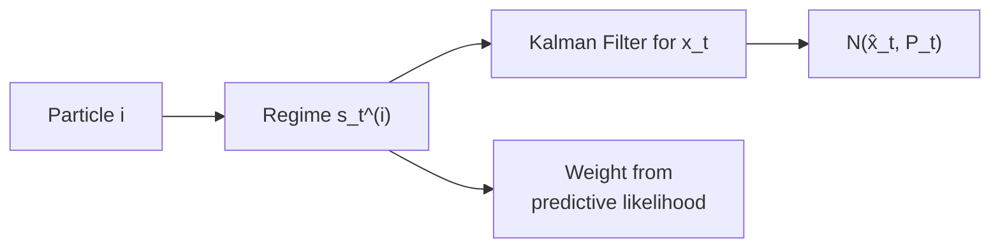

# Regime-Switching

!!! info "Quick Reference"
    | | |
    |---|---|
    | **Class** | `RegimeModel` |
    | **Import** | `from particlefilterbox.models import RegimeModel` |
    | **Variants** | `basic`, `mean-switching`, `variance-switching`, `full-switching` |
    | **State** | Discrete regime $s_t \in \{1, \ldots, K\}$ + continuous $x_t$ |
    | **Observation** | Continuous $y_t$ (regime-dependent) |
    | **Recommended filter** | [Bootstrap PF](../filters/bootstrap.md) / [Rao-Blackwellized PF](../filters/rbpf.md) |
    | **References** | Hamilton (1989); Kim & Nelson (1999); Carlin, Polson & Stoffer (1992) |

---

## Overview

The **Regime-Switching (Markov Switching)** model extends linear state-space models by allowing the system dynamics to switch between $K$ discrete regimes according to a hidden Markov chain. This captures structural breaks, business cycle phases, and other phenomena where the data-generating process changes qualitatively over time.

particlefilterbox supports regime-switching models where both the **discrete regime** $s_t$ and the **continuous state** $x_t$ are jointly estimated via particle filtering. When the continuous dynamics are linear-Gaussian within each regime, the **Rao-Blackwellized PF** marginalizes $x_t$ analytically, yielding dramatic variance reduction.

---

## Mathematical Framework

### General Regime-Switching Model

The model has three layers: regime transitions, state dynamics, and observations.

**Regime transition** (hidden Markov chain):

$$
P(s_t = j \mid s_{t-1} = i) = p_{ij}, \qquad \mathbf{P} = \begin{pmatrix} p_{11} & \cdots & p_{1K} \\ \vdots & \ddots & \vdots \\ p_{K1} & \cdots & p_{KK} \end{pmatrix}
$$

where $\sum_{j=1}^{K} p_{ij} = 1$ for each row $i$.

**State dynamics** (regime-dependent):

$$
x_t = f_{s_t}(x_{t-1}) + \eta_t, \qquad \eta_t \sim \mathcal{N}(0, Q_{s_t})
$$

**Observation equation** (regime-dependent):

$$
y_t = g_{s_t}(x_t) + \varepsilon_t, \qquad \varepsilon_t \sim \mathcal{N}(0, R_{s_t})
$$

The joint latent state at time $t$ is the pair $(s_t, x_t)$.

| Component | Symbol | Description |
|:----------|:-------|:------------|
| Regime | $s_t$ | Discrete state in $\{1, \ldots, K\}$ |
| Continuous state | $x_t$ | Latent continuous process |
| Transition matrix | $\mathbf{P}$ | $K \times K$ stochastic matrix |
| State noise | $Q_{s_t}$ | Regime-dependent process covariance |
| Obs noise | $R_{s_t}$ | Regime-dependent observation covariance |

### Mean-Switching Model

The simplest variant: only the intercept switches across regimes.

$$
\begin{aligned}
x_t &= \mu_{s_t} + \phi \, x_{t-1} + \sigma_\eta \, \eta_t \\[4pt]
y_t &= x_t + \sigma_\varepsilon \, \varepsilon_t
\end{aligned}
$$

This is the classic **Hamilton (1989)** specification for business cycle analysis, where $\mu_1$ (expansion) and $\mu_2$ (recession) capture different growth rates.

### Variance-Switching Model

Volatility changes across regimes while dynamics remain the same:

$$
\begin{aligned}
x_t &= \phi \, x_{t-1} + \sigma_{\eta, s_t} \, \eta_t \\[4pt]
y_t &= x_t + \sigma_{\varepsilon, s_t} \, \varepsilon_t
\end{aligned}
$$

Useful for modeling **volatility regimes** (low-vol vs. high-vol periods) in financial data.

### Full-Switching Model

Both mean and variance are regime-dependent:

$$
\begin{aligned}
x_t &= \mu_{s_t} + \phi_{s_t} \, x_{t-1} + \sigma_{\eta, s_t} \, \eta_t \\[4pt]
y_t &= \alpha_{s_t} + \beta_{s_t} \, x_t + \sigma_{\varepsilon, s_t} \, \varepsilon_t
\end{aligned}
$$

!!! note "Identification"
    With full switching, the number of parameters grows as $\mathcal{O}(K)$ per coefficient. For $K > 3$ regimes, ensure sufficient data and consider regularizing priors to avoid identification issues.

---

## Particle Filter for Regime Models

### Standard Approach

Each particle carries the pair $(s_t^{(i)}, x_t^{(i)})$. At each time step:

1. **Propagate regime**: sample $s_t^{(i)} \sim P(\cdot \mid s_{t-1}^{(i)})$ from the transition matrix
2. **Propagate state**: sample $x_t^{(i)} \sim f_{s_t^{(i)}}(x_{t-1}^{(i)}) + \mathcal{N}(0, Q_{s_t^{(i)}})$
3. **Weight**: $w_t^{(i)} \propto p(y_t \mid x_t^{(i)}, s_t^{(i)})$

### Rao-Blackwellized PF (RBPF)

When the continuous dynamics are **linear-Gaussian within each regime**, the RBPF marginalizes the continuous state analytically using a bank of Kalman filters:

$$
p(x_t \mid s_{1:t}, y_{1:t}) = \mathcal{N}(\hat{x}_t^{(s_{1:t})}, P_t^{(s_{1:t})})
$$

Each particle only carries the **discrete path** $s_{1:t}$. The continuous state is tracked by a Kalman filter conditioned on each particle's regime sequence.



!!! tip "RBPF vs. Bootstrap PF"
    The RBPF reduces the effective state dimension from $(s_t, x_t)$ to $s_t$ alone. For a model with $K = 2$ regimes and $d$-dimensional continuous state, RBPF can reduce variance by orders of magnitude. Always prefer RBPF when the within-regime dynamics are linear-Gaussian.

### Filtered Regime Probabilities

After filtering, compute the **posterior regime probability** at each time step:

$$
P(s_t = k \mid y_{1:t}) \approx \sum_{i=1}^{N} w_t^{(i)} \, \mathbf{1}(s_t^{(i)} = k)
$$

This is one of the primary outputs of interest --- it tells you which regime the system is most likely in at each point in time.

---

## API

### Constructor

```python
from particlefilterbox.models import RegimeModel

# 2-regime mean-switching model
regime = RegimeModel(
    n_regimes=2,
    variant="mean-switching",
    params={
        "mu_1": 0.5, "mu_2": -0.3,
        "phi": 0.95, "sigma_eta": 0.1, "sigma_eps": 0.5,
    },
    transitions=[[0.95, 0.05],
                 [0.10, 0.90]],
)

# 2-regime variance-switching model
regime_var = RegimeModel(
    n_regimes=2,
    variant="variance-switching",
    params={
        "phi": 0.95,
        "sigma_eta_1": 0.1, "sigma_eta_2": 0.5,
        "sigma_eps_1": 0.3, "sigma_eps_2": 1.0,
    },
    transitions=[[0.98, 0.02],
                 [0.05, 0.95]],
)

# Full-switching with custom dynamics
regime_full = RegimeModel(
    n_regimes=3,
    variant="full-switching",
    dynamics=[f1, f2, f3],
    obs=[g1, g2, g3],
    transitions=P,
)
```

### Parameters by Variant

=== "mean-switching"

    | Parameter | Key | Default | Description |
    |:----------|:----|:--------|:------------|
    | $\mu_k$ | `mu_1`, `mu_2`, ... | $0.5$, $-0.3$ | Regime-specific intercept |
    | $\phi$ | `phi` | $0.95$ | AR coefficient (shared) |
    | $\sigma_\eta$ | `sigma_eta` | $0.1$ | State noise (shared) |
    | $\sigma_\varepsilon$ | `sigma_eps` | $0.5$ | Observation noise (shared) |

=== "variance-switching"

    | Parameter | Key | Default | Description |
    |:----------|:----|:--------|:------------|
    | $\phi$ | `phi` | $0.95$ | AR coefficient (shared) |
    | $\sigma_{\eta,k}$ | `sigma_eta_1`, `sigma_eta_2`, ... | $0.1$, $0.5$ | Regime-specific state noise |
    | $\sigma_{\varepsilon,k}$ | `sigma_eps_1`, `sigma_eps_2`, ... | $0.3$, $1.0$ | Regime-specific obs noise |

=== "full-switching"

    | Parameter | Key | Default | Description |
    |:----------|:----|:--------|:------------|
    | $\mu_k$ | `mu_1`, `mu_2`, ... | varies | Regime-specific intercept |
    | $\phi_k$ | `phi_1`, `phi_2`, ... | varies | Regime-specific AR coefficient |
    | $\sigma_{\eta,k}$ | `sigma_eta_1`, ... | varies | Regime-specific state noise |
    | $\sigma_{\varepsilon,k}$ | `sigma_eps_1`, ... | varies | Regime-specific obs noise |
    | $\alpha_k$ | `alpha_1`, ... | $0.0$ | Regime-specific obs intercept |
    | $\beta_k$ | `beta_1`, ... | $1.0$ | Regime-specific obs loading |

### Simulation

```python
# Simulate from the regime-switching model
regime = RegimeModel(
    n_regimes=2,
    variant="mean-switching",
    params={"mu_1": 0.5, "mu_2": -0.3, "phi": 0.95, "sigma_eta": 0.1, "sigma_eps": 0.5},
    transitions=[[0.95, 0.05], [0.10, 0.90]],
)
sim = regime.simulate(T=500, seed=42)

observations = sim["observations"]  # shape (500, 1)
states = sim["states"]              # shape (500, 1) - continuous state
regimes = sim["regimes"]            # shape (500,) - discrete regime labels
```

---

## Filtering

### Bootstrap PF

```python
import numpy as np
from particlefilterbox.models import RegimeModel
from particlefilterbox.filters import BootstrapPF
from particlefilterbox.core.config import PFConfig

# Model: Hamilton business cycle
regime = RegimeModel(
    n_regimes=2,
    variant="mean-switching",
    params={"mu_1": 0.8, "mu_2": -0.4, "phi": 0.90, "sigma_eta": 0.2, "sigma_eps": 0.6},
    transitions=[[0.95, 0.05], [0.10, 0.90]],
)

# Simulate
sim = regime.simulate(T=300, seed=42)
y = sim["observations"]

# Filter with 2000 particles (more needed for mixed discrete/continuous state)
config = PFConfig(n_particles=2000, seed=42)
pf = BootstrapPF(model=regime, config=config)
result = pf.filter(y)

print(f"Log-likelihood: {result.log_likelihood:.2f}")
print(f"Mean ESS: {np.mean(result.ess_history):.0f}")
```

### Rao-Blackwellized PF

When within-regime dynamics are linear-Gaussian, RBPF is strongly preferred:

```python
from particlefilterbox.filters import RaoBlackwellizedPF

# RBPF: particles only for discrete regime, Kalman filter for continuous state
config = PFConfig(n_particles=500, seed=42)
rbpf = RaoBlackwellizedPF(model=regime, config=config)
result = rbpf.filter(y)

print(f"Log-likelihood: {result.log_likelihood:.2f}")
print(f"Mean ESS: {np.mean(result.ess_history):.0f}")
```

!!! warning "RBPF Requirements"
    The RBPF requires that the within-regime dynamics are linear-Gaussian. If $f_{s_t}$ or $g_{s_t}$ are nonlinear, use the standard Bootstrap PF or [Guided PF](../filters/guided.md) instead.

### Extracting Regime Probabilities

```python
import matplotlib.pyplot as plt

# Posterior regime probabilities
# For RBPF / Bootstrap PF with regime models:
regime_probs = result.regime_probabilities  # shape (T, K)

# Alternatively, compute from particles:
# regime_probs[:, k] = weighted fraction of particles in regime k

fig, axes = plt.subplots(3, 1, figsize=(12, 9), sharex=True)

# Observations
axes[0].plot(y, color="steelblue", alpha=0.7, linewidth=0.5)
axes[0].set_ylabel("$y_t$")
axes[0].set_title("Observations")

# True regimes
axes[1].fill_between(range(len(sim["regimes"])), sim["regimes"],
                     alpha=0.3, color="red", step="mid")
axes[1].set_ylabel("True regime")
axes[1].set_yticks([0, 1])
axes[1].set_yticklabels(["Expansion", "Recession"])

# Filtered regime probability
axes[2].plot(regime_probs[:, 1], color="darkred", linewidth=1.2)
axes[2].axhline(0.5, color="gray", linestyle="--", alpha=0.5)
axes[2].set_ylabel("$P(s_t = 2 \\mid y_{1:t})$")
axes[2].set_xlabel("Time")
axes[2].set_title("Filtered Recession Probability")
axes[2].set_ylim(-0.05, 1.05)

plt.tight_layout()
plt.show()
```

---

## Parameter Estimation with PMMH

### Estimating Transition Probabilities and Regime Parameters

```python
from particlefilterbox.models import RegimeModel
from particlefilterbox.filters import BootstrapPF
from particlefilterbox.pmcmc import PMMH
from particlefilterbox.core.config import PFConfig

# True model
regime_true = RegimeModel(
    n_regimes=2,
    variant="mean-switching",
    params={"mu_1": 0.8, "mu_2": -0.4, "phi": 0.90, "sigma_eta": 0.2, "sigma_eps": 0.6},
    transitions=[[0.95, 0.05], [0.10, 0.90]],
)
sim = regime_true.simulate(T=1000, seed=42)
y = sim["observations"]

# Model for estimation
regime_est = RegimeModel(n_regimes=2, variant="mean-switching")

# PMMH
pf_config = PFConfig(n_particles=1000, seed=0)
priors = regime_est.default_prior()

pmmh = PMMH(
    model=regime_est,
    filter_cls=BootstrapPF,
    pf_config=pf_config,
    priors=priors,
    n_iterations=15000,
    burn_in=5000,
    seed=42,
)

chain = pmmh.run(y)

# Posterior summary
for param in ["mu_1", "mu_2", "phi", "sigma_eta", "p_11", "p_22"]:
    samples = chain[param]
    print(f"{param}: mean={samples.mean():.4f}, std={samples.std():.4f}")
```

!!! tip "Label Switching"
    Regime models are subject to **label switching**: permuting the regime labels produces an equivalent model. To resolve this in PMMH, impose an ordering constraint (e.g., $\mu_1 > \mu_2$) via the prior or post-process the chain with a relabeling algorithm.

---

## Example: Hamilton Business Cycle Model

A complete workflow for the classic Hamilton (1989) model of US GDP growth:

```python
import numpy as np
from particlefilterbox.models import RegimeModel
from particlefilterbox.filters import RaoBlackwellizedPF
from particlefilterbox.pmcmc import PMMH
from particlefilterbox.core.config import PFConfig

# --- 1. Define the Hamilton model ---
# Regime 1: expansion (positive growth), Regime 2: recession (negative growth)
hamilton = RegimeModel(
    n_regimes=2,
    variant="mean-switching",
    params={
        "mu_1": 0.9,   # expansion growth rate
        "mu_2": -0.4,  # recession growth rate
        "phi": 0.0,    # no persistence in growth
        "sigma_eta": 0.8,
        "sigma_eps": 0.3,
    },
    transitions=[[0.95, 0.05],   # P(stay expansion) = 0.95
                 [0.15, 0.85]],  # P(stay recession) = 0.85
)

# --- 2. Simulate GDP-like data ---
sim = hamilton.simulate(T=800, seed=42)
gdp_growth = sim["observations"]

# --- 3. Filter with RBPF ---
config = PFConfig(n_particles=500, seed=42)
rbpf = RaoBlackwellizedPF(model=hamilton, config=config)
result = rbpf.filter(gdp_growth)

# --- 4. Regime inference ---
recession_prob = result.regime_probabilities[:, 1]

# NBER-style recession dating: P(recession) > 0.5
recession_dates = recession_prob > 0.5
n_recession_periods = np.diff(recession_dates.astype(int))
n_recessions = np.sum(n_recession_periods == 1)

print(f"Log-likelihood: {result.log_likelihood:.2f}")
print(f"Number of recession episodes: {n_recessions}")
print(f"Fraction in recession: {recession_dates.mean():.1%}")

# --- 5. Bayesian estimation ---
hamilton_est = RegimeModel(n_regimes=2, variant="mean-switching")
pf_config = PFConfig(n_particles=500, seed=0)

pmmh = PMMH(
    model=hamilton_est,
    filter_cls=RaoBlackwellizedPF,
    pf_config=pf_config,
    priors=hamilton_est.default_prior(),
    n_iterations=10000,
    burn_in=3000,
    seed=42,
)
chain = pmmh.run(gdp_growth)

print("\nPosterior estimates:")
for param in ["mu_1", "mu_2", "phi", "sigma_eta", "p_11", "p_22"]:
    samples = chain[param]
    print(f"  {param}: {samples.mean():.4f} +/- {samples.std():.4f}")
```

---

## Filter Recommendations

| Scenario | Recommended Filter | Particles | Notes |
|:---------|:-------------------|:----------|:------|
| Linear-Gaussian within regime | [RBPF](../filters/rbpf.md) | 200--500 | Best efficiency; marginalizes continuous state |
| Nonlinear within-regime dynamics | [Bootstrap PF](../filters/bootstrap.md) | 2000--5000 | Standard approach for general case |
| Many regimes ($K > 3$) | [Bootstrap PF](../filters/bootstrap.md) | 5000+ | Exponential growth in regime combinations |
| Parameter estimation | [PMMH](../pmcmc/pmmh.md) + RBPF/Bootstrap | 500--1000 | RBPF preferred for lower-variance likelihood |

!!! warning "Particle Count for Regime Models"
    Regime models require more particles than purely continuous models because the particle filter must cover all $K$ regimes. A rough guideline: use at least $200 \times K$ particles for the Bootstrap PF, or $100 \times K$ for the RBPF.

---

## See Also

- [Rao-Blackwellized PF](../filters/rbpf.md) --- Optimal filter for linear-Gaussian regime models
- [Bootstrap PF](../filters/bootstrap.md) --- General-purpose filter for nonlinear regime dynamics
- [PMMH](../pmcmc/pmmh.md) --- Bayesian estimation of transition probabilities and parameters
- [Stochastic Volatility](stochastic-volatility.md) --- Volatility model (often combined with regime switching)
- [DSGE](dsge.md) --- Macroeconomic model that can incorporate regime changes
