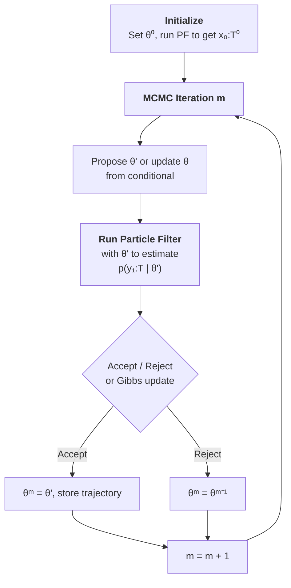

# Particle MCMC

**Particle Markov Chain Monte Carlo** (PMCMC) methods embed a particle filter inside an MCMC sampler to perform fully Bayesian inference in nonlinear, non-Gaussian state-space models. The key insight is that the particle filter provides an **unbiased estimate** of the marginal likelihood $p(y_{1:T} \mid \theta)$, which can be plugged into a Metropolis-Hastings or Gibbs sampler while preserving the correct stationary distribution.

These methods were introduced by [Andrieu, Doucet & Holenstein (2010)](https://doi.org/10.1111/j.1467-9868.2009.00736.x) and have become the standard approach for parameter estimation in complex state-space models.

---

## The Core Idea

Consider a state-space model with parameters $\theta$:

$$
x_0 \sim p(x_0 \mid \theta), \quad x_t \sim p(x_t \mid x_{t-1}, \theta), \quad y_t \sim p(y_t \mid x_t, \theta)
$$

The goal is to sample from the **joint posterior**:

$$
p(\theta, x_{0:T} \mid y_{1:T}) \propto p(y_{1:T} \mid x_{0:T}, \theta) \, p(x_{0:T} \mid \theta) \, p(\theta)
$$

Direct MCMC on this high-dimensional target is difficult because the state trajectory $x_{0:T}$ can have thousands of dimensions. PMCMC methods solve this by using a particle filter to **marginalize out** the states or to **propose** state trajectories efficiently.

---

## The PMCMC Loop

All PMCMC methods share the same high-level structure: an outer MCMC loop that updates parameters, with an inner particle filter that handles the latent states.



The particle filter runs **inside** each MCMC iteration. This is more expensive than standard MCMC (each iteration costs $O(N \cdot T)$ for $N$ particles and $T$ time steps), but it enables exact Bayesian inference for models where no closed-form likelihood exists.

---

## Three PMCMC Methods

particlefilterbox implements three PMCMC algorithms, each targeting the posterior differently:

### 1. Particle Marginal Metropolis-Hastings (PMMH)

PMMH treats the particle filter as a **black-box likelihood estimator**. It proposes new parameters $\theta'$, runs a particle filter to estimate $\hat{p}(y_{1:T} \mid \theta')$, and uses this estimate in a standard Metropolis-Hastings accept/reject step.

- **Target**: $p(\theta \mid y_{1:T})$ (marginal posterior of parameters)
- **States**: integrated out by the particle filter
- **Simplest to implement** -- no need to sample states explicitly

[Read more: PMMH](pmmh.md){ .md-button }

### 2. Particle Gibbs (PG)

Particle Gibbs uses a **conditional SMC** algorithm to sample state trajectories, alternating with parameter updates in a Gibbs scheme. One particle is forced to follow a reference trajectory from the previous iteration, ensuring validity of the MCMC chain.

- **Target**: $p(\theta, x_{0:T} \mid y_{1:T})$ (joint posterior)
- **Provides** both parameter samples and state trajectory samples
- **Limitation**: path degeneracy for long time series

[Read more: Particle Gibbs](particle-gibbs.md){ .md-button }

### 3. Particle Gibbs with Ancestor Sampling (PGAS)

PGAS extends Particle Gibbs by adding an **ancestor sampling** step that reconnects the reference trajectory to the particle genealogy at each time step. This dramatically improves mixing and resolves the path degeneracy problem.

- **Target**: $p(\theta, x_{0:T} \mid y_{1:T})$ (joint posterior)
- **Best mixing** among PMCMC methods
- **Recommended** as the default choice for joint inference

[Read more: PGAS](pgas.md){ .md-button }

---

## Comparative Table

| Feature | PMMH | Particle Gibbs | PGAS |
|---|---|---|---|
| **Target** | $p(\theta \mid y_{1:T})$ | $p(\theta, x_{0:T} \mid y_{1:T})$ | $p(\theta, x_{0:T} \mid y_{1:T})$ |
| **State samples** | No (integrated out) | Yes | Yes |
| **Algorithm** | MH + standard PF | Gibbs + conditional PF | Gibbs + conditional PF + ancestor sampling |
| **Particles needed** | 200--1000 | 500--2000 | 100--500 |
| **Mixing quality** | Good for $\theta$ | Poor for long $T$ | Excellent |
| **Path degeneracy** | N/A | Yes, for large $T$ | Resolved |
| **Tuning difficulty** | Moderate | Low | Low |
| **Best for** | Parameter estimation only | Short series, joint inference | General joint inference |

!!! tip "Which method should I use?"
    - **Only need parameters?** Use [PMMH](pmmh.md) -- it is the simplest and avoids state sampling entirely.
    - **Need states and parameters, short series ($T < 200$)?** [Particle Gibbs](particle-gibbs.md) works well.
    - **Need states and parameters, any series length?** Use [PGAS](pgas.md) -- it is the most robust choice and should be your default for joint inference.

---

## When to Use PMCMC vs Other Methods

PMCMC is not the only approach for Bayesian inference in state-space models. Here is a decision guide:

| Method | When to use |
|---|---|
| **PMCMC** | Fixed-dimensional parameter space, moderate $T$, exact posterior needed |
| **SMC$^2$** | Online/sequential parameter learning, growing dataset |
| **IBIS** | Static parameters with sequential data arrival, simpler models |
| **Kalman-based (kalmanbox)** | Linear-Gaussian models, or as a proposal within PMCMC |
| **Variational** | Very large datasets where MCMC is too slow, approximate posterior acceptable |

!!! info "Compare with kalmanbox"
    For linear-Gaussian state-space models, the Kalman filter in
    [kalmanbox](https://github.com/nodesecon/kalmanbox) provides the **exact**
    marginal likelihood $p(y_{1:T} \mid \theta)$ analytically. In this case, you
    can run standard MCMC without any particle filter.

    PMCMC becomes necessary when the model is **nonlinear** or **non-Gaussian**,
    so that no closed-form likelihood exists.

---

## Pseudocode: Generic PMCMC

The following pseudocode captures the structure shared by all PMCMC methods:

$$
\boxed{
\begin{aligned}
&\textbf{Algorithm: Particle MCMC (generic)} \\
&\text{1. Initialize } \theta^{(0)}, \text{ run PF to get } \hat{p}(y_{1:T} \mid \theta^{(0)}) \\
&\text{2. For } m = 1, \ldots, M: \\
&\quad \text{a. Propose } \theta' \sim q(\theta' \mid \theta^{(m-1)}) \\
&\quad \text{b. Run particle filter with } \theta' \text{ to get } \hat{p}(y_{1:T} \mid \theta') \\
&\quad \text{c. Compute acceptance ratio:} \\
&\quad\quad \alpha = \min\!\left(1, \;\frac{\hat{p}(y_{1:T} \mid \theta') \, p(\theta')}{\hat{p}(y_{1:T} \mid \theta^{(m-1)}) \, p(\theta^{(m-1)})} \cdot \frac{q(\theta^{(m-1)} \mid \theta')}{q(\theta' \mid \theta^{(m-1)})}\right) \\
&\quad \text{d. Accept } \theta^{(m)} = \theta' \text{ with probability } \alpha, \text{ else } \theta^{(m)} = \theta^{(m-1)} \\
&\text{3. Return } \{\theta^{(m)}\}_{m=1}^{M}
\end{aligned}
}
$$

!!! note "Unbiased likelihood is the key"
    The central theoretical result of Andrieu et al. (2010) is that using the
    **unbiased** particle filter estimate $\hat{p}(y_{1:T} \mid \theta)$ in place
    of the true likelihood preserves the correct stationary distribution. This is
    the **pseudo-marginal** property: the chain targets exactly $p(\theta \mid y_{1:T})$,
    not an approximation.

---

## Quick Start

```python
from particlefilterbox.models import SVModel
from particlefilterbox.pmcmc import PMMH, ParticleGibbs, PGAS

# Define model and generate synthetic data
model = SVModel(mu=0.0, phi=0.97, sigma=0.15)
observations = model.simulate(T=500)

# --- Option 1: PMMH (parameter estimation only) ---
pmmh = PMMH(model, n_particles=500, n_iterations=10000,
            proposal='adaptive', burnin=2000)
chain = pmmh.sample(observations)
print(f"Posterior mean phi: {chain.mean('phi'):.3f}")

# --- Option 2: PGAS (parameters + states) ---
pgas = PGAS(model, n_particles=200, n_iterations=5000)
chain = pgas.sample(observations)
print(f"Posterior mean phi: {chain.mean('phi'):.3f}")
print(f"Smoothed states shape: {chain.states.shape}")
```

---

## What's Next?

<div class="grid cards" markdown>

- :material-arrow-right-bold: **[PMMH](pmmh.md)**

    Parameter estimation via Metropolis-Hastings with particle filter likelihood

- :material-arrow-right-bold: **[Particle Gibbs](particle-gibbs.md)**

    Joint inference with conditional SMC

- :material-arrow-right-bold: **[PGAS](pgas.md)**

    The recommended default -- Particle Gibbs with ancestor sampling

</div>
