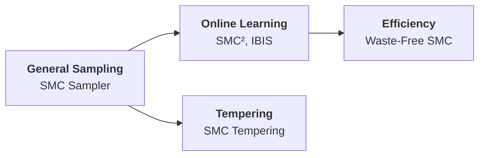
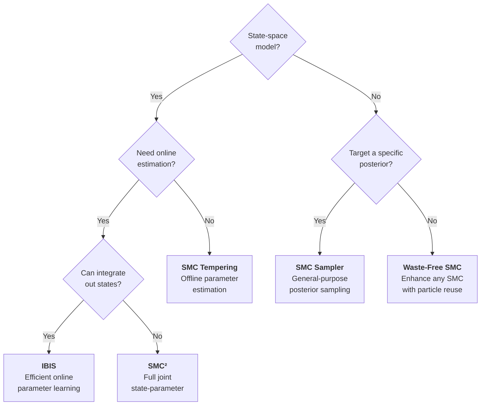

# SMC Methods

!!! info "Prerequisites"
    This guide assumes you are familiar with [Particle Filters](../filters/index.md) and the core concepts of importance sampling and resampling. SMC methods generalize particle filtering to problems beyond sequential state estimation.

## Beyond Particle Filtering

Particle filters are one instance of a broader class of algorithms called **Sequential Monte Carlo (SMC)**. While particle filters target the filtering distribution $p(x_t \mid y_{1:t})$, SMC methods can target *any* sequence of distributions:

$$
\pi_0, \quad \pi_1, \quad \ldots, \quad \pi_T = \pi^*
$$

where $\pi^*$ is the distribution of interest (e.g., a Bayesian posterior).

### Particle Filters vs. SMC Samplers

| Aspect | Particle Filter | SMC Sampler |
|--------|:--------------:|:-----------:|
| **Target** | $p(x_t \mid y_{1:t})$ | Any $\pi(\theta)$ |
| **Sequence source** | Observations arrive sequentially | Designed by the user (e.g., tempering) |
| **Particles represent** | State values at time $t$ | Parameter values |
| **Mutation** | State transition model | MCMC kernel |
| **Key application** | Online state estimation | Static inference, model comparison |

---

## Applications

SMC methods shine in several challenging inference problems:

- **Bayesian parameter estimation** --- sample from $p(\theta \mid y_{1:T})$ when the posterior is complex
- **Model comparison** --- estimate marginal likelihoods $p(y_{1:T} \mid \mathcal{M})$ for Bayes factors
- **Online parameter learning** --- update parameter estimates as new data arrives
- **Multimodal posteriors** --- explore multiple modes without getting trapped
- **Rare event simulation** --- estimate probabilities of unlikely events

---

## Taxonomy

particlefilterbox provides **5 SMC methods** organized by their primary use case:



### General-Purpose SMC

| Method | Class | Key idea | Best for |
|--------|-------|----------|----------|
| [SMC Sampler](smc-sampler.md) | `SMCSampler` | Bridge from prior to target via MCMC moves | Sampling complex posteriors, rare events |

### Online Parameter Learning

| Method | Class | Key idea | Best for |
|--------|-------|----------|----------|
| [SMC$^2$](smc-squared.md) | `SMCSquared` | Nested SMC: outer for $\theta$, inner PF for $x$ | Joint state-parameter estimation in SSMs |
| [IBIS](ibis.md) | `IBIS` | Incremental likelihood with MCMC rejuvenation | Parameter estimation when states are integrable |

### Computational Efficiency

| Method | Class | Key idea | Best for |
|--------|-------|----------|----------|
| [Waste-Free SMC](waste-free.md) | `WasteFreeSMC` | Reuse all MCMC particles, not just final ones | Reducing waste in any SMC algorithm |

### Tempering

| Method | Class | Key idea | Best for |
|--------|-------|----------|----------|
| [SMC Tempering](tempering.md) | `SMCTempering` | Adaptive temperature schedule $\beta_0 < \cdots < \beta_T = 1$ | Multimodal posteriors, marginal likelihood |

---

## Quick Comparison

| Method | Complexity | Handles states? | Online? | Marginal likelihood | Ease of use |
|--------|:----------:|:---------------:|:-------:|:-------------------:|:-----------:|
| SMC Sampler | $O(N \cdot T \cdot C_{\text{MCMC}})$ | No | No | Yes | :material-star: :material-star: |
| SMC$^2$ | $O(N_\theta \cdot N_x \cdot T)$ | **Yes** | **Yes** | Yes | :material-star: |
| IBIS | $O(N_\theta \cdot T \cdot C_{\text{lik}})$ | Marginalizes | **Yes** | Yes | :material-star: :material-star: |
| Waste-Free | $O(M \cdot N \cdot C_{\text{MCMC}})$ | Depends | Depends | Yes | :material-star: :material-star: |
| Tempering | $O(N \cdot T \cdot C_{\text{MCMC}})$ | No | No | **Yes** | :material-star: :material-star: :material-star: |

Where $N$ = particles, $T$ = steps, $C_{\text{MCMC}}$ = cost of one MCMC move, $C_{\text{lik}}$ = cost of likelihood evaluation.

---

## Choosing an SMC Method



!!! tip "Default recommendation"
    For **static parameter estimation**, start with **SMC Tempering** --- it is the simplest to configure and provides marginal likelihood estimates as a by-product. Use **IBIS** or **SMC$^2$** only when you need online estimation or have a state-space model. Use **Waste-Free SMC** as a drop-in enhancement for any of the above.

---

## Common API Pattern

All SMC methods in particlefilterbox follow a consistent interface:

```python
from particlefilterbox.smc import SMCSampler, SMCConfig

# 1. Configure
config = SMCConfig(
    n_particles=2000,
    resampling="systematic",
    ess_threshold=0.5,
    seed=42,
)

# 2. Instantiate
sampler = SMCSampler(target=my_posterior, config=config)

# 3. Run
result = sampler.sample()

# 4. Access results
print(result.particles.shape)         # (N, dim)
print(result.log_marginal_likelihood) # log Z estimate
print(result.ess_history)             # ESS at each step
print(result.acceptance_rates)        # MCMC acceptance rates
```

### Result Attributes

| Attribute | Shape | Description |
|-----------|-------|-------------|
| `particles` | `(N, dim)` | Final weighted particles |
| `weights` | `(N,)` | Normalized importance weights |
| `log_marginal_likelihood` | scalar | Log normalizing constant estimate $\log \hat{Z}$ |
| `ess_history` | `(T,)` | ESS at each distribution |
| `acceptance_rates` | `(T,)` | MCMC acceptance rates per step |

---

## The SMC Framework

All SMC methods share a common algorithmic skeleton:

$$
\boxed{
\begin{aligned}
&\textbf{Generic SMC Algorithm} \\[6pt]
&\text{1. } \textbf{Initialize: } \text{For } i = 1, \ldots, N: \quad \theta_0^{(i)} \sim \pi_0, \quad w_0^{(i)} = \tfrac{1}{N} \\[4pt]
&\text{2. } \textbf{For } t = 1, \ldots, T: \\
&\qquad \text{a. } \textbf{Reweight: } \tilde{w}_t^{(i)} = w_{t-1}^{(i)} \cdot \frac{\pi_t(\theta_{t-1}^{(i)})}{\pi_{t-1}(\theta_{t-1}^{(i)})} \\
&\qquad \text{b. } \textbf{Normalize: } w_t^{(i)} = \frac{\tilde{w}_t^{(i)}}{\sum_{j=1}^{N} \tilde{w}_t^{(j)}} \\
&\qquad \text{c. } \textbf{Resample: } \text{If } \text{ESS} < \tau \cdot N, \text{ resample and set } w_t^{(i)} = \tfrac{1}{N} \\
&\qquad \text{d. } \textbf{Move: } \theta_t^{(i)} \sim K_t(\theta_t^{(i)} \mid \theta_{t-1}^{(i)}) \text{ where } K_t \text{ is } \pi_t\text{-invariant}
\end{aligned}
}
$$

The key differences between methods lie in:

1. **How the sequence** $\pi_0, \ldots, \pi_T$ **is constructed** (tempering, data batching, bridging)
2. **What the MCMC kernel** $K_t$ **is** (random walk MH, HMC, Gibbs)
3. **Whether latent states are involved** (SMC$^2$ nests a particle filter)

---

## References

- Del Moral, P., Doucet, A. & Jasra, A. (2006). Sequential Monte Carlo Samplers. *Journal of the Royal Statistical Society: Series B*, 68(3), 411--436.
- Chopin, N. (2002). A Sequential Particle Filter Method for Static Models. *Biometrika*, 89(3), 539--552.
- Chopin, N., Jacob, P.E. & Papaspiliopoulos, O. (2013). SMC$^2$: An Efficient Algorithm for Sequential Analysis of State-Space Models. *Journal of the Royal Statistical Society: Series B*, 75(3), 397--426.
- Dau, H.D. & Chopin, N. (2022). Waste-Free Sequential Monte Carlo. *Journal of the Royal Statistical Society: Series B*, 84(1), 114--148.
- Chopin, N. & Papaspiliopoulos, O. (2020). *An Introduction to Sequential Monte Carlo*. Springer.
