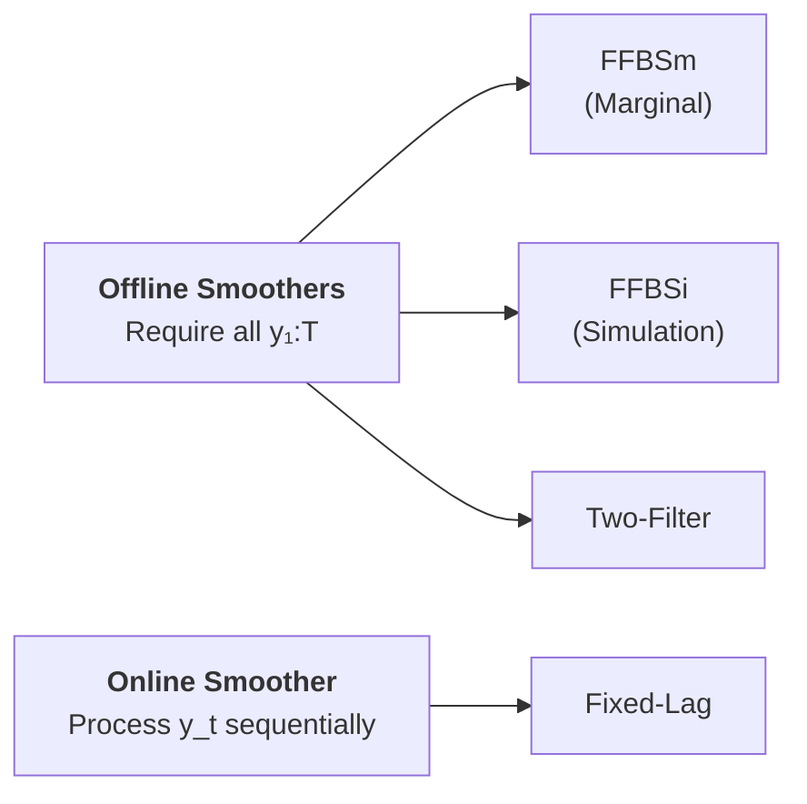
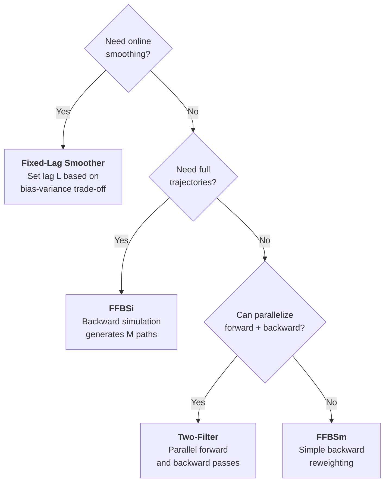

# Particle Smoothers

!!! info "Prerequisites"
    This guide assumes you are familiar with [Particle Filters](../filters/index.md) and the [ParticleCloud](../core/particle-cloud.md) data structure. Smoothers operate on filter results, so you should be comfortable running a filter before proceeding.

## Filtering vs. Smoothing

Particle filters compute the **filtering distribution** — the belief about the current state given observations *up to now*:

$$
p(x_t \mid y_{1:t})
$$

Particle smoothers compute the **smoothing distribution** — the belief about a past state given *all* observations, including future ones:

$$
p(x_t \mid y_{1:T}), \qquad t \leq T
$$

Because smoothing incorporates future information, smoothed estimates are always at least as accurate as filtered estimates. The difference is most pronounced when:

- The state transition is noisy relative to the observation noise
- There are sudden regime changes or jumps in the latent state
- You need accurate estimates of the *entire trajectory*, not just the latest state

---

## When to Use Smoothing

| Use case | Why smoothing helps |
|----------|-------------------|
| **Parameter estimation** (EM, PMCMC) | The complete-data likelihood $p(x_{0:T}, y_{1:T} \mid \theta)$ requires smoothed states |
| **Retrospective analysis** | After collecting all data, you want the best possible state estimates |
| **State trajectory sampling** | Generating full trajectories $x_{0:T} \sim p(x_{0:T} \mid y_{1:T})$ for downstream tasks |
| **Model validation** | Comparing smoothed residuals with filtered residuals to assess model fit |
| **Missing data imputation** | Smoothing fills gaps more accurately than filtering alone |

!!! tip "Filtering is sufficient when..."
    You only need the *current* state estimate in an online setting (e.g., real-time tracking or control). Smoothing is for when you can afford to wait for future observations.

---

## Taxonomy

Particle smoothers fall into two categories based on whether they require the full observation sequence upfront.



### Offline Smoothers

Offline smoothers first run a **forward filter** over the full dataset, then perform a **backward pass** to incorporate future information. They produce the best smoothing estimates but require storing the entire filter history.

- [**FFBSm**](ffbsm.md) — Forward-Filtering Backward-Smoothing (Marginal): reweights existing particles
- [**FFBSi**](ffbsi.md) — Forward-Filtering Backward-Simulation: generates new smoothed trajectories
- [**Two-Filter**](two-filter.md) — Combines forward and backward information filters

### Online Smoother

The online smoother processes observations sequentially, providing smoothed estimates with a fixed delay.

- [**Fixed-Lag**](fixed-lag.md) — Smooths with a lag of $L$ steps: $p(x_{t-L} \mid y_{1:t})$

---

## Quick Comparison

| Smoother | Type | Complexity per step | Output | Parallelizable | Best for |
|----------|:----:|:-------------------:|--------|:--------------:|----------|
| [FFBSm](ffbsm.md) | Offline | $O(N^2)$ | Smoothing weights | No | Marginal expectations $\mathbb{E}[f(x_t) \mid y_{1:T}]$ |
| [FFBSi](ffbsi.md) | Offline | $O(NM)$ | $M$ full trajectories | No | Trajectory sampling, path-dependent functionals |
| [Two-Filter](two-filter.md) | Offline | $O(N^2)$ | Smoothing weights | **Yes** | Large datasets, parallel computing environments |
| [Fixed-Lag](fixed-lag.md) | Online | $O(N \cdot L)$ | Lagged smoothed states | N/A | Real-time applications with bounded delay |

Where $N$ = number of particles, $M$ = number of trajectories, $L$ = lag.

!!! warning "Complexity note"
    The $O(N^2)$ cost of FFBSm and Two-Filter can be prohibitive for large $N$. Both support **complexity reduction** techniques (rejection sampling, kd-trees) that bring the cost down to $O(N \log N)$ in practice. See individual pages for details.

---

## Common Workflow

All offline smoothers follow the same two-stage pattern:

```python
import numpy as np
from particlefilterbox.filters import BootstrapPF
from particlefilterbox.smoothers import FFBSm, FFBSi
from particlefilterbox.core.config import PFConfig

# Stage 1: Forward filtering
config = PFConfig(n_particles=1000, resampling="systematic", seed=42)
pf = BootstrapPF(model=my_model, config=config)
filter_result = pf.filter(observations)

# Stage 2a: Marginal smoothing (reweight particles)
smoother = FFBSm(filter_result)
smoothed = smoother.smooth()
print(smoothed.smoothed_means.shape)  # (T, state_dim)

# Stage 2b: Trajectory smoothing (generate full paths)
smoother = FFBSi(filter_result, n_trajectories=100)
trajectories = smoother.smooth()
print(trajectories.paths.shape)  # (100, T, state_dim)
```

The online Fixed-Lag smoother uses a different interface — see its [dedicated page](fixed-lag.md).

---

## Choosing a Smoother



!!! tip "Default recommendation"
    Start with **FFBSm** for offline smoothing tasks. It reuses the particles from the forward filter and provides smoothed marginals without generating new samples. Move to **FFBSi** when you need full trajectories, or to **Two-Filter** when you need to exploit parallelism.

---

## Smoother Results

All offline smoothers return a result object with a common interface:

| Attribute | Shape | Description |
|-----------|-------|-------------|
| `smoothed_means` | `(T, k)` | Smoothed state means at each time step |
| `smoothed_covs` | `(T, k, k)` | Smoothed state covariances |
| `smoothing_weights` | `(T, N)` | Smoothing weights (FFBSm, Two-Filter) |
| `paths` | `(M, T, k)` | Smoothed trajectories (FFBSi only) |
| `log_likelihood` | scalar | Log-marginal likelihood from forward filter |

---

## References

- Doucet, A. & Johansen, A.M. (2009). A Tutorial on Particle Filtering and Smoothing: Fifteen Years Later. *Handbook of Nonlinear Filtering*, 12, 656–704.
- Lindsten, F. & Schön, T.B. (2013). Backward Simulation Methods for Monte Carlo Statistical Inference. *Foundations and Trends in Machine Learning*, 6(1), 1–143.
- Briers, M., Doucet, A. & Maskell, S. (2010). Smoothing Algorithms for State-Space Models. *Annals of the Institute of Statistical Mathematics*, 62(1), 61–89.
