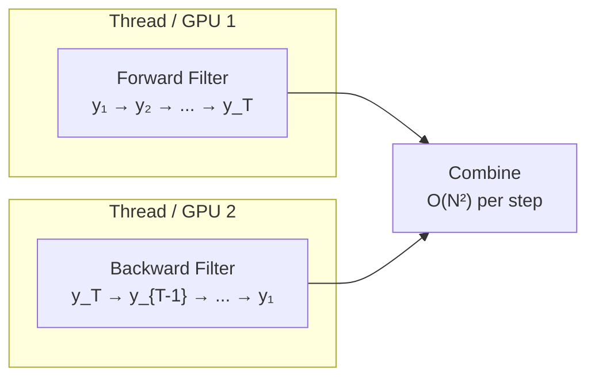

# Two-Filter Smoother

!!! info "Quick Reference"
    | | |
    |---|---|
    | **Class** | `TwoFilterSmoother` |
    | **Import** | `from particlefilterbox.smoothers import TwoFilterSmoother` |
    | **Type** | Offline (requires all observations) |
    | **Complexity** | $O(N^2)$ per time step (reducible) |
    | **Output** | Smoothing weights for combined particles |
    | **Reference** | Briers, Doucet & Maskell (2010) |

## Overview

The Two-Filter Smoother computes the smoothing distribution by combining a **forward filter** (processing $y_1, \ldots, y_t$) with a **backward information filter** (processing $y_T, \ldots, y_{t+1}$). The smoothing distribution at time $t$ is obtained as a product of forward and backward contributions.

**Advantages:**

- Forward and backward passes are **independent** — they can run in parallel
- Naturally suited for distributed computing and GPU acceleration
- Provides smoothed marginals at every time step

**Disadvantages:**

- $O(N^2)$ combination step to merge forward and backward particles
- Backward information filter can be less stable than the forward filter
- Requires evaluating the transition density $p(x_t \mid x_{t-1})$

---

## Algorithm

### Two-Pass Structure

$$
\boxed{
\begin{aligned}
&\textbf{Two-Filter Smoother} \\[6pt]
&\textbf{Pass 1 — Forward Filter } \text{(can run in parallel with Pass 2):} \\
&\qquad \text{Run any particle filter forward on } y_1, \ldots, y_T \\
&\qquad \text{Obtain particles } \{x_t^{(i)}, w_t^{F,(i)}\}_{i=1}^{N} \text{ for } t = 1, \ldots, T \\[8pt]
&\textbf{Pass 2 — Backward Information Filter:} \\
&\qquad \text{Run an information filter backward on } y_T, \ldots, y_1 \\
&\qquad \text{Obtain particles } \{\tilde{x}_t^{(j)}, w_t^{B,(j)}\}_{j=1}^{N} \text{ for } t = T, \ldots, 1 \\[8pt]
&\textbf{Combine — Smoothing Weights:} \\
&\qquad \text{For each time } t = 1, \ldots, T: \\
&\qquad\qquad w_{t|T}^{(i)} \propto w_t^{F,(i)} \sum_{j=1}^{N} w_{t+1}^{B,(j)} \, p(\tilde{x}_{t+1}^{(j)} \mid x_t^{(i)})
\end{aligned}
}
$$

### Backward Information Filter

The backward information filter processes observations in reverse order. At each step $t$ (going from $T$ to $1$):

$$
\boxed{
\begin{aligned}
&\textbf{Backward Information Filter} \\[6pt]
&\text{1. } \textbf{Initialize: } \tilde{x}_{T+1}^{(j)} \sim q_B(x), \quad w_{T+1}^{B,(j)} = \tfrac{1}{N} \\[4pt]
&\text{2. } \textbf{For } t = T, \ldots, 1: \\
&\qquad \text{a. } \textbf{Propose: } \tilde{x}_t^{(j)} \sim q_B(x_t \mid \tilde{x}_{t+1}^{(j)}, y_t) \\
&\qquad \text{b. } \textbf{Weight: } \tilde{w}_t^{B,(j)} \propto \frac{p(y_t \mid \tilde{x}_t^{(j)}) \, p(\tilde{x}_{t+1}^{(j)} \mid \tilde{x}_t^{(j)})}{q_B(\tilde{x}_t^{(j)} \mid \tilde{x}_{t+1}^{(j)}, y_t)} \\
&\qquad \text{c. } \textbf{Normalize and resample if needed}
\end{aligned}
}
$$

### Combining Forward and Backward

The smoothing weight at time $t$ for forward particle $i$ is:

$$
w_{t|T}^{(i)} \propto w_t^{F,(i)} \sum_{j=1}^{N} w_{t+1}^{B,(j)} \, p(\tilde{x}_{t+1}^{(j)} \mid x_t^{(i)})
$$

!!! note "Intuition"
    The forward weight $w_t^{F,(i)}$ captures how well particle $i$ explains $y_{1:t}$. The backward sum captures how well it connects to particles that explain $y_{t+1:T}$. Their product gives the full smoothing information $y_{1:T}$.

---

## Parallelization

The key advantage of the Two-Filter Smoother is that **the forward and backward passes are completely independent**:



This enables a near-$2\times$ speedup on multi-core systems:

| Phase | Sequential cost | Parallel cost |
|-------|:--------------:|:-------------:|
| Forward filter | $O(N \cdot T)$ | $O(N \cdot T)$ |
| Backward filter | $O(N \cdot T)$ | Runs in parallel |
| Combination | $O(N^2 \cdot T)$ | $O(N^2 \cdot T)$ |
| **Total** | **$O(N^2 \cdot T + 2N \cdot T)$** | **$O(N^2 \cdot T + N \cdot T)$** |

For the combination step, further parallelization is possible since each time step $t$ can be combined independently.

---

## API Reference

### Constructor

```python
from particlefilterbox.smoothers import TwoFilterSmoother

smoother = TwoFilterSmoother(
    model,                      # State-space model
    n_particles=1000,           # Particles per filter
    resampling="systematic",    # Resampling scheme
    parallel=True,              # Run forward/backward in parallel
    n_jobs=2,                   # Number of parallel jobs
    seed=42,                    # Random seed
)
```

| Parameter | Type | Default | Description |
|-----------|------|---------|-------------|
| `model` | `ParticleFilterModel` | *required* | State-space model with `transition_log_density` |
| `n_particles` | `int` | `1000` | Particles per filter direction |
| `resampling` | `str` | `"systematic"` | Resampling scheme |
| `parallel` | `bool` | `True` | Enable parallel forward/backward |
| `n_jobs` | `int` | `2` | Number of parallel workers |
| `seed` | `int \| None` | `None` | Random seed |

### Smoothing

```python
result = smoother.smooth(observations)
```

| Result attribute | Shape | Description |
|------------------|-------|-------------|
| `smoothed_means` | `(T, k)` | Smoothed state means |
| `smoothed_covs` | `(T, k, k)` | Smoothed state covariances |
| `smoothing_weights` | `(T, N)` | Combined smoothing weights |
| `forward_result` | `FilterResult` | Forward filter output |
| `backward_result` | `FilterResult` | Backward filter output |
| `log_likelihood` | scalar | Log-marginal likelihood |

---

## Examples

### Example 1: Parallel Smoothing on a Long Series

```python
import numpy as np
from particlefilterbox.smoothers import TwoFilterSmoother
from particlefilterbox.core.model import ParticleFilterModel

class LocalLevel(ParticleFilterModel):
    """
    x_t = x_{t-1} + eta_t,    eta_t ~ N(0, sigma_x^2)
    y_t = x_t + eps_t,        eps_t ~ N(0, sigma_y^2)
    """
    k_states = 1
    k_obs = 1

    def __init__(self, sigma_x=0.5, sigma_y=1.0):
        self.sigma_x = sigma_x
        self.sigma_y = sigma_y

    def initial_distribution(self, n_particles, rng):
        return rng.normal(0.0, 1.0, size=(n_particles, 1))

    def transition(self, particles, t, rng):
        return particles + rng.normal(0.0, self.sigma_x, size=particles.shape)

    def log_observation_likelihood(self, particles, y_t, t):
        residual = y_t - particles[:, 0]
        return -0.5 * (residual / self.sigma_y) ** 2

    def transition_log_density(self, x_next, x_curr, t):
        return -0.5 * ((x_next - x_curr) / self.sigma_x) ** 2

# --- Simulate a long series ---
model = LocalLevel(sigma_x=0.5, sigma_y=1.0)
rng = np.random.default_rng(42)
T = 5000

x_true = np.cumsum(rng.normal(0.0, 0.5, size=T))
y_obs = x_true + rng.normal(0.0, 1.0, size=T)

# --- Two-Filter Smoother with parallelization ---
smoother = TwoFilterSmoother(
    model=model,
    n_particles=2000,
    parallel=True,
    n_jobs=2,
    seed=42,
)
result = smoother.smooth(y_obs)

# --- Evaluate ---
rmse = np.sqrt(np.mean((result.smoothed_means[:, 0] - x_true) ** 2))
print(f"Smoothed RMSE: {rmse:.4f}")
print(f"Series length: {T}")
```

### Example 2: Comparing with FFBSm

```python
import time
from particlefilterbox.filters import BootstrapPF
from particlefilterbox.smoothers import FFBSm, TwoFilterSmoother
from particlefilterbox.core.config import PFConfig

# --- FFBSm approach ---
config = PFConfig(n_particles=2000, resampling="systematic", seed=42)
pf = BootstrapPF(model=model, config=config)

t0 = time.time()
filter_result = pf.filter(y_obs)
ffbsm = FFBSm(filter_result)
result_ffbsm = ffbsm.smooth()
t_ffbsm = time.time() - t0

# --- Two-Filter approach (parallel) ---
t0 = time.time()
tfs = TwoFilterSmoother(model=model, n_particles=2000, parallel=True, seed=42)
result_tfs = tfs.smooth(y_obs)
t_tfs = time.time() - t0

print(f"FFBSm time:      {t_ffbsm:.2f}s")
print(f"Two-Filter time: {t_tfs:.2f}s")
print(f"Speedup:         {t_ffbsm / t_tfs:.1f}x")
```

!!! tip "When to use Two-Filter"
    The Two-Filter Smoother shines when:

    - The time series is very long ($T > 1000$)
    - You have multiple CPU cores or GPUs available
    - You need smoothing at all time steps (not just a subset)
    - The combination step can be parallelized across time steps

---

## Comparison with Other Smoothers

| Aspect | [FFBSm](ffbsm.md) | [FFBSi](ffbsi.md) | Two-Filter (this page) |
|--------|:------------------:|:------------------:|:----------------------:|
| **Parallelizable** | No | No | **Yes** |
| **Output** | Weights | Trajectories | Weights |
| **Complexity** | $O(N^2 T)$ | $O(NMT)$ | $O(N^2 T)$ |
| **Wall-clock** | Baseline | Depends on $M$ | ~$0.5\times$ with 2 cores |
| **Implementation** | Simplest | Moderate | Most complex |

---

## References

- Briers, M., Doucet, A. & Maskell, S. (2010). Smoothing Algorithms for State-Space Models. *Annals of the Institute of Statistical Mathematics*, 62(1), 61–89.
- Fearnhead, P., Wyncoll, D. & Tawn, J. (2010). A Sequential Smoothing Algorithm with Linear Computational Cost. *Biometrika*, 97(2), 447–464.
- Kitagawa, G. (1994). The Two-Filter Formula for Smoothing and an Implementation of the Gaussian-Sum Smoother. *Annals of the Institute of Statistical Mathematics*, 46(4), 605–623.
